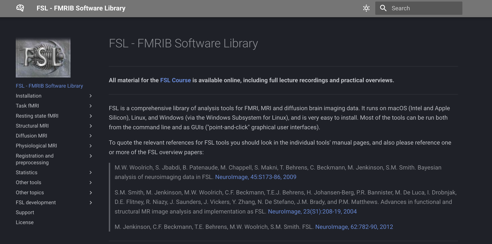

# Introduction: Understanding the DTI Preprocessing Pipeline

Diffusion Tensor Imaging (DTI) preprocessing is the foundation for all diffusion analyses -- from tensor fitting to tractography. The goal is to transform raw scanner output (DICOMs) into artifact-free, anatomically aligned NIfTI data that accurately represents water diffusion along white-matter pathways.

This tutorial provides a conceptual roadmap to the core preprocessing sequence used in the SDN Lab / IMPACT project, outlining:

What each step accomplishes
Why it’s necessary for reliable DTI data
Which tools are typically used

| Order | Stage                          | Core Purpose                                                             | Main Tool(s)                          |
| :---: | ------------------------------ | ------------------------------------------------------------------------ | ------------------------------------- |
|   1   | **DICOM → NIfTI Conversion**   | Standardizes raw data into analysis-ready NIfTI + JSON + bvec/bval files | `dcm2niix`                            |
|   2   | **Skull Stripping (T1)**       | Removes non-brain tissue for cleaner registration and masks              | `ANTs`                                |
|   3   | **B0 Concatenation**           | Combines reverse phase-encoded fieldmaps (AP/PA) for distortion modeling | `FSL` (`fslroi`, `fslmerge`)          |
|   4   | **TOPUP**                      | Corrects susceptibility distortions using paired B0s                     | `FSL` (`topup`)                       |
|   5   | **Mean B0 + Mask**             | Averages B0s and extracts a robust brain mask                            | `FSL` (`fslmaths`, `bet`)             |
|   6   | **MRDegibbs + Denoising**      | Removes Gibbs ringing and spatial noise                                  | `MRtrix3` (`dwidenoise`, `mrdegibbs`) |
|   7   | **Eddy Correction**            | Corrects head motion and eddy-current distortions                        | `FSL` (`eddy`)                        |
|   8   | **DTI Fit**                    | Fits diffusion tensor model to generate FA/MD/RD maps                    | `FSL` (`dtifit`)                      |
|   9   | **Spatial Alignment (Flirt and Convert)**          | Aligns diffusion data to structural and standard spaces                  | `FSL` (`flirt`, `convert_xfm`)        |
|   10  | **AFQ Prep / BIDS Conversion** | Organizes data for tractography and quality control                      | `pyAFQ`, `AFQ-Browser`                |
|   11  | **ICV Calculation**            | Estimates intracranial volume for normalization                          | `FSL` or `ANTs`                       |

# A more in depth overview: 

Perfect — so that table you showed (the one with DICOM → NIfTI, Skull Stripping, etc.) is great as a *summary* for people who already know roughly what DTI preprocessing is.

For a more **in-depth review that introduces beginners to what’s actually happening and why**, you can structure it like this — essentially turning the table into a **mini-tutorial overview** that explains *what each step does, why it matters, and what tool performs it*.

---

## 🧠 DTI Preprocessing: A Conceptual Overview

Diffusion Tensor Imaging (DTI) preprocessing transforms raw diffusion scans into scientifically usable measures of white matter structure (like FA, MD, and RD). Each step removes artifacts, aligns data, and prepares it for tractography and statistical analyses. Below is an expanded overview of what happens at each stage.

---

### **1. DICOM → NIfTI Conversion**

* **What it is:** Raw MRI data are stored as DICOM files, which contain both image data and metadata (scanner info, orientation, acquisition parameters).
* **Why it matters:** Most neuroimaging software (FSL, MRtrix, AFQ) requires NIfTI format. Conversion also extracts the gradient direction (`bvec`) and strength (`bval`) files needed for tensor modeling.
* **Main tool:** `dcm2niix` (robust, widely used).

---

### **2. Skull Stripping (T1 or B0)**

* **What it is:** Removes non-brain tissue (skull, scalp, eyes, etc.) from the image.
* **Why it matters:** Accurate brain extraction ensures better registration and prevents contamination from non-brain voxels.
* **Main tool:** `ANTs` or FSL’s `BET`.

---

### **3. B0 Concatenation (AP/PA Merge)**

* **What it is:** Combines the “blip-up” (AP) and “blip-down” (PA) fieldmap scans.
* **Why it matters:** These paired images capture distortions in opposite phase directions, enabling later correction for magnetic susceptibility artifacts.
* **Main tool:** FSL (`fslroi`, `fslmerge`).

---

### **4. TOPUP (Distortion Correction)**

* **What it is:** Estimates a susceptibility distortion field using the AP/PA pair.
* **Why it matters:** Corrects for spatial warping that occurs near air/tissue boundaries (e.g., orbitofrontal cortex).
* **Main tool:** FSL (`topup`).

---

### **5. Mean B0 and Mask Creation**

* **What it is:** Averages all B0 images (non-diffusion-weighted) and generates a brain mask.
* **Why it matters:** Produces a high SNR reference image and defines the region for later analysis (ensures non-brain voxels aren’t included).
* **Main tools:** FSL (`fslmaths`, `bet`).

---

### **6. MRDegibbs and Denoising**

* **What it is:** Removes Gibbs ringing artifacts (oscillations near sharp edges) and random noise.
* **Why it matters:** Improves image sharpness and increases the reliability of diffusion metrics without blurring.
* **Main tool:** MRtrix3 (`dwidenoise`, `mrdegibbs`).

---

### **7. Eddy Current Correction**

* **What it is:** Models and corrects for eddy-current–induced distortions and small subject movements.
* **Why it matters:** Diffusion gradients cause eddy currents that shift the image; without correction, tensor fitting becomes unreliable.
* **Main tool:** FSL (`eddy` or `eddy_openmp`).

---

### **8. DTI Fit (Tensor Estimation)**

* **What it is:** Fits a diffusion tensor model to the corrected data.
* **Why it matters:** This produces voxelwise maps of fractional anisotropy (FA), mean diffusivity (MD), axial diffusivity (AD), and radial diffusivity (RD)—the core measures in DTI studies.
* **Main tool:** FSL (`dtifit`).

---

### **9. Spatial Alignment (FLIRT and Convert)**

* **What it is:** Registers diffusion data to the subject’s T1-weighted structural image and/or a standard template.
* **Why it matters:** Enables group analyses and comparison across individuals.
* **Main tool:** FSL (`flirt`, `convert_xfm`).

---

### **10. AFQ Prep / BIDS Conversion**

* **What it is:** Converts data into a standardized format (BIDS) and prepares inputs for Automated Fiber Quantification (AFQ).
* **Why it matters:** BIDS ensures reproducibility and compatibility with analysis pipelines; AFQ computes tract profiles along major white matter bundles.
* **Main tools:** `pyAFQ`, `AFQ-Browser`.

---

### **11. Intracranial Volume (ICV) Calculation**

* **What it is:** Estimates total brain volume (from T1 or mask).
* **Why it matters:** Used as a covariate to control for individual differences in brain size during statistical analysis.
* **Main tool:** FSL (`fslstats`) or `ANTs`.

---

Would you like me to make a **diagram version of this** (like your table, but visually showing flow + brief blurbs under each box) or a **text-only “tutorial handout”** that explains each step in paragraph form for students who’ve never seen DTI preprocessing before?

# Tools The Pipeline Will Use

🧩 1. FSL (FMRIB Software Library)

Role: The backbone of the DTI pipeline.
Used for: motion/distortion correction, tensor fitting, registration, and basic brain extraction.

Key commands:

* fslroi, fslmerge → extract/merge volumes (used for B0 concatenation)
* topup → corrects susceptibility distortions using reverse phase-encoded fieldmaps
* eddy → corrects eddy currents + head motion, uses TOPUP output
* dtifit → fits tensors to produce FA, MD, RD, and AD maps
* flirt → linear registration of diffusion data to T1 or standard space
* bet → simple skull stripping (often used for mean B0 mask)

Why it’s essential:
FSL integrates all major corrections into a consistent framework and is highly optimized for DTI. It also outputs all standard diffusion metrics in formats compatible with downstream software (AFQ, MRtrix, SPM).