# 🧠 SDN Lab — Project IMPACT DTI Guide

## SSH:  Before we begin; Accessing the Linux, your Project (IMPACT), and creating a DTI directory 

 1. SSH Into the Linux
From your local terminal:
```bash
ssh -XY tur50045@cla19097.tu.temple.edu
```

2. Navigate to Project Impact DICOMs
```bash
cd /data/projects/STUDIES/IMPACT/fMRI/dicoms
# this will take us into the raw dicoms

ls # checking the list of participants
s0105-pilot  s1000  s1228-pilot  s1253  s1323  s1350 ...
s4427  s4436  s4446  s4449  s4459  s4482 ...
```

3. Where Will the DTI Files Go?
I created this file:
```bash
tur50045@cla19097:/data/projects/STUDIES/IMPACT$ mkdir DTI
mkdri /DTI/config ##we will put configuration txt files neccesary for DTI preprocessing here
```
* Note: All the configutation files needed for this pipeline can be found in the /config folder of this repo: https://github.com/DiffusionTensorImaging-Repos/SDN-IMPACT-DTI/tree/bd9b3a1670651fc73af3fec46001cdf099ea086b/config

## What does the DTI pipeline ential?
- **Note** - see github repo for a a breif description of each of the steps below:https://github.com/DiffusionTensorImaging-Repos/SDN-IMPACT-DTI/blob/main/Pipelineoutline.MD

- Additionally all steps are described in detail before their implimentation below. 

A. Preprocessing
1. **DICOM to NIfTI Conversion**
2. **ANTs Skull Stripping**
3. **RB0 Concatenate**
4. **TOPUP**
5. **Mean B0 Image**
6. **Binary Brain Mask**
7. **MRDegibbes**
8. **Eddy Current Correction**
9. **DWI Extraction**
10. **DTI Fit**
11. **FLIRT and Convert**
12. **AFQ Prep - BIDS Conversion**
13. **ICV Calculation**

Index — IMPACT DTI Preprocessing Pipeline
1. [Step 1 — DICOM to NIfTI Conversion](#step-1--dicom-to-nifti-conversion)
2. [Step 2 -  ANTs Skull Stripping](#step-2---ants-skull-stripping)
3. [Step 3 — B0 Concatenation](#step-3--b0-concatenation)
4. [Step 4 — TOPUP (Susceptibility Distortion Correction)](#step-4--topup-susceptibility-distortion-correction)
5. [Step 5 — Mean B0 Image (Collapse Across Time)](#step-5--mean-b0-image-collapse-across-time)
6. [Step 6 — Brain Extraction on Mean B0](#step-6--brain-extraction-on-mean-b0)
7. [Step 7 — Gibbs Ringing Removal + b=250 Cleanup](#step-7--gibbs-ringing-removal--b250-cleanup)
8. [Step 8 — Eddy Current & Motion Correction](#step-8--eddy-current--motion-correction)
9. [Step 9: BedpostX](#step-9-bedpostx)
10. [Step 10: DWI Shell Extraction](#step-10-dwi-shell-extraction)
11. [Step 11 Tensor Fitting (DTIFIT)](#step-11-tensor-fitting-dtifit)
12. [Step 12: FLIRT and CONVERT (Spatial Alignment and Standardization)](#step-12-flirt-and-convert-spatial-alignment-and-standardization)
13. [Step 13: Intracranial Volume (ICV Estimation)](#step-13-intracranial-volume-icv-estimation)
14. [Step 14: PYAFQ - BIDS and Running AFQ](#step-14-pyafq---bids-and-running-afq)

Index — IMPACT DTI Tractography Pipeline (Section B)
15. [Step 15 — MRtrix Conversion (mrconvert)](#step-15--mrtrix-conversion-mrconvert)
16. [Step 16 — Response Function Estimation (dwi2response)](#step-16--response-function-estimation-dwi2response)
17. [Step 17 — Group-Average Response Functions (responsemean)](#step-17--group-average-response-functions-responsemean)
18. [Step 18 — Fiber Orientation Distribution (dwi2fod MSMT-CSD)](#step-18--fiber-orientation-distribution-dwi2fod-msmt-csd)
19. [Step 19 — FOD Normalization (mtnormalise)](#step-19--fod-normalization-mtnormalise)
20. [Step 20 — ANTs Registration: MNI → T1 Space](#step-20--ants-registration-mni--t1-space)
21. [Step 21 — ROI Warping: MNI → T1 → Diffusion Space + Visual QC](#step-21--roi-warping-mni--t1--diffusion-space--visual-qc)
22. Step 22 — Atlas-Based Exclusion Masks
23. Step 23 — Test Tractography (5 Subjects)
24. Step 24 — Full Tractography (All Subjects)
25. Step 25 — Tract Cleaning (pyAFQ)
26. Step 26 — Visual QC
27. Step 27 — Node-wise FA Extraction
28. Step 28 — Statistical Analysis (Permutation Testing)


# DTI PREPROCESSING: 

## Step 1 — DICOM to NIfTI Conversion

Before we we begin conversion, lets quickly check which participants have the necessary DTI and anatomical DICOM Runs?

For a subject to be *DTI-clear*, it must include all four required scan types inside its DICOM folder:

- Note look through your DICOMS first To make sure your T1 and DTI runs follow this naming structure.
Example:

```bash
 ls /project/dicoms/subject*/
```

If they don't, update the naming throughout this step

1. Structural T1 (`anat_T1w_acq_mpgSag`)  
2. Diffusion run (`cmrr_mb3hydi_ipat2_64ch`)  
3. Fieldmap AP (`cmrr_fieldmapse_ap`)  
4. Fieldmap PA (`cmrr_fieldmapse_pa`)  


 **We will use the following bash Code to check which participants have these files:**

Paste the following into the SSH terminal: 
```bash
#!/bin/bash
# Tidy check for required DTI runs in each IMPACT subject folder

base_dir="/data/projects/STUDIES/IMPACT/fMRI/dicoms"

required_scans=(
    "anat_T1w_acq_mpgSag"
    "cmrr_mb3hydi_ipat2_64ch"
    "cmrr_fieldmapse_ap"
    "cmrr_fieldmapse_pa"
)

echo "=== DTI Scan Check: $base_dir ==="
printf "%-12s | %-25s | %-25s | %-20s | %-20s\n" \
"Subject" "T1 (anat_T1w)" "DTI (mb3hydi)" "Fieldmap AP" "Fieldmap PA"
printf -- "-------------+---------------------------+---------------------------+----------------------+----------------------\n"

for subj in "$base_dir"/*; do
    [ -d "$subj" ] || continue
    subj_id=$(basename "$subj")
    status=()
    for scan in "${required_scans[@]}"; do
        if find "$subj" -maxdepth 1 -type d -regex ".*/[0-9]+-$scan.*" | grep -q .; then
            status+=("✅")
        else
            status+=("❌")
        fi
    done
    printf "%-12s | %-25s | %-25s | %-20s | %-20s\n" \
    "$subj_id" "${status[0]}" "${status[1]}" "${status[2]}" "${status[3]}"
done
```

**What We get from the Output:**

 Most subjects are DTI-clear: they have T1, diffusion, and both fieldmaps present.
Incomplete subjects include:  
* s1253  
* s1476  
* s578  
* s820  
* s999-pilot

**Next, we will batch convert the DICOM to NIFTI conversion**

- We use **dcm2niix**, a widely adopted command-line tool that converts DICOM medical imaging files into the NIfTI format.  

- DICOMs are the raw scanner output, but NIfTI is the standard format used by neuroimaging software (FSL, AFNI, SPM, etc.).  
- `dcm2niix` automatically handles orientation, metadata, and generates `.json`, `.bval`, and `.bvec` files that are essential for preprocessing.  

As a reminder, we require the following four scan types for each subject:
1. **Structural T1** → `anat_T1w_acq_mpgSag`  
2. **DTI run** → `cmrr_mb3hydi_ipat2_64ch`  
3. **Fieldmap AP** → `cmrr_fieldmapse_ap`  
4. **Fieldmap PA** → `cmrr_fieldmapse_pa`  

- Only subjects with all 4 will be converted, and the output files will be place in the newly created DTI directory. 

This step will use the basic dc2niix function. 

**Note** — This step is lightweight and will be completed quickly, so we just paste it directly into the SSH terminal and run it for all participants at once. 

I quickly check available system RAM to decide how many participants we can process at once, by pasting this in the SSH terminal: 
```
free -h
```

Example output:
```
              total        used        free      shared  buff/cache   available
Mem:          125Gi       9.7Gi        54Gi        60Mi        61Gi       114Gi
Swap:         2.0Gi          0B       2.0Gi
```

dcm2niix is very lightweight, using only ~100–300 MB per subject. With 114 GB available, even 60 subjects in parallel is well within limits.
→ Safe to set max_jobs=60.

To run the code, 
**Paste the following directly into the SSH terminal**
```bash
#!/bin/bash
# ============================================================
# DICOM → NIfTI conversion for IMPACT (DTI pipeline)
# With subject-prefixed filenames + logging
# ============================================================

base_dir="/data/projects/STUDIES/IMPACT/fMRI/dicoms"
out_base="/data/projects/STUDIES/IMPACT/DTI/NIFTI"
dcm2niix_bin="/usr/bin/dcm2niix"   # confirmed path on cluster

# Required scan patterns (pattern:output_dir:label)
scan_types=(
    "anat_T1w_acq_mpgSag:struct:struct"
    "cmrr_mb3hydi_ipat2_64ch:dti:dwi"
    "cmrr_fieldmapse_ap:dti:fmapAP"
    "cmrr_fieldmapse_pa:dti:fmapPA"
)

# Log file (always overwrite dcm2niix.log)
logfile="dcm2niix.log"
: > "$logfile"

# Simple logger: prints to screen AND appends to logfile
log() { echo "$*" | tee -a "$logfile" ; }

log "=== Starting DICOM → NIfTI conversion ==="

for subj in "$base_dir"/*; do
    [ -d "$subj" ] || continue
    subj_id=$(basename "$subj")
    log "--- Checking subject: $subj_id ---"

    # Check completeness
    complete=true
    for scan in "${scan_types[@]}"; do
        pattern="${scan%%:*}"
        if ! find "$subj" -maxdepth 1 -type d -regex ".*/[0-9]+-$pattern.*" | grep -q .; then
            log "  ❌ Missing required scan: $pattern"
            complete=false
        fi
    done
    if [ "$complete" = false ]; then
        log "  ⚠️ Skipping $subj_id (not DTI-clear)"
        continue
    fi

    # Output directories
    subj_out="$out_base/$subj_id"
    mkdir -p "$subj_out/struct" "$subj_out/dti"

    # Convert each scan type
    for scan in "${scan_types[@]}"; do
        IFS=":" read -r pattern target label <<< "$scan"
        scan_dir=$(find "$subj" -maxdepth 1 -type d -regex ".*/[0-9]+-$pattern.*" | head -n 1)
        log "  ✅ Converting $pattern → $target/"

        {
            echo "----- [$subj_id $label] dcm2niix start"
            $dcm2niix_bin -o "$subj_out/$target" -f "${subj_id}_${label}" "$scan_dir"
            echo "----- [$subj_id $label] dcm2niix end"
            echo
        } >>"$logfile" 2>&1
    done
done

log "=== Conversion finished. Output saved to: $out_base ==="


```
Note: All coding output from this script is recorded in dcm2niix.log.

The output data will look like this: 
```bash
/data/projects/STUDIES/IMPACT/DTI/NIFTI/
│
├── s1000/
│   ├── struct/
│   │   ├── s1000_struct.nii
│   │   ├── s1000_struct.json
│   └── dti/
│       ├── s1000_dwi.nii
│       ├── s1000_dwi.bval
│       ├── s1000_dwi.bvec
│       ├── s1000_dwi.json
│       ├── s1000_fmapAP.nii
│       ├── s1000_fmapAP.json
│       ├── s1000_fmapPA.nii
│       ├── s1000_fmapPA.json
│
├── s1323/
│   ├── struct/
│   │   ├── s1323_struct.nii
│   └── dti/
│       ├── s1323_dwi.nii
│       ├── s1323_fmapAP.nii
│       ├── s1323_fmapPA.nii
│
└── ...
```
Next, we'll run a NIFTI AUDIT to check that conversion and file org was succesful.
- **Note**: in following pre-processing steps I will  present the audit code without this detailed explanation. In each step, it will do the same thing: checking for the presence of all the files showed in the output data of the code. 

- This script audits the **NIFTI output directory** (`/Volumes/DTI/DTI/Wave1/NIFTI`) to check which subjects have proper output from this step. 

For each subject, it confirms the presence of:  
- `struct/` folder with T1 outputs (`.nii`, `.json`)  
- `dti/cmrr_mb3hydi_ipat2_64ch/` with diffusion outputs (`.nii`, `.json`, `.bval`, `.bvec`)  
- `dti/cmrr_fieldmapse_ap/` with fieldmap AP outputs (`.nii`, `.json`)  
- `dti/cmrr_fieldmapse_pa/` with fieldmap PA outputs (`.nii`, `.json`)  

The script prints a table of subjects with a ✅/**NIFTI-clear** flag if all required files exist, or ❌ if anything is missing. It also provides a final summary count of complete vs. incomplete subjects.

**Paste the following directly into the SSH terminal:**

```bash
#!/bin/bash

# Base directory with subject-level NIFTI outputs
nifti_base="/data/projects/STUDIES/IMPACT/DTI/NIFTI"

# Counters
complete=0
incomplete=0

echo "=== NIFTI Output Check: $nifti_base ==="
printf "%-12s | %-8s\n" "Subject" "NIFTI-clear"
printf -- "-------------+----------\n"

for subj in "$nifti_base"/*; do
    [ -d "$subj" ] || continue
    subj_id=$(basename "$subj")

    # Required files for this layout
    struct_ok=$(ls "$subj"/struct/${subj_id}_struct.{nii,json} 2>/dev/null | wc -l)
    dwi_ok=$(ls "$subj"/dti/${subj_id}_dwi.{nii,json,bval,bvec} 2>/dev/null | wc -l)
    fmap_ap_ok=$(ls "$subj"/dti/${subj_id}_fmapAP.{nii,json} 2>/dev/null | wc -l)
    fmap_pa_ok=$(ls "$subj"/dti/${subj_id}_fmapPA.{nii,json} 2>/dev/null | wc -l)

    if [ $struct_ok -eq 2 ] && [ $dwi_ok -eq 4 ] && [ $fmap_ap_ok -eq 2 ] && [ $fmap_pa_ok -eq 2 ]; then
        echo "$subj_id    | ✅"
        ((complete++))
    else
        echo "$subj_id    | ❌"
        ((incomplete++))
    fi
done

echo
echo "Summary: $complete subjects complete, $incomplete subjects incomplete"
```

 OUTPUT: Summary: 57 subjects complete, 0 subjects incomplete (We're good to go)

---

## Step 2 -  ANTs Skull Stripping

We use **ANTs (Advanced Normalization Tools)**, an open-source software suite for image processing. ANTs is a highly reliable package for brain extraction.  
- ( ANTs’ template-based approach typically produces cleaner extractions than simpler tools (like FSL BET), especially for high-resolution T1 images.)

- **Why it’s needed for DTI:** later diffusion preprocessing (e.g., registration, distortion correction) requires the structural image to be **brain-only**. Extra tissue like skull and scalp can throw off alignment and bias field corrections, so stripping ensures cleaner, accurate DTI processing.


**Locating ANTs skull stripping**: 
- Rather than download the ANTs library, I conducted a search to check if it is already on the Linux:

Type the following into the terminal: 
```bash
find / -type f -name "antsBrainExtraction.sh" 2>/dev/null | head -n 20
```
I confirmed ANTs is available on the lab Linux system under: `data/tools/ANTs/bin`

- **Note**: If you need to download ANTs *yourself* in future implementations, the official repository is here:  https://github.com/ANTsX/ANTs

Next, we add the ANTs functions to path by pasting the following in the terminal: 
```bash
export ANTSPATH="/data/tools/ANTs/bin"
export PATH="$ANTSPATH:$PATH"
```

**Before skull stripping we will set up the template and mask for  skull stripping**:
 
- ANTs (Advanced Normalization Tools) needs a **template image** (a standardized brain) and a **mask** (which defines which parts of that template are “brain” vs. “not-brain”) to guide skull stripping. These act as a reference: your subject’s T1 is aligned to the template, and the mask tells ANTs where to cut off skull, scalp, and neck.

**Which template should I use?**  
- **NKI templates** (from the Enhanced NKI-Rockland sample) are commonly used for **adolescent and adult** data.  
- **OASIS** or **ICBM** templates are sometimes used for older adults.  
- **Custom or age-specific templates** might be needed for pediatric datasets or other special populations.  

**What to check as an RA:**  
- Confirm whether the lab already has suitable templates downloaded (saves time and ensures consistency across projects).  
- Look for a pair within the SAME TEMPLATE (eg., NKI):  
  - `T_template.nii.gz` → the actual template brain.  
  - `T_template_BrainCerebellumMask.nii.gz` → the brain + cerebellum mask.  
  - Type the following into the terminal to conduct this search to see if masks already exist on the Linux: 
```bash
 find / -type f -name "T_template.nii" 2>/dev/null | head -n 20
 find /-type f -name "T_template_BrainCerebellumMask.nii" 2>/dev/null | head -n 20
 ```

- If you don’t find both the template **and** its matching mask for the template type you’re using (e.g., NKI, OASIS, ICBM), download the correct pair from the official ANTs figshare repository:  
https://figshare.com/articles/dataset/ANTs_ANTsR_Brain_Templates/915436
Then save it and reference the brain and mask tamplates for your participants. 

**In our case:**  
- We already found the NKI templates (this template has worked very well on adult data) on the lab Linux under `/data/projects/STUDIES/LEARN/…/ANTs_Images/NKI`. 
- To keep things organized, we copy them into the IMPACT project folder:

Type the following into the terminal:
```bash
mkdir -p /data/projects/STUDIES/IMPACT/DTI/ANTsTemplate/NKI
cd /data/projects/STUDIES/IMPACT/DTI/ANTsTemplate/NKI

cp /data/projects/STUDIES/LEARN/fMRI/NM/ANTs_toolbox/NM_toolbox/ANTs_Images/NKI/T_template.nii.gz \
   /data/projects/STUDIES/IMPACT/DTI/ANTsTemplate/NKI/

cp /data/projects/STUDIES/LEARN/fMRI/NM/ANTs_toolbox/NM_toolbox/ANTs_Images/NKI/T_template_BrainCerebellumMask.nii.gz \
   /data/projects/STUDIES/IMPACT/DTI/ANTsTemplate/NKI/
```

**Now that the masks are set, we can execute the ANTs Skull Stripping.**

Brefore running this, I conduct a System RAM check to help decide how many paritcipants we can tell ANTs to skullstrip at once.

Type the following into the terminal: 

```bash
free -h
```

Example output:
```
              total        used        free      shared  buff/cache   available
Mem:          125Gi       9.7Gi        54Gi        60Mi        61Gi       114Gi
Swap:         2.0Gi          0B       2.0Gi
```

`antsBrainExtraction.sh` typically uses ~2–3 GB per subject.  
With 114 GB free, we could theoretically run ≈38 jobs in parallel (114 ÷ 3).  
To be safe but still efficient, we cap at 30 jobs (max_jobs=30).

**This script will use the antsBrainExtraction.sh function from the ANTs library:** 

**Note** — This step may take a while (1-2 hours), so we run it as a background script in Nohup to avoid it terminating in the case ssh disruptions. Here is how to run The Bash Code in Nohup:

1.  **First, create the `run_ants.sh` script**

Open nano to create the script file:
```bash
nano run_ants.sh
```
 Paste the following into nano:
```bash
#!/bin/bash
# ============================================================
# Parallelized ANTs Skull Stripping for IMPACT (DTI)
# ============================================================

# Paths
ANTs_bin="/data/tools/ants/bin/antsBrainExtraction.sh"
TEMPLATE="/data/projects/STUDIES/IMPACT/DTI/ANTsTemplate/NKI/T_template.nii.gz"
TEMPLATE_MASK="/data/projects/STUDIES/IMPACT/DTI/ANTsTemplate/NKI/T_template_BrainCerebellumMask.nii.gz"
in_base="/data/projects/STUDIES/IMPACT/DTI/NIFTI"
out_base="/data/projects/STUDIES/IMPACT/DTI/derivatives/ANTs"

# Collect all subject IDs from NIFTI directory
subjects=($(ls -1 "$in_base"))

# Function to process one subject
process_subject () {
    subj_id="$1"
    echo "=== Processing $subj_id ==="

    nii_file="$in_base/$subj_id/struct/${subj_id}_struct.nii"
    out_dir="$out_base/$subj_id"
    mkdir -p "$out_dir"

    "$ANTs_bin" -d 3 -a "$nii_file" -e "$TEMPLATE" -m "$TEMPLATE_MASK" -o "$out_dir/"

    # Rename outputs with subject prefix
    mv "$out_dir/BrainExtractionBrain.nii.gz" "$out_dir/${subj_id}_BrainExtractionBrain.nii.gz"
    mv "$out_dir/BrainExtractionMask.nii.gz" "$out_dir/${subj_id}_BrainExtractionMask.nii.gz"
    mv "$out_dir/BrainExtractionPrior0GenericAffine.mat" "$out_dir/${subj_id}_BrainExtractionPrior0GenericAffine.mat"

    echo "=== Finished $subj_id ==="
}

# ==============================
# Run jobs in parallel (max 30)
# ==============================
max_jobs=30
job_count=0

for subj in "${subjects[@]}"; do
    process_subject "$subj" &   # run in background
    ((job_count++))

    if (( job_count >= max_jobs )); then
        wait -n                 # wait for one job to finish
        ((job_count--))
    fi
done

wait  # wait for all jobs to finish

echo -e "\n=== Skull stripping finished. Results saved to: $out_base ==="
```
**Save and exit nano:**
Press Ctrl+O then Enter to save
Press Ctrl+X to close

2. **Make the script runnable**
```bash
 chmod +x run_ants.sh 
 ```

3.  Run with nohup so it survives SSH disconnections during execution: 
```bash
 nohup ./run_ants.sh >ants.log 2>&1 & 
 ```

4. We can still watch the progress even though it is running outside of the ssh - by typing: 
```bash
tail -f ants.log
```
- Even if you disconnect, the job keeps running. When you reconnect later, you can just run the same tail -f topup.log command to pick up the log again.

**Expected output structure**:
```bash
/data/projects/STUDIES/IMPACT/DTI/derivatives/ANTs/
│
├── s1000/
│   ├── s1000_BrainExtractionBrain.nii.gz
│   ├── s1000_BrainExtractionMask.nii.gz
│   ├── s1000_BrainExtractionPrior0GenericAffine.mat
│
├── s1323/
│   ├── s1323_BrainExtractionBrain.nii.gz
│   ├── s1323_BrainExtractionMask.nii.gz
│   ├── s1323_BrainExtractionPrior0GenericAffine.mat
│
└── ...
```

**Here is the script to conduct an audit to make sure this was properly run for all subjects:**
```bash
#!/bin/bash
# Robust audit for ANTs skull stripping outputs

in_base="/data/projects/STUDIES/IMPACT/DTI/NIFTI"
out_base="/data/projects/STUDIES/IMPACT/DTI/derivatives/ANTs"

printf "Subject\tBrain\tMask\tAffine\n"

for subj in $(ls -1 "$in_base"); do
    out_dir="$out_base/$subj"

    brain=$(find "$out_dir" -maxdepth 1 -type f -name "${subj}_BrainExtractionBrain.nii.gz" 2>/dev/null | head -n1)
    mask=$(find "$out_dir" -maxdepth 1 -type f -name "${subj}_BrainExtractionMask.nii.gz" 2>/dev/null | head -n1)
    affine=$(find "$out_dir" -maxdepth 1 -type f -name "${subj}_BrainExtractionPrior0GenericAffine.mat" 2>/dev/null | head -n1)

    [[ -n "$brain"  ]] && bstat="✅" || bstat="❌"
    [[ -n "$mask"   ]] && mstat="✅" || mstat="❌"
    [[ -n "$affine" ]] && astat="✅" || astat="❌"

    printf "%s\t%s\t%s\t%s\n" "$subj" "$bstat" "$mstat" "$astat"
done

echo -e "\n=== ANTs Skull Stripping Audit Finished ==="
```

**The next step in ANTs is to use the FSL - fsleyes- interface to check each participant to make sure that the skull strip was successful.**

- You may want to use another device other than the linux to operate fsleyes. Here is how to move the files from ANTs (or any other file) onto a local computer:
```bash
# === Copy ANTs-stripped brain + T1 from Linux to local ===
# Replace subject IDs in the brace list {s1287,s1323,s1324}

# first for brain extraction: 
rsync -av \
  "tur50045@cla19097:/data/projects/STUDIES/IMPACT/DTI/derivatives/ANTs/{s1228-pilot,s4418,s4419,s4423,s4427,s4429,s4436,s4440,s4446,s4447,s4449,s4450,s4459,s4475,s4482,s4531,s4631,s4643,s4650,s523,s601,s606,s673,s692,s701,s745,s807,s926}/*BrainExtractionBrain.nii.gz" \
  /Users/dannyzweben/Desktop/SDN/DTI/data.check/

#then the full T1

rsync -av \
  "tur50045@cla19097.tu.temple.edu:/data/projects/STUDIES/IMPACT/DTI/NIFTI/{s1228-pilot,s4418,s4419,s4423,s4427,s4429,s4436,s4440,s4446,s4447,s4449,s4450,s4459,s4475,s4482,s4531,s4631,s4643,s4650,s523,s601,s606,s673,s692,s701,s745,s807,s926}/struct/*_struct.nii" \
  /Users/dannyzweben/Desktop/SDN/DTI/data.check/
```

**Next, we will check the quality of  ANTs Skull Stripping with FSLeyes, and we will make sure to check every single participant.**

 **Open FSLeyes**
From terminal, launch:
```bash
fsleyes
```

When FSL opens, it will first pull up:

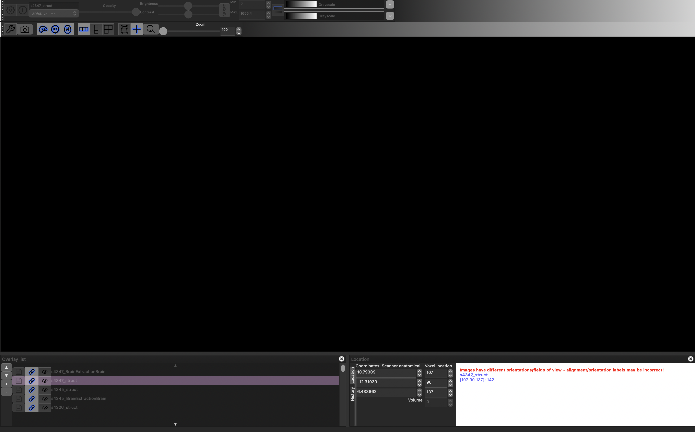

Next, we wil overlaying Structural and ANTS Images

For each participant:  
1. Load the participant’s NIFTI structural scan.  
2. Hit the **plus (+)** to add the ANTS-stripped version.  
3. Move the stripped brain above the struct.  
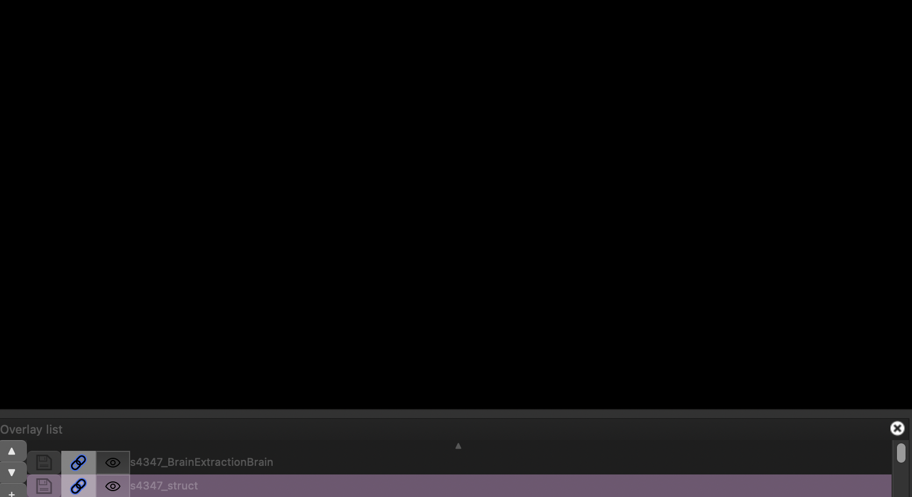     

4. Change the stripped brain’s color so the extraction edges are visible:  
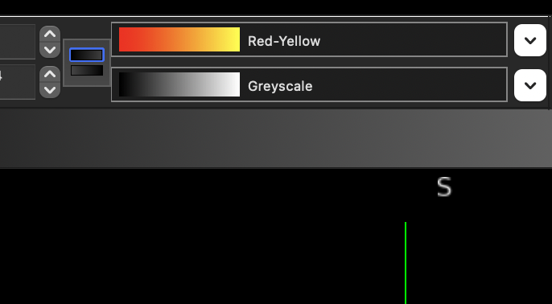

5. We want to make sure that for each participant, the stripped brain fully covers the T1 brain and doesn't capture non brain structures.  

6. Example of a Good Extraction -- For confidentiality this is generic example not from our data base.
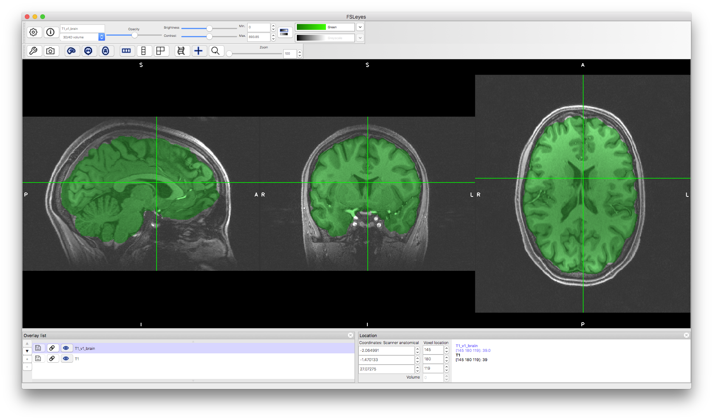

7. Here it is good to begin keeping a csv to track your progress. 
I track each participant's progress after skullstripping. 
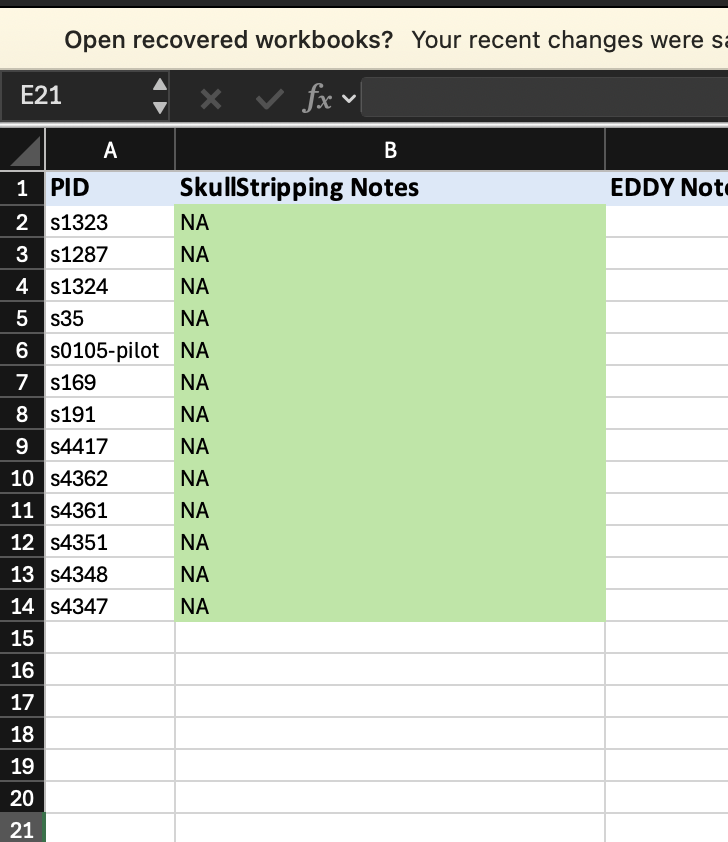

**Note:** If extraction cuts off brain or pulls in excesive spine/scalp/neck, exclude and note. This should be a rare issue (~all participants should be stripped propely if you used a good mask/template), if you run into several issues,switch template (NKI worked perfectly with IMPACT).

If you have found good mask and made sure it worked for ~all participants, we can move to the next step: 

---
## Step 3 — B0 Concatenation

- This is a step that is neccesary to prep our data before we run  **topup** for susceptibility distortion correction! This step will build a combined baseline (b0) image. 

This step extracts the first volume (the b0) from each subject’s AP and PA fieldmaps and merges them into a single 4D file. This merged file is the required input for topup.

This step will accomplish the following: 
1. Extract the first volume (b0) from the AP fieldmap (`*_fmapAP.nii`) → `<subj>_a2p_b0.nii.gz`  
2. Extract the first volume (b0) from the PA fieldmap (`*_fmapPA.nii`) → `<subj>_p2a_b0.nii.gz`  
3. Concatenate the AP and PA b0s into one file (`<subj>_merged_b0s.nii.gz`)  

This step will use the following input (per subject)
- `NIFTI/<subj>/dti/<subj>_fmapAP.nii`  
- `NIFTI/<subj>/dti/<subj>_fmapPA.nii`  

The code will use the fslroi + fslmerge FSL functions to grab the first b0 from each direction and merge them into the required *_merged_b0s.nii.gz

- This is a lightweight step and it will be pasted directly into the SSH terminal:

```bash
#!/bin/bash

# Step 3: B0 Concatenation (parallel + verbose)

nifti_base="/data/projects/STUDIES/IMPACT/DTI/NIFTI"
deriv_base="/data/projects/STUDIES/IMPACT/DTI/derivatives/b0_concat"

mkdir -p "$deriv_base"

# Function to process a single subject
process_subj() {
    subj=$1
    subj_dir="$nifti_base/$subj/dti"
    out_dir="$deriv_base/$subj"
    mkdir -p "$out_dir"

    echo ">>> [$subj] Starting B0 extraction and concatenation"

    # Check inputs exist
    if [ ! -f "$subj_dir/${subj}_fmapAP.nii" ] || [ ! -f "$subj_dir/${subj}_fmapPA.nii" ]; then
        echo "!!! [$subj] Missing AP or PA fieldmap. Skipping."
        return
    fi

    # Extract b0 from AP
    echo ">>> [$subj] Extracting AP b0"
    fslroi "$subj_dir/${subj}_fmapAP.nii" \
           "$out_dir/${subj}_a2p_b0.nii.gz" 0 1

    # Extract b0 from PA
    echo ">>> [$subj] Extracting PA b0"
    fslroi "$subj_dir/${subj}_fmapPA.nii" \
           "$out_dir/${subj}_p2a_b0.nii.gz" 0 1

    # Merge AP + PA
    echo ">>> [$subj] Merging AP+PA b0s"
    fslmerge -t "$out_dir/${subj}_merged_b0s.nii.gz" \
             "$out_dir/${subj}_a2p_b0.nii.gz" \
             "$out_dir/${subj}_p2a_b0.nii.gz"

    echo ">>> [$subj] Done!"
}

export -f process_subj
export nifti_base deriv_base

# === Run in parallel ===
# Safe to use 30 jobs: B0 extraction/merge is light compared to ANT for which 30 parellel was no problem
#30 subjects in parallel.

subjects=$(basename -a "$nifti_base"/*)

echo "Found $(echo $subjects | wc -w) subjects in $nifti_base"
echo "Running with up to 30 in parallel..."

if command -v parallel > /dev/null; then
    echo "$subjects" | tr ' ' '\n' | parallel -j 30 process_subj {}
else
    max_jobs=30
    for subj in $subjects; do
        process_subj "$subj" &
        while [ "$(jobs -r | wc -l)" -ge "$max_jobs" ]; do
            sleep 1
        done
    done
    wait
fi

echo "=== All B0 concatenation jobs finished ==="

```

* Note -  All coding output from this script is recorded in b0_concat.log

**Expected File Output (Per participant):**
```
/data/projects/STUDIES/IMPACT/DTI/derivatives/b0_concat/
│
├── s1000/
│ ├── s1000_a2p_b0.nii.gz
│ ├── s1000_p2a_b0.nii.gz
│ ├── s1000_merged_b0s.nii.gz
│
├── s1323/
│ ├── s1323_a2p_b0.nii.gz
│ ├── s1323_p2a_b0.nii.gz
│ ├── s1323_merged_b0s.nii.gz
│
└── ...
```

**B0 Audit to check that conversion and file org was succesful.**:
```bash
#!/bin/bash

nifti_base="/data/projects/STUDIES/IMPACT/DTI/NIFTI"
deriv_base="/data/projects/STUDIES/IMPACT/DTI/derivatives/b0_concat"

echo -e "Subject\tAP_b0\tPA_b0\tMerged"

for subj in $(ls "$nifti_base"); do
    out_dir="$deriv_base/$subj"
    ap="$out_dir/${subj}_a2p_b0.nii.gz"
    pa="$out_dir/${subj}_p2a_b0.nii.gz"
    merged="$out_dir/${subj}_merged_b0s.nii.gz"

    ap_status=$([ -f "$ap" ] && echo "✅" || echo "❌")
    pa_status=$([ -f "$pa" ] && echo "✅" || echo "❌")
    merged_status=$([ -f "$merged" ] && echo "✅" || echo "❌")

    echo -e "$subj\t$ap_status\t$pa_status\t$merged_status"
done

```
---
## Step 4 — TOPUP Susceptibility Distortion Correction

**TOPUP corrects for **susceptibility-induced geometric distortions** in diffusion-weighted MRI**

- By using the AP and PA b0s created in Step 6, TOPUP estimates the susceptibility field and produces corrected reference images. These corrected b0s are essential for accurate alignment and later diffusion preprocessing.


The following steps accomplished by our code..
1. Create an output directory for TOPUP results inside each subject’s `dti/` folder.  
2. Use the merged AP/PA b0 file  from the previous step(`<subj>_merged_b0s.nii.gz`) as input to TOPUP.  
3. Call in an acquisition parameters file (`acqp.txt`) that specifies phase encoding direction and readout time.  
4. TOPUP outputs corrected b0 images and a displacement field for later use.  


**! IMPORTANT: Configuration File needed:** 
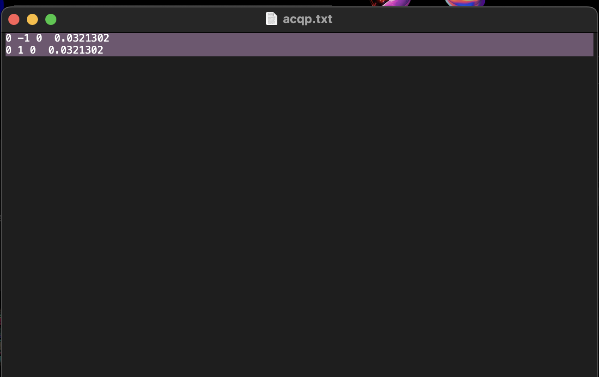


This file tells TOPUP how the scans were collected. Each row is one scan (AP or PA) and describes:  
- **Direction of phase encoding** (whether distortion runs front-to-back or back-to-front).  
- **How long the readout took** (the time distortions can build up).  
- It can be found here: -`/data/projects/STUDIES/IMPACT/DTI/config/acqp.txt`  
- With both directions listed, TOPUP can figure out how the distortions flip and then fix them in the diffusion data.


For the TOPUP code, the following input, produced by the previous steps is needed: 

**Expected Input (per subject)**
- `NIFTI/<subj>/dti/<subj>_merged_b0s.nii.gz` (from Step 6)  
- Acquisition parameters file:  `/data/projects/STUDIES/IMPACT/DTI/config/acqp.txt`  

Topup will use the "topup" FSL function, and the topup call will use the following sturcture:
```
topup --imain="$b0_file" \
      --datain="$datain_file" \
      --config="$config_file" \
      --out="$output_prefix" \
      --iout="${output_prefix}_corrected_b0" \
      --fout="${output_prefix}_fieldmap" \
      --verbose
```

Before implimenting this code, I conducted a quick
**System RAM check**

```bash
free -h

              total        used        free      shared  buff/cache   available
Mem:          125Gi       9.7Gi        54Gi        60Mi        61Gi       114Gi
Swap:         2.0Gi          0B       2.0Gi

```
TOPUP is more demanding than earlier steps. Even though the system has plenty of RAM, I/O and CPU load can still cause failures when too many jobs run at once. To keep things stable, we cap parallel jobs at 18 (max_jobs=18).

**How to run The Bash Code in Nohup**

1. **Create the `run_topup.sh` script**
Open nano to create the script file:
```bash
nano run_topup.sh
```

2. **Paste the following into nano:**
```Bash
#!/bin/bash

# Step 4: TOPUP (susceptibility distortion correction)

nifti_base="/data/projects/STUDIES/IMPACT/DTI/NIFTI"
b0_base="/data/projects/STUDIES/IMPACT/DTI/derivatives/b0_concat"
deriv_base="/data/projects/STUDIES/IMPACT/DTI/derivatives/TOPUP"
datain_file="/data/projects/STUDIES/IMPACT/DTI/config/acqp.txt"
config_file="/usr/local/fsl/etc/flirtsch/b02b0_1.cnf"

process_subj() {
    subj=$1
    b0_file="$b0_base/$subj/${subj}_merged_b0s.nii.gz"
    output_dir="$deriv_base/$subj/topup_output"
    mkdir -p "$output_dir"

    output_prefix="$output_dir/${subj}_topup"

    # Skip if outputs already exist
    if [[ -f "${output_prefix}_corrected_b0.nii.gz" && -f "${output_prefix}_fieldmap.nii.gz" ]]; then
        echo "=== [$subj] Already has TOPUP outputs, skipping"
        return
    fi

    if [ ! -f "$b0_file" ]; then
        echo "!!! [$subj] Missing merged b0 input, skipping"
        return
    fi

    echo ">>> [$subj] Running TOPUP"
    topup --imain="$b0_file" --datain="$datain_file" \
          --config="$config_file" \
          --out="$output_prefix" \
          --iout="${output_prefix}_corrected_b0" \
          --fout="${output_prefix}_fieldmap" \
          --verbose
    echo ">>> [$subj] Done"
}

export -f process_subj
export nifti_base b0_base deriv_base datain_file config_file

subjects=$(basename -a "$nifti_base"/*)

echo "Found $(echo $subjects | wc -w) subjects in $nifti_base"

# Run in parallel: up to 18 jobs at once
if command -v parallel > /dev/null; then
    echo "$subjects" | tr ' ' '\n' | parallel -j 18 process_subj {}
else
    max_jobs=18
    for subj in $subjects; do
        process_subj "$subj" &
        while [ "$(jobs -r | wc -l)" -ge "$max_jobs" ]; do
            sleep 1
        done
    done
    wait
fi

echo "=== All TOPUP jobs finished ==="


```

3. **Save and exit nano:**
Press Ctrl+O then Enter to save
Press Ctrl+X to close

4. **Make the script runnable**
```bash
 chmod +x run_topup.sh 
 ```
5. **Run with nohup so it survives SSH disconnections**
```bash
 nohup ./run_topup.sh > topup.log 2>&1 & 
 ```

6. **Watch progress in real time**
We can still watch the progress even though it is running outside of the ssh!
```bash
tail -f topup.log
```
Even if you disconnect, the job keeps running. When you reconnect later, you can just run the same tail -f topup.log command to pick up the log again. **This log will also be SAVED and can be checked later if you encounter errors**

**Expected Output**:
```
derivatives/TOPUP/s100/topup_output/
│
├── s1000_topup.nii.gz
├── s1000_topup_corrected_b0.nii.gz
├── s1000_topup_fieldmap.nii.gz

derivatives/TOPUP/s1323/topup_output/
├── s1323_topup.nii.gz
├── s1323_topup_corrected_b0.nii.gz
├── s1323_topup_fieldmap.nii.gz
│
└── ...
```
Notes
* _topup.nii.gz → combined corrected image (TOPUP’s direct output, less commonly used than the corrected_b0)
* _corrected_b0.nii.gz → distortion-corrected baseline images
* _fieldmap.nii.gz → estimated field distortion map

**These outputs will be used in eddy motion corrections in following steps.**

**Here is a Topup Audit to check that conversion and file org was succesful**

```bash
#!/bin/bash
# Robust audit for TOPUP outputs (handles prefixed/unprefixed names)

nifti_base="/data/projects/STUDIES/IMPACT/DTI/NIFTI"

printf "Subject\tCorrected_b0\tFieldmap\tTopupCore\n"

for subj in $(ls -1 "$nifti_base"); do
    out_dir="$nifti_base/$subj/dti/topup_output"

    corrected=$(find "$out_dir" -maxdepth 1 -type f -name "*corrected*b0*.nii*" 2>/dev/null | head -n1)
    fieldmap=$(find "$out_dir" -maxdepth 1 -type f \( -name "*fieldmap*.nii*" -o -name "fout*.nii*" \) 2>/dev/null | head -n1)
    topupcore=$(find "$out_dir" -maxdepth 1 -type f \( -name "*fieldcoef*.nii*" -o -name "*movpar*.txt" -o -name "*log*.txt" \) 2>/dev/null | head -n1)

    [[ -n "$corrected" ]] && cstat="✅" || cstat="❌"
    [[ -n "$fieldmap" ]] && fstat="✅" || fstat="❌"
    [[ -n "$topupcore" ]] && tstat="✅" || tstat="❌"

    printf "%s\t%s\t%s\t%s\n" "$subj" "$cstat" "$fstat" "$tstat"
done

```
---

## Step 5 — Mean B0 Image (Collapse Across Time)


Each subject has multiple b0 volumes (AP and PA) across time. Averaging them creates a single, **mean b0 image** that is more robust, less noisy, and better aligned than using any one volume. This mean image will serve as the reference for later registration and eddy correction.

---
**The following steps will be accopmlished by our code**: 
-  For each subject, locate the merged b0 file produced in Step 7:  
-  Collapse the 4D b0 into a 3D mean volume.  
- ave output in the same `topup_output/` folder, suffixed with `_Tcollapsed.nii.gz`.  

Our code will utilitze the fslmaths fsl function, and the call will use this structure: 
```
fslmaths "$input_file" -Tmean "$output_file"
```

* This step is computationally light — averaging is fast and memory-safe.
We allow up to 60 parallel jobs at once because it’s just I/O + averaging. We'll just paste this right in the terminal. This step will be completed instantly!

**Here is the Bash Code for this step**

```bash
#!/bin/bash
# Step 5: Mean B0 Image (collapse across time, with logging)

deriv_base="/data/projects/STUDIES/IMPACT/DTI/derivatives/TOPUP"
logfile="mean_b0.log"

# Initialize/clear log
: > "$logfile"

# Logger function
log() { printf '%s %s\n' "$(date '+%F %T')" "$*" | tee -a "$logfile" ; }

# Source FSL environment once
source /usr/local/fsl/etc/fslconf/fsl.sh
export FSLOUTPUTTYPE=NIFTI_GZ

process_subj() {
    subj=$1
    input_file="${deriv_base}/${subj}/topup_output/${subj}_topup_corrected_b0.nii.gz"
    output_file="${deriv_base}/${subj}/topup_output/${subj}_topup_Tmean.nii.gz"

    if [[ -f "$input_file" ]]; then
        log ">>> [$subj] Averaging B0 across time"
        {
            echo "----- [$subj] fslmaths start"
            echo "cmd: fslmaths \"$input_file\" -Tmean \"$output_file\""
            fslmaths "$input_file" -Tmean "$output_file"
            echo "----- [$subj] fslmaths end"
            echo
        } >>"$logfile" 2>&1
        log ">>> [$subj] Done"
    else
        log "!!! [$subj] Missing input: $input_file"
    fi
}

# Max parallel jobs
max_jobs=60
job_count=0

for subj in $(ls -1 "$deriv_base"); do
    process_subj "$subj" &
    ((job_count++))

    if (( job_count >= max_jobs )); then
        wait -n
        ((job_count--))
    fi
done

wait
log "=== Mean B0 collapse finished for all subjects ==="
```
Note: All coding output from this script is recorded in mean_b0.log.


Expected file Output (per subject)
```bash
derivatives/TOPUP/<subj>/topup_output/
│
├── <subj>_topup.nii.gz              # input (4D b0 stack from TOPUP)
├── <subj>_topup_Tmean.nii.gz        # NEW mean B0 image
```

**Audit Step 8: Mean B0 Image (_Tmean.nii.gz). Checking that all the files were run propely.**

```bash
#!/bin/bash
# Audit Step 8: Mean B0 Image (_Tmean.nii.gz)
# Compare against NIFTI subject list

nifti_base="/data/projects/STUDIES/IMPACT/DTI/NIFTI"
deriv_base="/data/projects/STUDIES/IMPACT/DTI/derivatives/TOPUP"

printf "Subject\tMeanB0_Tcollapsed\n"

for subj in $(ls -1 "$nifti_base"); do
    mean_b0="${deriv_base}/${subj}/topup_output/${subj}_topup_Tmean.nii.gz"

    if [[ -f "$mean_b0" ]]; then
        stat="✅"
    else
        stat="❌"
    fi

    printf "%s\t%s\n" "$subj" "$stat"
done
```


## Step 6 — Brain Extraction on Mean B0


After creating the mean B0 image in Step 8, we need to generate a **brain mask**. This mask is critical for later MRtrix preprocessing steps (e.g., `dwidenoise`, `mrdegibbs`) because it ensures operations are limited to brain tissue, avoiding noise from skull and neck regions.  

This step will provide a **clean mask** for denoising and Gibbs ringing removal, prevent non-brain voxels from skewing noise estimation, and it ensures consistency across subjects during diffusion preprocessing.  

We use **FSL BET (Brain Extraction Tool)** on the mean B0 (`*_Tmean.nii.gz`) to create a skull-stripped volume and a binary brain mask.  

- **Input**: `<subj>_topup_Tmean.nii.gz` (mean b0)  
- **Output**:  
  - `<subj>_topup_Tmean_brain.nii.gz` → skull-stripped b0  
  - `<subj>_topup_Tmean_brain_mask.nii.gz` → binary mask  


This step is computationally light — averaging is fast and memory-safe.
We allow up to 60 parallel jobs at once (all participants simultaniously)

Thiss step is safe to run fully parallel without worrying about SSH disconnects. So we'll just paste this right in the terminal. This step will be completed instantly.


**The Bash Code**
```bash
# Step 6: Brain extraction on mean b0 (parallelized, Bash-only, safe logging)

deriv_base="/data/projects/STUDIES/IMPACT/DTI/derivatives/TOPUP"

# One shared log file (always overwrite bet.log)
logfile="bet.log"
: > "$logfile"   # create/clear

# Simple logger: prints to screen AND appends to logfile
log() { echo "$*" | tee -a "$logfile" ; }

# Source FSL environment once
source /usr/local/fsl/etc/fslconf/fsl.sh
export FSLOUTPUTTYPE=NIFTI_GZ

process_subj() {
    local subj="$1"
    local input="${deriv_base}/${subj}/topup_output/${subj}_topup_Tmean.nii.gz"
    local output="${deriv_base}/${subj}/topup_output/${subj}_topup_Tmean_brain.nii.gz"

    if [[ -f "$input" ]]; then
        log ">>> [$subj] Running BET on mean b0"
        {
            echo "----- [$subj] BET start"
            echo "cmd: bet \"$input\" \"$output\" -m -f 0.2 -g 0.1 -R -v"
            bet "$input" "$output" -m -f 0.2 -g 0.1 -R -v
            echo "----- [$subj] BET end"
            echo
        } >>"$logfile" 2>&1
        log ">>> [$subj] Brain mask created"
    else
        log "!!! [$subj] Missing input: $input"
    fi
}

subjects=$(ls -1 "$deriv_base")
max_jobs=60
job_count=0

for subj in $subjects; do
    process_subj "$subj" &
    ((job_count++))
    if (( job_count >= max_jobs )); then
        wait -n   # wait for one to finish, then continue launching
        ((job_count--))
    fi
done

wait  # ensure all background jobs are finished
log "=== Brain extraction finished for all subjects ==="
```

Note: All coding output from this script is recorded in bet.log.


**Expected Output (per subject)**
```
derivatives/TOPUP/<subj>/topup_output/
│
├── <subj>_topup_Tmean.nii.gz            # mean b0 (input)
├── <subj>_topup_Tmean_brain.nii.gz      # skull-stripped mean b0
├── <subj>_topup_Tmean_brain_mask.nii.gz # binary brain mask

```
**Here is the Audit to make sure all steps have been completed:**
```bash

#!/bin/bash
# Audit Step 8b: Brain extraction outputs (compare against NIFTI subject list)

nifti_base="/data/projects/STUDIES/IMPACT/DTI/NIFTI"
deriv_base="/data/projects/STUDIES/IMPACT/DTI/derivatives/TOPUP"

printf "Subject\tBrain\tMask\n"

for subj in $(ls -1 "$nifti_base"); do
    out_dir="$deriv_base/$subj/topup_output"
    brain="${out_dir}/${subj}_topup_Tmean_brain.nii.gz"
    mask="${out_dir}/${subj}_topup_Tmean_brain_mask.nii.gz"

    [[ -f "$brain" ]] && bstat="✅" || bstat="❌"
    [[ -f "$mask"  ]] && mstat="✅" || mstat="❌"

    printf "%s\t%s\t%s\n" "$subj" "$bstat" "$mstat"
done

echo -e "\n=== BET audit finished ==="
```
---


## Step 7 — Gibbs Ringing Removal + b=250 Cleanup

This step does two things:  reduces oscillation artifacts in diffusion MRI caused by Fourier sampling. Additionaly, we remove volumes with b=250 from the `.bvec` and `.bval` files. These volumes can cause instability in downstream tensor modeling.  
   The Olson Lab (and others at Temple) have regularly excluded these volumes, and doing so will not interfere with analyses. (Many labs don't even ***collect*** b=250 for DTI anymore, so this is a safe bet.)

**! Required Software**:

- Note that this step requires MRtrix3 (for following commands: dwidenoise, mrdegibbs, dwiextract).

Since MRtrix3 was not originally available on the LINUX, I cloned and built it manually:
```bash
cd /data/tools
git clone https://github.com/MRtrix3/mrtrix3.git
cd mrtrix3
./configure
/data/tools/mrtrix3$ ./build ##this won't add the GUI features, which depend on specific modules (QtSvg, QtOpenGL) not in the Linux, and we won't need them. 
```
Then we added it to the PATH (so commands are globally available):
```
export PATH=/data/tools/mrtrix3/bin:$PATH
```

**Our code will use the following Inputs**:
- Gradient tables (per subject):  
  - `NIFTI/<subj>/dti/cmrr_mb3hydi_ipat2_64ch/<subj>_cmrr_mb3hydi_ipat2_64ch.bval`  
  - `NIFTI/<subj>/dti/cmrr_mb3hydi_ipat2_64ch/<subj>_cmrr_mb3hydi_ipat2_64ch.bvec`  
- NIfTI data (per subject):  
  - `NIFTI/<subj>/dti/cmrr_mb3hydi_ipat2_64ch/<subj>_cmrr_mb3hydi_ipat2_64ch.nii.gz`

**Outputs (per subject)**:
```
denoise/<subj>/
├── dwidenoise/              → noise map + denoised volume
├── mrdegibbs/               → Gibbs-corrected volume
└── mrdegibbs_no_b250/       → final cleaned volume + modified .bval / .bvec
```


**And -  it will use the following functions from MrTRIX dwidenoise, mrdegibbs, dwiextract, which will be called using the following structure:**
```
dwidenoise dwi.nii.gz dwi_denoised.nii.gz -mask brain_mask.nii.gz -noise noise_map.nii.gz

 mrdegibbs dwi_denoised.nii.gz dwi_denoised_degibbs.nii.gz

dwiextract dwi_denoised_degibbs.nii.gz dwi_no_b250.nii.gz -fslgrad dwi.bvec dwi.bval -shells 0,1000,2000,3250,5000 -export_grad_fsl dwi_no_b250.bvec dwi_no_b250.bval
```


---

**Notes**: 

- Because it will take some time to finish across ~60 subjects, it’s best to run the script with nohup (in the background) so it survives SSH disconnects.
- We run one subject at a time. Mrdegibbs is multithreaded by default and will use all available CPU cores for a single subject. If you try to run many subjects in parallel, they compete for the same cores and slow each other down. Therefore, the most efficient approach is to run jobs sequentially (1 at a time) — each finishes quickly because it uses the whole available CPU.

---

**To run The Bash Code in Nohup**
1. **Create the `run_denoise.sh` script**
Open nano to create the script file:
```bash
nano run_denoise.sh
```
2. **Paste the following into nano:**
```bash
#!/bin/bash

# Step 7: Gibbs ringing removal + b=250 cleanup (sequential version)

denoise_dir="/data/projects/STUDIES/IMPACT/DTI/derivatives/denoise"
nifti_base="/data/projects/STUDIES/IMPACT/DTI/NIFTI"
topup_base="/data/projects/STUDIES/IMPACT/DTI/derivatives/TOPUP"

# Add MRtrix to PATH (adjust if installed elsewhere)

for subj in $(ls -1 "$nifti_base"); do
    echo ">>> [$subj] Starting denoise + mrdegibbs + b=250 cleanup"

    subj_dir="$nifti_base/$subj/dti"
    # Auto-detect .nii or .nii.gz for DWI
    dwi_file=$(ls "$subj_dir/${subj}_dwi.nii"* 2>/dev/null | head -n1)
    bval_file="$subj_dir/${subj}_dwi.bval"
    bvec_file="$subj_dir/${subj}_dwi.bvec"
    mask_file="$topup_base/$subj/topup_output/${subj}_topup_Tmean_brain_mask.nii.gz"

    # Skip subject if files are missing
    if [[ ! -f "$dwi_file" || ! -f "$bval_file" || ! -f "$bvec_file" || ! -f "$mask_file" ]]; then
        echo "!!! [$subj] Missing input files, skipping"
        continue
    fi

    out_subj="$denoise_dir/$subj"
    mkdir -p "$out_subj/dwidenoise" "$out_subj/mrdegibbs" "$out_subj/mrdegibbs_no_b250"

    # Step 1: Denoise
    dwidenoise \
        -mask "$mask_file" \
        -noise "$out_subj/dwidenoise/${subj}_noise_map.nii.gz" \
        "$dwi_file" \
        "$out_subj/dwidenoise/${subj}_denoised.nii.gz" -force

    # Step 2: Gibbs ringing removal
    mrdegibbs \
        "$out_subj/dwidenoise/${subj}_denoised.nii.gz" \
        "$out_subj/mrdegibbs/${subj}_denoised_degibbs.nii.gz" -force

    # Step 3: Remove b=250 shell from data (keep 0,1000,2000,3250,5000)
    dwiextract \
        "$out_subj/mrdegibbs/${subj}_denoised_degibbs.nii.gz" \
        -fslgrad "$bvec_file" "$bval_file" \
        -shells 0,1000,2000,3250,5000 \
        "$out_subj/mrdegibbs_no_b250/${subj}_dwi_no_b250.nii.gz" \
        -export_grad_fsl \
        "$out_subj/mrdegibbs_no_b250/${subj}_dwi_no_b250.bvec" \
        "$out_subj/mrdegibbs_no_b250/${subj}_dwi_no_b250.bval" \
        -force

    echo ">>> [$subj] Done"
done

echo "=== All subjects finished (sequential run) ==="


```
3. **Save and exit nano:**
Press Ctrl+O then Enter to save
Press Ctrl+X to close

4. **Make the script runnable**
```bash
 chmod +x run_denoise.sh 
 ```

5. **Run with nohup so it survives SSH disconnects**
```bash
 nohup ./run_denoise.sh >denoise.log 2>&1 & 
 ```
6. **Watch progress in real time**
We can still watch the progress even though it is running outside of the ssh!
```bash
tail -f denoise.log
```
Even if you disconnect, the job keeps running. When you reconnect later, you can just run the same tail -f topup.log command to pick up the log again.

**Outputs For each subject:**
```
derivatives/denoise/s1000/mrdegibbs_no_b250/
│
├── 1000_modified_bvec.bvec
├── 1000_mrdegibbs.nii.gzata
```

**Audit Script to ensure proper execution of this step:**
```bash
#!/bin/bash
# Audit Step 9: Denoise + mrdegibbs + b=250 cleanup

denoise_dir="/data/projects/STUDIES/IMPACT/DTI/derivatives/denoise"
nifti_base="/data/projects/STUDIES/IMPACT/DTI/NIFTI"

printf "Subject\tNoiseMap\tDenoisedDegibbs\tNoB250\tBvec\tBval\n"

for subj in $(ls -1 "$nifti_base"); do
    out_subj="$denoise_dir/$subj"

    noise_map="$out_subj/dwidenoise/${subj}_noise_map.nii.gz"
    degibbs="$out_subj/mrdegibbs/${subj}_denoised_degibbs.nii.gz"
    nob250="$out_subj/mrdegibbs_no_b250/${subj}_dwi_no_b250.nii.gz"
    nob250_bvec="$out_subj/mrdegibbs_no_b250/${subj}_dwi_no_b250.bvec"
    nob250_bval="$out_subj/mrdegibbs_no_b250/${subj}_dwi_no_b250.bval"

    [[ -f "$noise_map" ]] && noise_stat="✅" || noise_stat="❌"
    [[ -f "$degibbs" ]] && degibbs_stat="✅" || degibbs_stat="❌"
    [[ -f "$nob250" ]] && nob250_stat="✅" || nob250_stat="❌"
    [[ -f "$nob250_bvec" ]] && bvec_stat="✅" || bvec_stat="❌"
    [[ -f "$nob250_bval" ]] && bval_stat="✅" || bval_stat="❌"

    printf "%s\t%s\t%s\t%s\t%s\t%s\n" "$subj" "$noise_stat" "$degibbs_stat" "$nob250_stat" "$bvec_stat" "$bval_stat"
done
```
---
## Step 8 — Eddy Current & Motion Correction

FSL EDDY corrects for subject head motion during diffusion scans, Eddy current–induced geometric distortions, and uses TOPUP fieldmap outputs (Step 7) to further correct susceptibility distortions.

Without this step, head motion and distortions can bias tensor fitting and tractography.

**Inputs (per subject)**
1. From denoise step:
- <subj>_dwi_no_b250.nii.gz 
- <subj>_dwi_no_b250.bvec
- <subj>_dwi_no_b250.bval
2. From TOPUP step:
- <subj>_topup_Tmean_brain_mask.nii.gz
- <subj>_topup (field coefficients, fieldmap, corrected b0s)
3. From config:
- acqp.txt (phase encoding info) - same file we used in the TOPUP step
- index_no_b250.txt (volume index file)

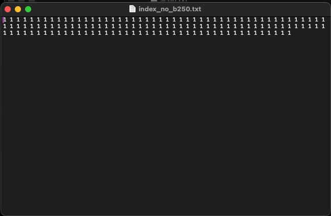

Each 1 in index_no_b250.txt points to line 1 of acqp.txt, telling eddy to use that set of phase-encoding parameters for the corresponding volume. Because the b=250 volumes were dropped earlier, only the remaining shells are listed, all mapped to the same acquisition direction.

**Outputs (per subject)**
```
derivatives/eddyoutput/<subj>/
├── data.nii.gz                     → corrected DWI
├── bvals, bvecs                    → gradients (updated & rotated)
├── nodif_brain_mask.nii.gz         → brain mask from Step 9
├── cnr_maps.nii.gz                 → contrast-to-noise maps
└── eddy QC files/                  → .eddy_rotated_bvecs, .eddy_outlier_report, etc.

```

Our code will use the FSL ```eddy``` function, and it will use the following call
```bash
eddy --imain="$mrdegibbs_dir/${subj}_dwi_no_b250.nii.gz" \   # input 4D DWI
     --mask="$topup_dir/${subj}_topup_Tmean_brain_mask.nii.gz" \   # brain mask
     --acqp="$acq_params_file" \   # acq params (phase-encoding)
     --index="$index_file" \       # index file mapping vols → acq lines
     --bvecs="$mrdegibbs_dir/${subj}_dwi_no_b250.bvec" \   # input bvecs
     --bvals="$mrdegibbs_dir/${subj}_dwi_no_b250.bval" \   # input bvals
     --topup="$topup_dir/${subj}_topup" \   # TOPUP field estimate prefix
     --out="$out_dir/${subj}_eddy" \        # eddy output prefix
     --cnr_maps \   # write CNR maps
     --repol \      # replace outlier slices - very important!
     -v             # verbose output
```


Eddy is computationally intensive and can take a few hours, so we will again run with nohup. In practice it does not fully use all available RAM/cores, which means it is safe and  preferable to parallelize across multiple subjects.

**Before running EDDY, we will check our copmuting power**
```bash
free -h
              total        used        free      shared  buff/cache   available
Mem:          125Gi        10Gi        66Gi        60Mi        48Gi       113Gi
Swap:         2.0Gi       5.0Mi       2.0Gi

```
We cap eddy at 8 parallel jobs because each run typically uses ~6–10 GB of memory, and with ~113 GB free this keeps total usage well within safe limits. This balance avoids overloading the system while still speeding up processing by running multiple participants at once.

(We likely could have run more than 8 in parallel, but chose a conservative cap.)

**Running Eddy in Nohup**: 
1. **Creat script in Nano**
```bash
nano run_eddy.sh**
```
2. **Paste the following code into Nano**: 
```bash
#!/bin/bash

# Base directories
nifti_base="/data/projects/STUDIES/IMPACT/DTI/NIFTI"
denoise_dir="/data/projects/STUDIES/IMPACT/DTI/derivatives/denoise"
topup_base="/data/projects/STUDIES/IMPACT/DTI/derivatives/TOPUP"
eddy_base="/data/projects/STUDIES/IMPACT/DTI/derivatives/EDDY"

acq_params_file="/data/projects/STUDIES/IMPACT/DTI/config/acqp.txt"
index_file="/data/projects/STUDIES/IMPACT/DTI/config/index_no_b250.txt"

# Function to run EDDY for one subject
process_subj() {
    subj=$1
    echo ">>> [$subj] Running EDDY"

    mrdegibbs_dir="$denoise_dir/$subj/mrdegibbs_no_b250"
    topup_dir="$topup_base/$subj/topup_output"
    out_dir="$eddy_base/$subj"
    mkdir -p "$out_dir"

    eddy \
        --imain="$mrdegibbs_dir/${subj}_dwi_no_b250.nii.gz" \
        --mask="$topup_dir/${subj}_topup_Tmean_brain_mask.nii.gz" \
        --acqp="$acq_params_file" \
        --index="$index_file" \
        --bvecs="$mrdegibbs_dir/${subj}_dwi_no_b250.bvec" \
        --bvals="$mrdegibbs_dir/${subj}_dwi_no_b250.bval" \
        --topup="$topup_dir/${subj}_topup" \
        --out="$out_dir/${subj}_eddy" \
        --cnr_maps \
        --repol \
        -v

    echo ">>> [$subj] Done"
}

export -f process_subj
export denoise_dir topup_base eddy_base acq_params_file index_file

subjects=$(ls -1 "$nifti_base")

# Run up to 8 jobs in parallel
if command -v parallel > /dev/null; then
    echo "$subjects" | parallel -j 8 process_subj {}
else
    max_jobs=8
    job_count=0
    for subj in $subjects; do
        process_subj "$subj" &
        ((job_count++))
        if (( job_count >= max_jobs )); then
            wait -n
            ((job_count--))
        fi
    done
    wait
fi

echo "=== All EDDY jobs finished ==="

```

3. **Save and exit nano:**
Press Ctrl+O then Enter to save
Press Ctrl+X to close

4. **Make the script runnable**
```bash
 chmod +x run_eddy.sh
 ```
5. **Run with nohup so it survives SSH disconnects**
```bash
 nohup ./run_eddy.sh >eddy.log 2>&1 & 
 ```
6. **Watch progress in real time**
We can still watch the progress even though it is running outside of the ssh!
```bash
tail -f eddy.log
```
- Even if you disconnect, the job keeps running. When you reconnect later, you can just run the same tail -f eddy.log command to pick up the log again.

**Expected File Output (Per Subject):**
```
derivatives/EDDY/s1000/
│
├── s1000_eddy.nii.gz          # corrected diffusion data
├── s1000_eddy.eddy_parameters # motion + eddy current params
├── s1000_eddy.eddy_cnr_maps.nii.gz  # contrast-to-noise ratio maps (from --cnr_maps)
├── s1000_eddy.eddy_outlier_map  # outlier replacement info (from --repol)
├── s1000_eddy.eddy_outlier_n_stdev_map  # stdev map of outlier replacement
├── s1000_eddy.eddy_outlier_report  # text report of outlier volumes
├── s1000_eddy.eddy_post_eddy_shell_alignment_parameters  # shell alignment
├── s1000_eddy.eddy_post_eddy_shell_PE_translation_parameters
├── s1000_eddy.eddy_movement_rms  # motion summary (RMS displacement)
├── s1000_eddy.eddy_restricted_movement_rms
└── s1000_eddy.eddy_command_txt   # record of the full eddy command used
```
**Audit script to make sure eddy was run succesfuly**:
```bash
#!/bin/bash
# Audit Step: EDDY outputs

nifti_base="/data/projects/STUDIES/IMPACT/DTI/NIFTI"
eddy_base="/data/projects/STUDIES/IMPACT/DTI/derivatives/EDDY"

printf "Subject\tNII\tParams\tCNR\tOutlierMap\n"

for subj in $(ls -1 "$nifti_base"); do
    out_dir="$eddy_base/$subj"

    nii="$out_dir/${subj}_eddy.nii.gz"
    params="$out_dir/${subj}_eddy.eddy_parameters"
    cnr="$out_dir/${subj}_eddy.eddy_cnr_maps.nii.gz"
    outmap="$out_dir/${subj}_eddy.eddy_outlier_map"

    [[ -f "$nii" ]] && niistat="✅" || niistat="❌"
    [[ -f "$params" ]] && pstat="✅" || pstat="❌"
    [[ -f "$cnr" ]] && cnrstat="✅" || cnrstat="❌"
    [[ -f "$outmap" ]] && omapstat="✅" || omapstat="❌"

    printf "%s\t%s\t%s\t%s\t%s\n" "$subj" "$niistat" "$pstat" "$cnrstat" "$omapstat"
done

echo -e "\n=== EDDY audit finished ==="
```
**NOTE:** If EDDY fails to complete for one or more participants, see the guide linked here: Pipeline_Failure_Recovery.md. It provides code for auditing the issue and instructions for re-running earlier steps for that participant if necessary.


### Post EDDY Outlier Checks 

**For eddy, it is crucial to conduct quality assurance and outlier removal.**

- **Note**: An outlier is defined as a slice whose average intensity is at least four standard deviations lower than the expected intensity, where the expectation is given by the Gaussian Process prediction.

**We will handle outliers in 3 ways:**

1. The --repol flag, used in the EDDY code above, instructs EDDY to remove any slices deemed as movement outliers and replace them with predictions made by the Gaussian process 

2. We will use the EDDY-quad/squad quality control tool to calculate avg. absolute motion per participant - so we can exclude anybody with >2mm of absolute motion.
    - **Note**- for reporting purposes -  for this step we will also calculate Mean, SD of absolute motion, and of absolute outlier slices. 

3. Using FSLeyes, we will visually inspect all volumes for each participant, and any participant with more than five volumes with excessive intensity artifacts were excluded.

To run these scripts: 

1. The repol flag step is handled in the eddy script, so let's start with eddy Quad (step 2)

2. Eddy QUAD/SQUAD: 

**The script will use the following FSL functions:**

- eddy_quad — runs QC on a single subject’s EDDY outputs.
- eddy_squad — aggregates QUAD outputs across all subjects to create group-level reports

**Required input (output from EDDY step):**
- Eddy output prefix:
/data/projects/STUDIES/IMPACT/DTI/derivatives/EDDY/<subj>/<subj>_eddy
- Brain mask:
/data/projects/STUDIES/IMPACT/DTI/derivatives/TOPUP/<subj>/topup_output/<subj>_topup_Tmean_brain_mask.nii.gz
- B-values (with b=250 removed):
/data/projects/STUDIES/IMPACT/DTI/derivatives/denoise/<subj>/mrdegibbs_no_b250/<subj>_dwi_no_b250.bval
- B-vectors (with b=250 removed):
/data/projects/STUDIES/IMPACT/DTI/derivatives/denoise/<subj>/mrdegibbs_no_b250/<subj>_dwi_no_b250.bvec
- Acquisition parameters file:
/data/projects/STUDIES/IMPACT/DTI/config/acqp.txt
- Index file (after dropping b=250 vols):
/data/projects/STUDIES/IMPACT/DTI/config/index_no_b250.txt

Additionally - SQUAD expects a text file listing QUAD subject dirs containing qc.json - this script creates the creation file. 
```
quad_list="$quad_base/quad_list.txt"
: > "$quad_list"
```

Quad and Squad jobs are low-intensity (mainly file I/O and small FSL utilities), so it’s safe to parallelize them. We cap at 60 concurrent runs which covered all participants in impact. If you have a larger sample consider checking availabe computing power first, but you should be good to go.
 
  This will compile the participant movement metrics with the total absolute motion and outlier %'s from SQUAD into a text file. The group-level SQUAD and summary steps run only after all per-subject jobs complete. 

* **Note**: If the outputs aren’t combining succesfuly into a single qc_summary.txt file, you can run QUAD and SQUAD manually and check each participant’s output. However, the combined QC file is much more convenient, so try to run it this way first and troubleshoot as needed 

Lastly - the script below is ***long*** because it combines quad, squad, and a script to combine them into one txt output. Feel free to only extract the quad and squad functions you need, or to run these 3 functions one at a time. 


```bash
#!/bin/bash
# ============================================================
# IMPACT DTI QC Pipeline (QUAD -> quad_list.txt -> SQUAD -> summary)
# Notes:
# - SQUAD expects a text file listing QUAD subject dirs containing qc.json - this script creates that file. 
# - Do NOT pre-create $squad_base (eddy_squad will create it)
# - "Outlier slice" = slice whose mean intensity is ≥ 4 SD below expected
# ============================================================

set -u -o pipefail
export OMP_NUM_THREADS=1
export MKL_NUM_THREADS=1 OPENBLAS_NUM_THREADS=1 NUMEXPR_NUM_THREADS=1

# --- Paths ---
nifti_base="/data/projects/STUDIES/IMPACT/DTI/NIFTI"
denoise_base="/data/projects/STUDIES/IMPACT/DTI/derivatives/denoise"
eddy_base="/data/projects/STUDIES/IMPACT/DTI/derivatives/EDDY"
topup_base="/data/projects/STUDIES/IMPACT/DTI/derivatives/TOPUP"
quad_base="/data/projects/STUDIES/IMPACT/DTI/derivatives/QUAD"
squad_base="/data/projects/STUDIES/IMPACT/DTI/derivatives/SQUAD"

acq_params="/data/projects/STUDIES/IMPACT/DTI/config/acqp.txt"
index_file="/data/projects/STUDIES/IMPACT/DTI/config/index_no_b250.txt"

out_txt="/data/projects/STUDIES/IMPACT/DTI/derivatives/qc_summary.txt"

quad_list="$quad_base/quad_list.txt"
: > "$quad_list"

# -------------------- Step 1: QUAD -------------------------
echo ">>> Step 1: running QUAD in parallel (max 60)..."

ls -1 "$nifti_base" | xargs -n 1 -P 60 -I{} bash -c '
  subj="{}"
  mask_file="'"$topup_base"'/$subj/topup_output/${subj}_topup_Tmean_brain_mask.nii.gz"
  bval_file="'"$denoise_base"'/$subj/mrdegibbs_no_b250/${subj}_dwi_no_b250.bval"
  bvec_file="'"$denoise_base"'/$subj/mrdegibbs_no_b250/${subj}_dwi_no_b250.bvec"
  eddy_prefix="'"$eddy_base"'/$subj/${subj}_eddy"
  out_dir="'"$quad_base"'/$subj"

  if [[ -f "$mask_file" && -f "$bval_file" && -f "$bvec_file" && -f "${eddy_prefix}.nii.gz" ]]; then
    echo ">>> QUAD: $subj"
    rm -rf "$out_dir"
    eddy_quad "$eddy_prefix" \
      -idx "'"$index_file"'" \
      -par "'"$acq_params"'" \
      -m "$mask_file" \
      -b "$bval_file" \
      -g "$bvec_file" \
      -o "$out_dir"
  else
    echo "!! Skipping $subj (missing inputs)"
  fi
'

# -------------------- Step 2: SQUAD ------------------------
echo ">>> Step 2: rebuilding quad_list (only QUADs with qc.json) and running SQUAD..."

find "$quad_base" -mindepth 1 -maxdepth 1 -type d \
  -exec test -f "{}/qc.json" \; -print | sort > "$quad_list"

nsubj=$(wc -l < "$quad_list" | tr -d " ")
echo "Found $nsubj subjects for SQUAD."
if [[ "$nsubj" -eq 0 ]]; then
  echo "!! quad_list.txt is empty; skipping SQUAD"
else
  # Optional: ensure a clean SQUAD run
  # rm -rf "$squad_base"

  echo "Running eddy_squad..."
  eddy_squad "$quad_list" -o "$squad_base" || echo "!! eddy_squad failed; continuing to summary with available data"
fi

# -------------------- Step 3: Summary ----------------------
echo ">>> Step 3: collating per-subject (QUAD) + group metrics (SQUAD)..."
{
  echo "QC Summary — IMPACT DTI"
  echo "Exclusion threshold: >2 mm average absolute motion"
  echo
  echo "Per-subject results:"
} > "$out_txt"

per_subj_tmp=$(mktemp)
excl_tmp=$(mktemp)

while IFS= read -r subj_dir; do
  subj=$(basename "$subj_dir")
  qc_file="$subj_dir/qc.json"
  [[ -f "$qc_file" ]] || continue

  abs_motion=$(python3 - <<PY "$qc_file"
import json,sys
d=json.load(open(sys.argv[1]))
print(d.get('qc_mot_abs') or d.get('avg_abs_motion') or "NA")
PY
)
  rel_motion=$(python3 - <<PY "$qc_file"
import json,sys
d=json.load(open(sys.argv[1]))
print(d.get('qc_mot_rel') or "NA")
PY
)
  out_prop=$(python3 - <<PY "$qc_file"
import json,sys
d=json.load(open(sys.argv[1]))
v=d.get('qc_outliers_tot') or d.get('outlier_prop')
print("" if v is None else v)
PY
)

  if [[ -n "$out_prop" ]]; then
    # qc_outliers_tot is already expressed as percent of slices
    out_pct=$(awk -v v="$out_prop" 'BEGIN{printf("%.2f",v)}')
  else
    out_pct="NA"
  fi

  printf "%s\tavg_abs_motion=%smm\trel_motion=%smm\toutlier_slices=%s%%\n" \
    "$subj" "$abs_motion" "$rel_motion" "$out_pct" >> "$per_subj_tmp"

  awk -v m="${abs_motion:-0}" -v s="$subj" 'BEGIN{ if (m+0>2.0) print s }' >> "$excl_tmp"
done < "$quad_list"

sort "$per_subj_tmp" >> "$out_txt"
echo >> "$out_txt"
echo "Exclusions (>2 mm):" >> "$out_txt"
if [[ -s "$excl_tmp" ]]; then
  sort "$excl_tmp" >> "$out_txt"
else
  echo "None" >> "$out_txt"
fi

# --- group stats from SQUAD group_db.json ---
group_db="$squad_base/group_db.json"
if [[ -f "$group_db" ]]; then
  echo >> "$out_txt"
  echo "Group-level metrics (from SQUAD group_db.json):" >> "$out_txt"

  python3 - "$group_db" >> "$out_txt" <<'PY'
import json, sys, numpy as np
path = sys.argv[1]
with open(path) as f:
    d = json.load(f)

motions = np.array(d.get("qc_motion", []), dtype=float)
outliers = np.array(d.get("qc_outliers", []), dtype=float)

if motions.size > 0:
    print(f"Mean (SD) average absolute motion across participants = {motions.mean():.2f} ({motions.std(ddof=1):.2f}) mm")
else:
    print("Mean (SD) average absolute motion across participants = NA (NA) mm")

if outliers.size > 0:
    print(f"Mean (SD) frequency of outlier slices = {outliers.mean():.2f}% ({outliers.std(ddof=1):.2f}%)")
else:
    print("Mean (SD) frequency of outlier slices = NA (NA)%")
PY
else
  echo >> "$out_txt"
  echo "!! No group_db.json found — group metrics unavailable" >> "$out_txt"
fi

rm -f "$per_subj_tmp" "$excl_tmp"

echo "=== Done. Summary written to: $out_txt ==="
tail -n 20 "$out_txt"


```

This will compile the participant movement metrics with the total absolute motion and outlier %'s from SQUAD into a text file. 

The following forum confirms that we have correctly interpreted our quad/output when converting it to  a summary txt file: https://www.jiscmail.ac.uk/cgi-bin/wa-jisc.exe?A2=FSL%3B8570b55c.1904&utm: 

```
qc_mot_abs → abs_motion
qc_mot_rel → rel_motion
qc_outliers_tot (or outlier_prop) → out_prop → out_pct
From group_db.json:
"qc_motion" → motions
"qc_outliers" → outliers
```
I moved this summary file and the SQUAD output onto a local computer in order to check output.
```bash
scp -Cp tur50045@cla19097.tu.temple.edu:/data/projects/STUDIES/IMPACT/DTI/derivatives/qc_summary.txt \
       tur50045@cla19097.tu.temple.edu:/data/projects/STUDIES/IMPACT/DTI/derivatives/SQUAD \
       /Users/dannyzweben/Desktop/SDN/DTI/eddyqc/
```            
Here is what our combine qc summary looks like:

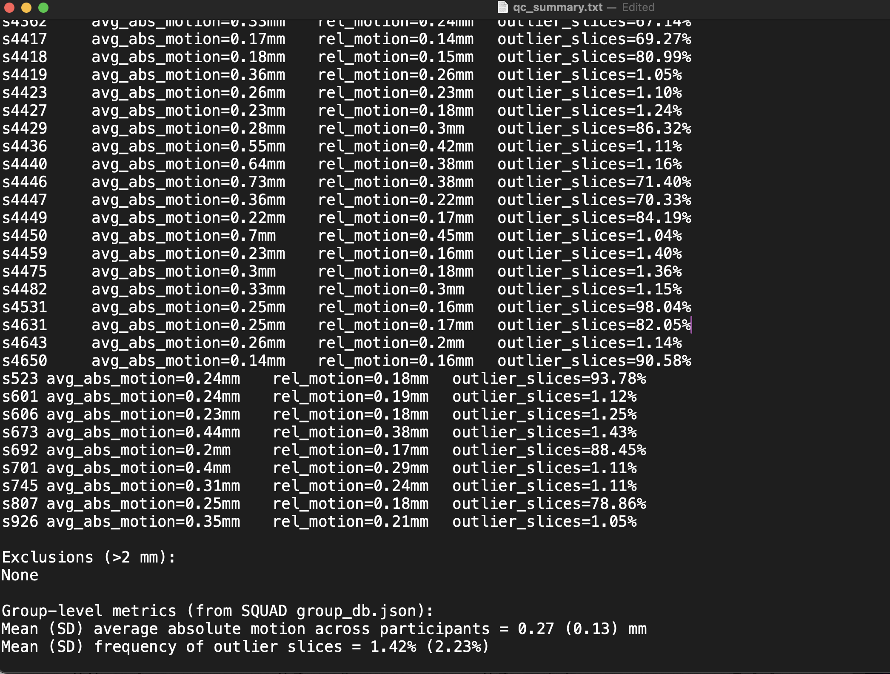

**Interpretation:** We found that head motion was low across participants, with mean average absolute motion of 0.27 mm (SD = 0.13), and no subjects exceeded the 2 mm exclusion threshold. Mean frequency of outlier slices was 1.42% (SD = 2.23%). 


**Fsl squad** will also produce a pdf with this output: 

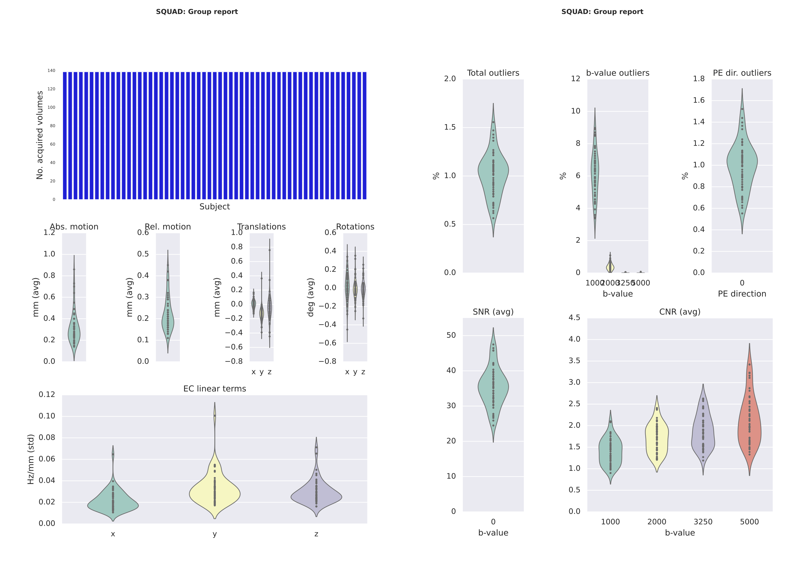


3. **Lastly, for step 3, we will visually inspect the eddy output for each participant to exlcude those with >5 volumes with visible eddy motion artifacts.** 

Data will be visually inspected for motion-related and signal-intensity artifacts in the EDDY-corrected diffusion volumes, and participants with more than five volumes showing excessive signal dropout or distortion were excluded from further analysis.

Volumes with visible horizontal banding or clean slice lines indicating within-volume motion or signal corruption were marked as outliers: 

* Below is an example of a volume that would be indicated as having excessive/outlier motion: 

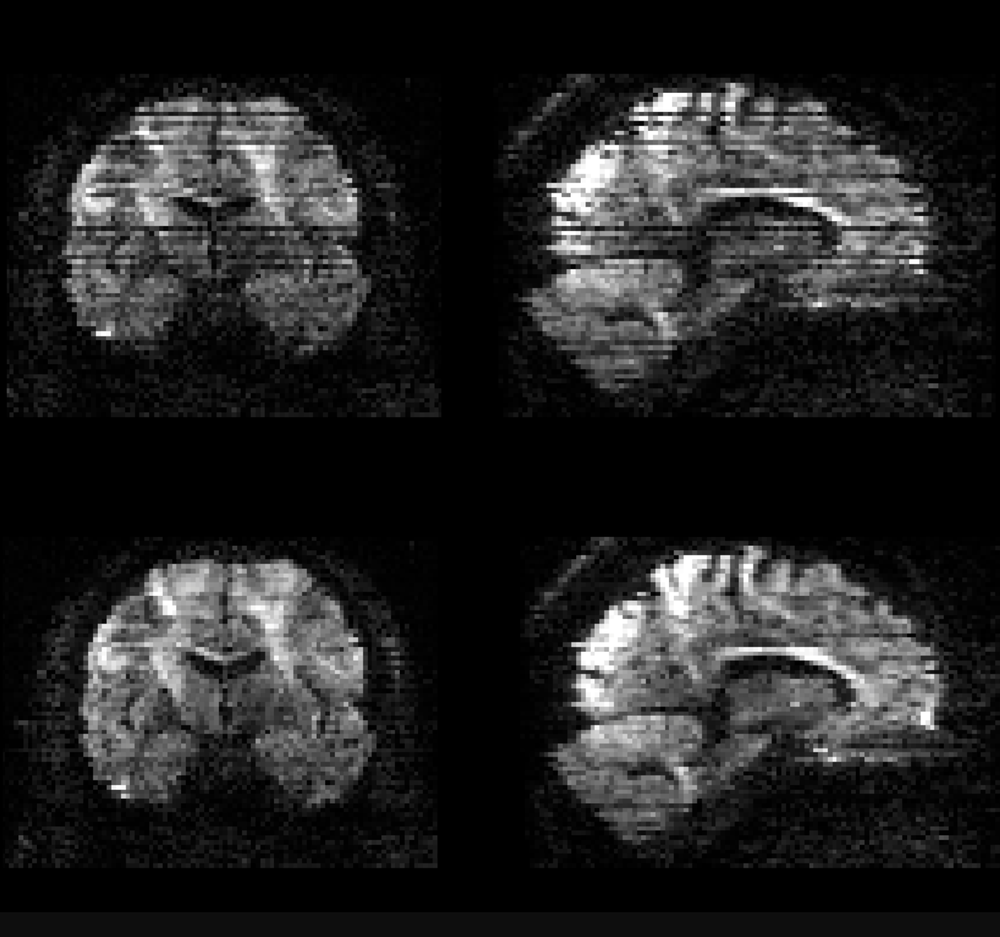


This step will use FSL. Because I prefer to run fsleyes externally to the Linux I copied these files locally: 
```bash
rsync -avz \
tur50045@cla19097:/data/projects/STUDIES/IMPACT/DTI/derivatives/EDDY/ \
/Users/dannyzweben/Desktop/SDN/DTI/eddyqc/manualcheck/ \
--include="*/" \
--include="*eddy_outlier_free_data.nii.gz" \
--exclude="*"
```


Next, we'll open fsleyes, to begin manually inspecting each participant. 


1.  **Open FSLeyes**

From terminal, launch:
```bash
fsleyes
```

2. Open participant level eddy data 

When FSL opens, hit the plus button in the bottom left, to add an image. Add the eddy output data for a given subject. Make sure it is the output that utlized eddy repol (####_eddy.eddy_outlier_free_data)

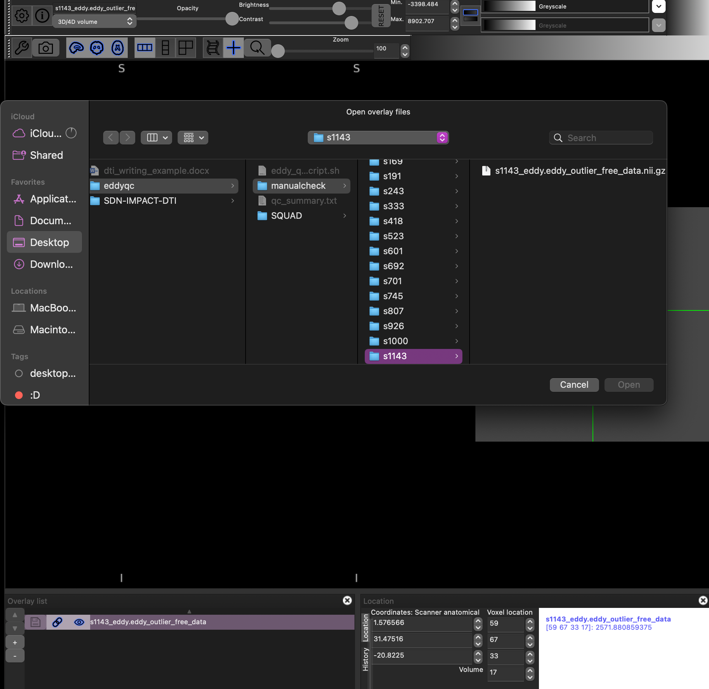


3. Adjust brightness/contrast, and begin inspecting each volume. 

Next, for each participant, adjust the brightness and contrast until you find a level for which each volume will be visible, and begin inspecting each volume for execssive motion, which would like like the example given above.

 Make sure you inspect every volume. This can be done relatively quickly for each volume
(note: the example below depicts volumes where no outliers are detected)


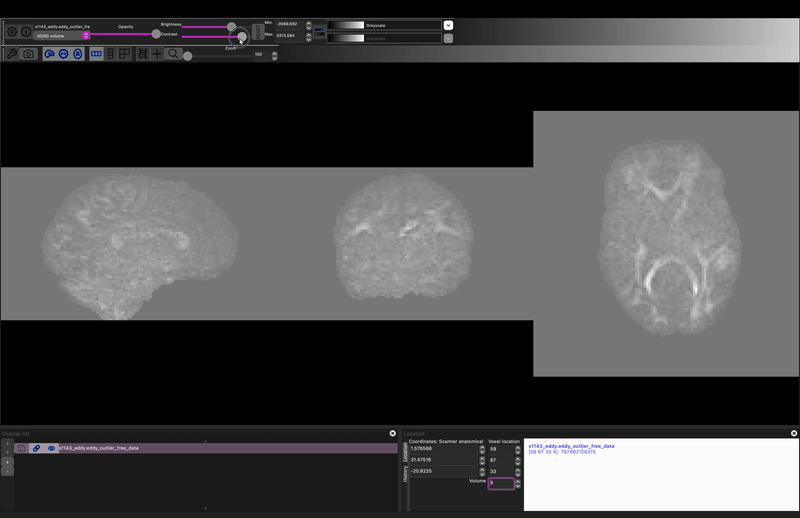     

**Note:** Very minor motion may appear as ***slight*** blurring or ghosting across slices and is acceptable.

Example: 

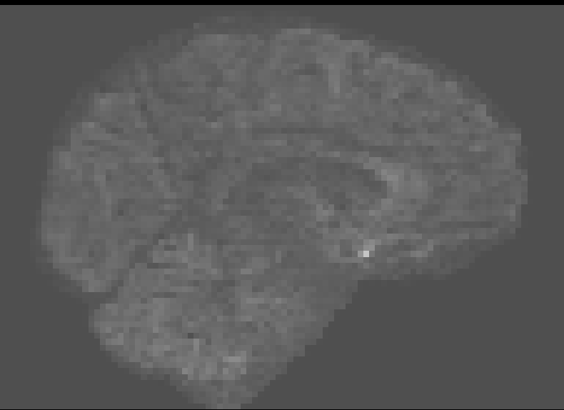


 In contrast, outlier volumes - depicted earlier - show distinct horizontal bands or sharp slice discontinuities that indicate severe motion or signal dropout. 

In a data tracker, for each participant, list which volumes are outliers. **If it is more than 5** exlcude that participant. 


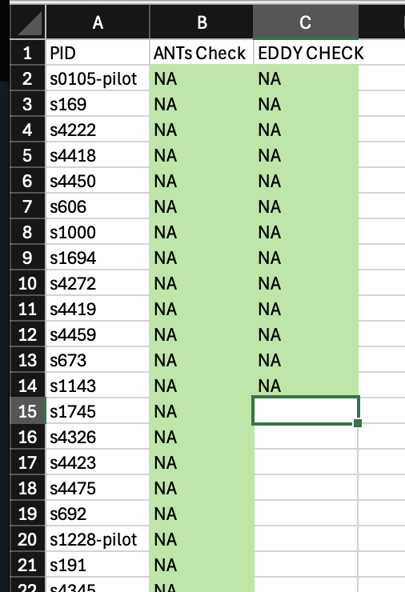


Repeat this step for all participants. 

---
## Step 9: BedpostX

FSL BEDPOSTX (Bayesian Estimation of Diffusion Parameters Obtained using Sampling Techniques) fits a multi-fiber diffusion model at each voxel.

- Uses Markov Chain Monte Carlo (MCMC) sampling to estimate distributions of fiber orientations.
- Provides the probabilistic fiber model that is required for probabilistic tractography (probtrackx2).
- Without this step, tractography would assume only a single tensor per voxel, missing crossing/kissing fibers and producing biased streamlines.

**Inputs (per subject)**

- * Note - make sure to use the version of eddy output with outliers replaced (see below)
From eddy step: 
- <subj>_eddy.eddy_outlier_free_data.nii.gz → eddy-corrected DWI (with repol; falls back to <subj>_eddy.nii.gz if not present)
- <subj>_eddy.eddy_rotated_bvecs → rotated b-vectors
- <subj>_dwi_no_b250.bval (from denoise step, unchanged by eddy) → b-values

From topup: 
- nodif_brain_mask.nii.gz → brain mask (collapsed b0)

The code will create a folder, derivatives/bedpostx_input, and rename the eddy files to FSL expected files names

**Outputs (per subject)**
```
derivatives/BEDPOSTX/s1000/
│
├── bedpostx_input/                      # input directory prepared for bedpostx
│   ├── data.nii.gz                      # eddy-corrected diffusion data
│   ├── bvecs                            # eddy-rotated gradient directions
│   ├── bvals                            # corresponding b-values
│   └── nodif_brain_mask.nii.gz          # binary brain mask (from TOPUP mean b0)
│
└── bedpostx_input.bedpostX/             # main output directory created by bedpostx
    ├── dyads1.nii.gz                    # principal fiber orientation (direction)
    ├── mean_f1samples.nii.gz            # mean fiber fraction (fiber 1)
    ├── mean_th1samples.nii.gz           # mean theta (fiber 1)
    ├── mean_ph1samples.nii.gz           # mean phi (fiber 1)
    ├── merged_f1samples.nii.gz          # merged MCMC samples for fiber 1
    ├── merged_th1samples.nii.gz         # merged MCMC samples for theta (fiber 1)
    ├── merged_ph1samples.nii.gz         # merged MCMC samples for phi (fiber 1)
    ├── merged_f2samples.nii.gz          # merged MCMC samples for fiber 2
    ├── merged_th2samples.nii.gz         # merged MCMC samples for theta (fiber 2)
    ├── merged_ph2samples.nii.gz         # merged MCMC samples for phi (fiber 2)
    ├── merged_f3samples.nii.gz          # merged MCMC samples for fiber 3
    ├── merged_th3samples.nii.gz         # merged MCMC samples for theta (fiber 3)
    └── merged_ph3samples.nii.gz         # merged MCMC samples for phi (fiber 3)

 ```

- **Note:** Unlike TOPUP/EDDY, which is moderately parallel and safe to run many subjects at once, BEDPOSTX is far more CPU-intensive, using MCMC sampling voxel-by-voxel. We cap threads per job (e.g., 4) and then parallelize across subjects dynamically, so the node stays busy without oversubscribing cores.

Because this is going to run for a long time, we will run the script in nohup, so it survives SSH disruptions. 

1. Create the run_topup.sh script Open nano to create the script file:
```bash
nano run_bedpostx.sh
```
Paste the following into nano: 

```bash
#!/bin/bash
# ============================================================
# Step 9: BEDPOSTX (IMPACT DTI)
# ============================================================
# Prepares inputs and runs bedpostx for each subject
# Dynamically parallelizes across available cores
# Outputs go to: derivatives/BEDPOSTX/<subj>.bedpostX/
# ============================================================

set -u -o pipefail

# --- Paths ---
nifti_base="/data/projects/STUDIES/IMPACT/DTI/NIFTI"
eddy_base="/data/projects/STUDIES/IMPACT/DTI/derivatives/EDDY"
denoise_base="/data/projects/STUDIES/IMPACT/DTI/derivatives/denoise"
topup_base="/data/projects/STUDIES/IMPACT/DTI/derivatives/TOPUP"
bedpostx_base="/data/projects/STUDIES/IMPACT/DTI/derivatives/BEDPOSTX"

mkdir -p "$bedpostx_base"

# --- Dynamic resource detection ---
ncores=$(nproc)              # total CPU cores
threads_per_job=4            # cores used *inside* each bedpostx
max_jobs=$(( ncores / threads_per_job ))

echo "Detected $ncores cores → running up to $max_jobs jobs in parallel"
export OMP_NUM_THREADS=$threads_per_job
export MKL_NUM_THREADS=$threads_per_job
export OPENBLAS_NUM_THREADS=$threads_per_job
export NUMEXPR_NUM_THREADS=$threads_per_job

# --- Subject processing function ---
process_subj() {
    subj=$1
    echo ">>> [$subj] Preparing and running bedpostx"

    out_dir="$bedpostx_base/$subj"
    mkdir -p "$out_dir/bedpostx_input"

    # Copy and rename into FSL’s expected filenames
    cp "$eddy_base/$subj/${subj}_eddy.nii.gz"                  "$out_dir/bedpostx_input/data.nii.gz"
    cp "$eddy_base/$subj/${subj}_eddy.eddy_rotated_bvecs"      "$out_dir/bedpostx_input/bvecs"
    cp "$denoise_base/$subj/mrdegibbs_no_b250/${subj}_modified_bval.bval" \
       "$out_dir/bedpostx_input/bvals"
    cp "$topup_base/$subj/topup_output/${subj}_topup_Tmean_brain_mask.nii.gz" \
       "$out_dir/bedpostx_input/nodif_brain_mask.nii.gz"

    # Run bedpostx
    bedpostx "$out_dir/bedpostx_input"
}

export -f process_subj
export eddy_base denoise_base topup_base bedpostx_base

# --- Loop through subjects with job control ---
subjects=$(ls -1 "$nifti_base")

job_count=0
for subj in $subjects; do
    process_subj "$subj" &
    ((job_count++))
    if (( job_count >= max_jobs )); then
        wait -n
        ((job_count--))
    fi
done

wait
echo "=== All BEDPOSTX jobs finished ==="

```
3. Save and exit nano: Press Ctrl+O then Enter to save Press Ctrl+X to close

4. Make the script runnable
```bash
 chmod +x run_bedpostx.sh 
```
5. Run with nohup so it survives SSH disconnections
```bash
 nohup ./run_bedpostx.sh > bedpostx.log 2>&1 & 
```
6. Watch progress in real time We can still watch the progress even though it is running outside of the ssh!
```bash
tail -f bedpostx.log
```
Even if you disconnect, the job keeps running. When you reconnect later, you can just run the same tail -f topup.log command to pick up the log again. This log will also be SAVED and can be checked later if you encounter errors

**Audit script to make sure that bedpostx was run properly for each participant**
```bash
#!/bin/bash
# ============================================================
# Simple BEDPOSTX Audit (IMPACT DTI)
# ============================================================
# Checks only the main expected outputs:
# dyads1, mean_f1/th1/ph1, merged f/th/ph (fibers 1–3)
# ============================================================

nifti_base="/data/projects/STUDIES/IMPACT/DTI/NIFTI"
bedpostx_base="/data/projects/STUDIES/IMPACT/DTI/derivatives/BEDPOSTX"

printf "Subject\tdyads1\tmean_f1\tmean_th1\tmean_ph1\tf1\tth1\tph1\tf2\tth2\tph2\tf3\tth3\tph3\n"

for subj in $(ls -1 "$nifti_base"); do
    subj_dir="$bedpostx_base/$subj/bedpostx_input.bedpostX"

    dyads=$([ -f "$subj_dir/dyads1.nii.gz" ] && echo "✅" || echo "❌")
    meanf1=$([ -f "$subj_dir/mean_f1samples.nii.gz" ] && echo "✅" || echo "❌")
    meanth1=$([ -f "$subj_dir/mean_th1samples.nii.gz" ] && echo "✅" || echo "❌")
    meanph1=$([ -f "$subj_dir/mean_ph1samples.nii.gz" ] && echo "✅" || echo "❌")

    f1=$([ -f "$subj_dir/merged_f1samples.nii.gz" ] && echo "✅" || echo "❌")
    th1=$([ -f "$subj_dir/merged_th1samples.nii.gz" ] && echo "✅" || echo "❌")
    ph1=$([ -f "$subj_dir/merged_ph1samples.nii.gz" ] && echo "✅" || echo "❌")

    f2=$([ -f "$subj_dir/merged_f2samples.nii.gz" ] && echo "✅" || echo "❌")
    th2=$([ -f "$subj_dir/merged_th2samples.nii.gz" ] && echo "✅" || echo "❌")
    ph2=$([ -f "$subj_dir/merged_ph2samples.nii.gz" ] && echo "✅" || echo "❌")

    f3=$([ -f "$subj_dir/merged_f3samples.nii.gz" ] && echo "✅" || echo "❌")
    th3=$([ -f "$subj_dir/merged_th3samples.nii.gz" ] && echo "✅" || echo "❌")
    ph3=$([ -f "$subj_dir/merged_ph3samples.nii.gz" ] && echo "✅" || echo "❌")

    printf "%s\t%s\t%s\t%s\t%s\t%s\t%s\t%s\t%s\t%s\t%s\t%s\t%s\t%s\n" \
      "$subj" "$dyads" "$meanf1" "$meanth1" "$meanph1" \
      "$f1" "$th1" "$ph1" "$f2" "$th2" "$ph2" "$f3" "$th3" "$ph3"
done

echo -e "\n=== BEDPOSTX Audit Finished ==="
```
---
## Step 10: DWI Shell Extraction

Following EDDY and BEDPOSTX preprocessing, we next extract diffusion-weighted imaging (DWI) volumes corresponding to specific b-value shells for downstream modeling and visualization.
This step uses MRtrix3’s dwiextract command, which isolates all volumes matching specified b-values (e.g., 0, 1000, 2000 s/mm²) and exports the corresponding gradient tables.

* **Note: As with BEDPOSTX, this step is performed primarily to prepare data for probabilistic tractography (e.g., MRtrix or FSL probtrackx2). It is not required for pyAFQ or other microstructure analyses, though it is advisable to run it regardless so the data remain ready for future tractography or modeling decisions.**

In our case, we extract two datasets per participant:

1. b=0 and b=1000 volumes
2. b=0, b=1000, and b=2000 volumes

Each extraction produces a 4D image containing only the selected shells, along with new .bvec and .bval files corresponding to those shells.

**Our code will use the following Inputs (output from the BEDPOSTX preparation step):** 
1. Eddy-corrected DWI data (per subject):
- /data/projects/STUDIES/IMPACT/DTI/derivatives/BEDPOSTX/<subj>/bedpostx_input/data.nii.gz
2. Gradient tables (per subject):
- /data/projects/STUDIES/IMPACT/DTI/derivatives/BEDPOSTX/<subj>/bedpostx_input/bvecs
- /data/projects/STUDIES/IMPACT/DTI/derivatives/BEDPOSTX/<subj>/bedpostx_input/bvals

**Outputs (per subject):** 
```
derivatives/mrtrix3_1000/s1000/
│
├── data_1000.nii.gz         # DWI volumes including only b=0 and b=1000 shells
├── bvecs_1000               # gradient directions for b=0,1000 data
└── bvals_1000               # corresponding b-values

derivatives/mrtrix3_2000/s1000/
│
├── data_1000_2000.nii.gz    # DWI volumes including b=0, b=1000, and b=2000 shells
├── bvecs_1000_2000          # gradient directions for b=0,1000,2000 data
└── bvals_1000_2000          # corresponding b-values
```

**This task is very lightweight, and thus can be pasted directly in the SSH terminal and easily parallelized acorss all 60 participants. If you have more participants than this, you can adjust accordingly.** 

**Paste the following into the terminal**: 

```bash
#!/bin/bash
###############################################################################
# 🧠 IMPACT DTI — Parallel DWIEXTRACT (live + logged output, stable + safe)
###############################################################################

# --- consistent logging (no SSH close) ---
log_file="$HOME/dwiextract.log"
: > "$log_file"   # clear previous run
echo "=== Starting DWIEXTRACT ===" | tee -a "$log_file"

# --- base directories ---
base_dir="/data/projects/STUDIES/IMPACT/DTI/derivatives/BEDPOSTX"
mrtrix3_1000_base="/data/projects/STUDIES/IMPACT/DTI/derivatives/mrtrix3_1000"
mrtrix3_2000_base="/data/projects/STUDIES/IMPACT/DTI/derivatives/mrtrix3_2000"

mkdir -p "$mrtrix3_1000_base" "$mrtrix3_2000_base"

# --- function: process one subject ---
process_subj() {
    subj="$1"
    subj_dir="$base_dir/$subj/bedpostx_input"

    echo ">>> [$subj] START" | tee -a "$log_file"

    mkdir -p "$mrtrix3_1000_base/$subj" "$mrtrix3_2000_base/$subj"

    echo ">>> [$subj] Running dwiextract (b=0,1000)" | tee -a "$log_file"
    dwiextract \
        -fslgrad "$subj_dir/bvecs" "$subj_dir/bvals" \
        -shells 0,1000 \
        "$subj_dir/data.nii.gz" \
        "$mrtrix3_1000_base/$subj/data_1000.nii.gz" \
        -export_grad_fsl \
        "$mrtrix3_1000_base/$subj/bvecs_1000" \
        "$mrtrix3_1000_base/$subj/bvals_1000" \
        -force 2>&1 | tee -a "$log_file"

    echo ">>> [$subj] Running dwiextract (b=0,1000,2000)" | tee -a "$log_file"
    dwiextract \
        -fslgrad "$subj_dir/bvecs" "$subj_dir/bvals" \
        -shells 0,1000,2000 \
        "$subj_dir/data.nii.gz" \
        "$mrtrix3_2000_base/$subj/data_1000_2000.nii.gz" \
        -export_grad_fsl \
        "$mrtrix3_2000_base/$subj/bvecs_1000_2000" \
        "$mrtrix3_2000_base/$subj/bvals_1000_2000" \
        -force 2>&1 | tee -a "$log_file"

    echo ">>> [$subj] DONE" | tee -a "$log_file"
}

export -f process_subj
export base_dir mrtrix3_1000_base mrtrix3_2000_base log_file

# --- find and run subjects in parallel (no hang, no wait) ---
subjects=$(find "$base_dir" -mindepth 1 -maxdepth 1 -type d -exec basename {} \;)
count=$(echo "$subjects" | wc -l)
echo "Found $count subjects. Running up to 60 in parallel..." | tee -a "$log_file"

echo "$subjects" | xargs -n 1 -P 60 -I {} bash -c 'process_subj "$@"' _ {} | tee -a "$log_file"

echo "=== All DWIEXTRACT jobs finished successfully ===" | tee -a "$log_file"

```
Note: All coding output from this script is recorded in dwiextract.log


**AUDIT script to make sure dwi extract worked properly for all participants**

```bash

#!/bin/bash
# ============================================================
# DWI Extract Audit — IMPACT DTI
# ============================================================
# Cross-checks that every subject in NIFTI base has
# corresponding dwiextract outputs in mrtrix3_1000 and mrtrix3_2000
# ============================================================

nifti_base="/data/projects/STUDIES/IMPACT/DTI/NIFTI"
mrtrix3_1000_base="/data/projects/STUDIES/IMPACT/DTI/derivatives/mrtrix3_1000"
mrtrix3_2000_base="/data/projects/STUDIES/IMPACT/DTI/derivatives/mrtrix3_2000"

printf "Subject\tdata_1000\tbvecs_1000\tbvals_1000\tdata_1000_2000\tbvecs_1000_2000\tbvals_1000_2000\n"

for subj in $(ls -1 "$nifti_base"); do
    # paths for b=1000 outputs
    data1000="$mrtrix3_1000_base/$subj/data_1000.nii.gz"
    bvec1000="$mrtrix3_1000_base/$subj/bvecs_1000"
    bval1000="$mrtrix3_1000_base/$subj/bvals_1000"

    # paths for b=2000 outputs
    data2000="$mrtrix3_2000_base/$subj/data_1000_2000.nii.gz"
    bvec2000="$mrtrix3_2000_base/$subj/bvecs_1000_2000"
    bval2000="$mrtrix3_2000_base/$subj/bvals_1000_2000"

    # ✅/❌ checks
    d1000=$([ -f "$data1000" ] && echo "✅" || echo "❌")
    bv1000=$([ -f "$bvec1000" ] && echo "✅" || echo "❌")
    bl1000=$([ -f "$bval1000" ] && echo "✅" || echo "❌")

    d2000=$([ -f "$data2000" ] && echo "✅" || echo "❌")
    bv2000=$([ -f "$bvec2000" ] && echo "✅" || echo "❌")
    bl2000=$([ -f "$bval2000" ] && echo "✅" || echo "❌")

    printf "%s\t%s\t%s\t%s\t%s\t%s\t%s\n" \
      "$subj" "$d1000" "$bv1000" "$bl1000" "$d2000" "$bv2000" "$bl2000"
done

echo -e "\n=== DWI Extract Audit Complete ==="
```
---
## Step 11 Tensor Fitting (DTIFIT)

After extracting the desired diffusion shells (b=0, 1000), the next step is to fit a diffusion tensor model to each participant’s DWI data. This is done using FSL’s dtifit, which estimates voxelwise diffusion tensor parameters including fractional anisotropy (FA), mean diffusivity (MD), axial diffusivity (AD/L1), and radial diffusivity (RD, derived as the mean of L2 and L3).

* Note: This model assumes diffusion is Gaussian within each voxel, which holds true at lower b-values (≤1000 s/mm²).Including higher shells (e.g., b=2000) can bias tensor estimates, so for DTIFIT, we restrict input to b=0 and b=1000 volumes.

The DTIFIT tool requires four key inputs per subject:
1. The diffusion-weighted image (data_1000.nii.gz)
2. Corresponding gradient direction files (bvecs_1000, bvals_1000)
3. A binary brain mask to constrain tensor fitting to brain voxels
4. An output prefix to specify where to save resulting tensor maps

**Expected Input structure:**
1. DWI data (b=0 and 1000 only):
- /data/projects/STUDIES/IMPACT/DTI/derivatives/mrtrix3_1000/<subj>/data_1000.nii.gz
2. Gradient tables:
- /data/projects/STUDIES/IMPACT/DTI/derivatives/mrtrix3_1000/<subj>/bvecs_1000
- /data/projects/STUDIES/IMPACT/DTI/derivatives/mrtrix3_1000/<subj>/bvals_1000
3. Brain mask:
/data/projects/STUDIES/IMPACT/DTI/derivatives/TOPUP/<subj>/topup_output/<subj>_topup_Tmean_brain_mask.nii.gz

**Outputs (per subject):**
```
derivatives/DTIFIT_OUTPUT/s1000/
│
├── DTI_FA.nii.gz      # fractional anisotropy map (0–1, white-matter integrity)
├── DTI_MD.nii.gz      # mean diffusivity map (overall diffusion magnitude)
├── DTI_L1.nii.gz      # axial diffusivity (principal eigenvalue)
├── DTI_L2.nii.gz      # secondary eigenvalue
├── DTI_L3.nii.gz      # tertiary eigenvalue
└── DTI_RD.nii.gz      # radial diffusivity, computed as (L2 + L3) / 2
```


**This task is very lightweight, and thus can be pasted directly in the SSH terminal and easily parallelized acorss all 60 participants. If you have more participants than this, you can adjust accordingly.** 

**Paste the following into the terminal**: 

```bash
#!/bin/bash
# ============================================================
# 🧠 IMPACT DTI — Step 11: Tensor Fitting (DTIFIT)
# ============================================================

source /usr/local/fsl/etc/fslconf/fsl.sh
export FSLOUTPUTTYPE=NIFTI_GZ

# --- Safe logging (no exec redirection, no SSH close) ---
log_file="$HOME/dtifit.log"
: > "$log_file"
echo "=== Starting DTIFIT ===" | tee -a "$log_file"

# --- Base directories ---
mrtrix3_1000_base="/data/projects/STUDIES/IMPACT/DTI/derivatives/mrtrix3_1000"
topup_base="/data/projects/STUDIES/IMPACT/DTI/derivatives/TOPUP"
dtifit_base="/data/projects/STUDIES/IMPACT/DTI/derivatives/DTIFIT_OUTPUT"
mkdir -p "$dtifit_base"

# --- Function ---
process_subj() {
    subj="$1"
    subj_mrtrix="$mrtrix3_1000_base/$subj"
    subj_topup="$topup_base/$subj/topup_output"
    subj_out="$dtifit_base/$subj"
    mkdir -p "$subj_out"

    data="$subj_mrtrix/data_1000.nii.gz"
    bvec="$subj_mrtrix/bvecs_1000"
    bval="$subj_mrtrix/bvals_1000"
    mask="$subj_topup/${subj}_topup_Tmean_brain_mask.nii.gz"

    if [[ ! -f "$data" || ! -f "$bvec" || ! -f "$bval" || ! -f "$mask" ]]; then
        echo "!!! [$subj] Missing input(s). Skipping." | tee -a "$log_file"
        return
    fi

    echo ">>> [$subj] Running DTIFIT" | tee -a "$log_file"
    {
        dtifit -k "$data" -o "$subj_out/DTI" -m "$mask" -r "$bvec" -b "$bval"

        if [[ -f "$subj_out/DTI_L2.nii.gz" && -f "$subj_out/DTI_L3.nii.gz" ]]; then
            echo ">>> [$subj] Calculating RD = (L2+L3)/2"
            fslmaths "$subj_out/DTI_L2.nii.gz" -add "$subj_out/DTI_L3.nii.gz" \
                     -div 2 "$subj_out/DTI_RD.nii.gz"
        else
            echo "!!! [$subj] Missing L2/L3 for RD computation"
        fi

        echo ">>> [$subj] Done"
    } 2>&1 | tee -a "$log_file"
}

export -f process_subj
export mrtrix3_1000_base topup_base dtifit_base log_file

# --- Parallel run ---
subjects=$(ls -1 "$mrtrix3_1000_base")
count=$(echo "$subjects" | wc -l)
echo "Found $count subjects. Running up to 60 in parallel..." | tee -a "$log_file"

echo "$subjects" | xargs -n 1 -P 60 -I {} bash -c 'process_subj "$@"' _ {} | tee -a "$log_file"

echo "=== All $count DTIFIT jobs finished successfully ===" | tee -a "$log_file"
```
Note: All coding output from this script is recorded in dtifit.log

**Audit script to ensure DTIFIT ran for everyone**

```bash
#!/bin/bash
###############################################################################
# 🧠 IMPACT DTI — DTIFIT Audit (compare against NIFTI base)
###############################################################################

nifti_base="/data/projects/STUDIES/IMPACT/DTI/NIFTI"
dtifit_base="/data/projects/STUDIES/IMPACT/DTI/derivatives/DTIFIT_OUTPUT"

printf "Subject\tFA\tMD\tL1\tL2\tL3\tRD\n"

for subj in $(ls -1 "$nifti_base"); do
    out_dir="$dtifit_base/$subj"

    fa="$out_dir/DTI_FA.nii.gz"
    md="$out_dir/DTI_MD.nii.gz"
    l1="$out_dir/DTI_L1.nii.gz"
    l2="$out_dir/DTI_L2.nii.gz"
    l3="$out_dir/DTI_L3.nii.gz"
    rd="$out_dir/DTI_RD.nii.gz"

    fa_chk=$([ -f "$fa" ] && echo "✅" || echo "❌")
    md_chk=$([ -f "$md" ] && echo "✅" || echo "❌")
    l1_chk=$([ -f "$l1" ] && echo "✅" || echo "❌")
    l2_chk=$([ -f "$l2" ] && echo "✅" || echo "❌")
    l3_chk=$([ -f "$l3" ] && echo "✅" || echo "❌")
    rd_chk=$([ -f "$rd" ] && echo "✅" || echo "❌")

    printf "%s\t%s\t%s\t%s\t%s\t%s\t%s\n" \
      "$subj" "$fa_chk" "$md_chk" "$l1_chk" "$l2_chk" "$l3_chk" "$rd_chk"
done

echo -e "\n=== DTIFIT Audit Complete ==="
```

## Step 12: FLIRT and CONVERT (Spatial Alignment and Standardization)

After tensor fitting, each participant’s diffusion-derived maps (FA, MD, RD, AD) remain in their native diffusion space. For many group-level or visualization analyses, however, these images must be aligned to a common reference space so that every voxel corresponds to the same anatomical location across participants.
This alignment step—performed using FSL’s FLIRT (FMRIB Linear Image Registration Tool)—creates spatially standardized versions of the scalar maps.

* Note: While pyAFQ handles its own registration and doesn’t require pre-aligned FA maps, running FLIRT is still useful for quality control, future voxelwise or atlas-based analyses, and maintaining standardized, shareable outputs for visualization or cross-study compatibility.

**Inputs (per subject)**

1. FA map (moving image)
- /data/projects/STUDIES/IMPACT/DTI/derivatives/DTIFIT_OUTPUT/<subj>/DTI_FA.nii.gz
2. Template / reference image (fixed)
- /data/projects/STUDIES/IMPACT/DTI/ANTsTemplate/FA_template.nii.gz
3. Output directory
/data/projects/STUDIES/IMPACT/DTI/derivatives/FLIRT/<subj>/

**Expected File Output (Per Subject):**
```
derivatives/FLIRT/s1000/
│
├── DTI_FA_flirted.nii.gz          # FA map aligned to the study or MNI template
├── DTI_FA_to_template.mat         # affine transform matrix (FA → template)
├── DTI_MD_flirted.nii.gz          # MD map transformed using same matrix
├── DTI_RD_flirted.nii.gz          # RD map transformed using same matrix
├── DTI_AD_flirted.nii.gz          # AD (L1) map transformed using same matrix
└── flirt_command.txt              # record of the full FLIRT command used
```

**This task is very lightweight, and thus can be pasted directly in the SSH terminal and easily parallelized acorss all 60 participants. If you have more participants than this, you can adjust accordingly.** 

**Past the following into the SSH terminal:**
```bash
#!/bin/bash
# ============================================================
# 🧠 IMPACT DTI — Step 12: FLIRT + CONVERT (Spatial Alignment)
# ============================================================

source /usr/local/fsl/etc/fslconf/fsl.sh
export FSLOUTPUTTYPE=NIFTI_GZ

# --- Logging ---
log_file="$HOME/flirtconvert.log"
: > "$log_file"
echo "=== Starting FLIRT + CONVERT ===" | tee -a "$log_file"

# --- Directories ---
ants_base="/data/projects/STUDIES/IMPACT/DTI/derivatives/ANTs"
topup_base="/data/projects/STUDIES/IMPACT/DTI/derivatives/TOPUP"
transform_base="/data/projects/STUDIES/IMPACT/DTI/derivatives/TRANSFORMS"
template_ref="/usr/local/fsl/data/standard/MNI152_T1_2mm_brain.nii.gz"

mkdir -p "$transform_base"

# --- Function: Run FLIRT + CONVERT for one subject ---
process_subj() {
    subj="$1"
    subj_ants="$ants_base/$subj"
    subj_topup="$topup_base/$subj/topup_output"
    subj_out="$transform_base/$subj"
    mkdir -p "$subj_out"

    t1_brain="$subj_ants/${subj}_BrainExtractionBrain.nii.gz"
    b0_brain="$subj_topup/${subj}_topup_Tmean_brain.nii.gz"

    # Skip if missing input
    if [[ ! -f "$t1_brain" || ! -f "$b0_brain" ]]; then
        echo "!!! [$subj] Missing input(s), skipping" | tee -a "$log_file"
        return
    fi

    echo ">>> [$subj] Running FLIRT + CONVERT" | tee -a "$log_file"

    flirt -in "$b0_brain" -ref "$t1_brain" \
        -omat "$subj_out/diff2str_${subj}.mat" \
        -searchrx -90 90 -searchry -90 90 -searchrz -90 90 \
        -dof 6 -cost corratio

    convert_xfm -omat "$subj_out/str2diff_${subj}.mat" \
        -inverse "$subj_out/diff2str_${subj}.mat"

    flirt -in "$t1_brain" -ref "$template_ref" \
        -omat "$subj_out/str2standard_${subj}.mat" \
        -searchrx -90 90 -searchry -90 90 -searchrz -90 90 \
        -dof 12 -cost corratio

    convert_xfm -omat "$subj_out/standard2str_${subj}.mat" \
        -inverse "$subj_out/str2standard_${subj}.mat"

    convert_xfm -omat "$subj_out/diff2standard_${subj}.mat" \
        -concat "$subj_out/str2standard_${subj}.mat" "$subj_out/diff2str_${subj}.mat"

    convert_xfm -omat "$subj_out/standard2diff_${subj}.mat" \
        -inverse "$subj_out/diff2standard_${subj}.mat"

    echo ">>> [$subj] Done" | tee -a "$log_file"
}

export -f process_subj
export ants_base topup_base transform_base template_ref log_file

# --- Parallel Run ---
subjects=$(ls -1 "$ants_base")
echo "Found $(echo "$subjects" | wc -l) subjects. Running up to 60 in parallel..." | tee -a "$log_file"

echo "$subjects" | xargs -n 1 -P 60 -I {} bash -c 'process_subj "$@"' _ {}

echo "=== All FLIRT + CONVERT jobs finished ===" | tee -a "$log_file"
```

Note: All coding output from this script is recorded in flirtconvert.log

**Flirt and Convert Audit Script**
```bash
#!/bin/bash
# ============================================================
# 🧠 IMPACT DTI — Step 12 Audit: FLIRT + CONVERT Outputs
# ============================================================

ants_base="/data/projects/STUDIES/IMPACT/DTI/derivatives/ANTs"
transform_base="/data/projects/STUDIES/IMPACT/DTI/derivatives/TRANSFORMS"

printf "Subject\tdiff2str\tstr2diff\tstr2standard\tstandard2str\tdiff2standard\tstandard2diff\n"

for subj in $(ls -1 "$ants_base"); do
    subj_dir="$transform_base/$subj"

    d2s=$([ -f "$subj_dir/diff2str_${subj}.mat" ] && echo "✅" || echo "❌")
    s2d=$([ -f "$subj_dir/str2diff_${subj}.mat" ] && echo "✅" || echo "❌")
    s2s=$([ -f "$subj_dir/str2standard_${subj}.mat" ] && echo "✅" || echo "❌")
    st2s=$([ -f "$subj_dir/standard2str_${subj}.mat" ] && echo "✅" || echo "❌")
    d2st=$([ -f "$subj_dir/diff2standard_${subj}.mat" ] && echo "✅" || echo "❌")
    st2d=$([ -f "$subj_dir/standard2diff_${subj}.mat" ] && echo "✅" || echo "❌")

    printf "%s\t%s\t%s\t%s\t%s\t%s\t%s\n" \
      "$subj" "$d2s" "$s2d" "$s2s" "$st2s" "$d2st" "$st2d"
done

echo -e "\n=== FLIRT + CONVERT Audit Complete ==="
```

## Step 13: Intracranial Volume (ICV Estimation)


ICV (total volume of CSF, gray matter, and white matter) is estimated from each participant’s skull-stripped T1 image using ANTs’ Atropos segmentation. This value is often used as a covariate in diffusion analyses to control for individual differences in head size.
ICV is estimated by segmenting T1 images into CSF, GM, and WM using ANTs’ Atropos, then summing their volumes with FSL’s fslstats.

**Inputs (per subject):**
1. Brain-extracted T1 image
- /data/projects/STUDIES/IMPACT/DTI/derivatives/ANTs/<subj>/<subj>_BrainExtractionBrain.nii.gz
2. Brain mask
- /data/projects/STUDIES/IMPACT/DTI/derivatives/ANTs/<subj>/<subj>_BrainExtractionMask.nii.gz

Expected File Output (per subject):
```
derivatives/ICV/<subj>/
├── anat/
│   ├── <subj>_BrainExtractionBrain_segmentation_labelled.nii.gz   → 3-class segmentation
│   ├── <subj>_BrainExtractionBrain_segmentation_prob01.nii.gz     → CSF probability map
│   ├── <subj>_BrainExtractionBrain_segmentation_prob02.nii.gz     → GM probability map
│   └── <subj>_BrainExtractionBrain_segmentation_prob03.nii.gz     → WM probability map
└── icv_results.csv                                                → total ICV summary (CSF+GM+WM)
```
**This task is very lightweight, and thus can be pasted directly in the SSH terminal and easily parallelized acorss all 60 participants. If you have more participants than this, you can adjust accordingly.** 

**Paste the following into the terminal:**
```bash
#!/bin/bash
# ============================================================
# 🧠 IMPACT DTI — Step 13: Intracranial Volume (ICV) Estimation
# ============================================================

source /usr/local/fsl/etc/fslconf/fsl.sh
export FSLOUTPUTTYPE=NIFTI_GZ

ANTs_bin="/data/tools/ANTs/bin"
ants_base="/data/projects/STUDIES/IMPACT/DTI/derivatives/ANTs"
icv_base="/data/projects/STUDIES/IMPACT/DTI/derivatives/ICV"
csv_file="$icv_base/icv_results.csv"
log_file="$HOME/icv.log"

mkdir -p "$icv_base"
: > "$log_file"
echo "participant_id,brain_file_name,ICV_mm3" > "$csv_file"

# --- Function to process one subject ---
process_subj() {
    subj="$1"
    subj_dir="$ants_base/$subj"
    brain_file="$subj_dir/${subj}_BrainExtractionBrain.nii.gz"
    mask_file="$subj_dir/${subj}_BrainExtractionMask.nii.gz"
    out_dir="$icv_base/$subj"
    mkdir -p "$out_dir"

    echo ">>> [$subj] Running Atropos segmentation..." | tee -a "$log_file"

    # Segmentation (probabilistic)
    "$ANTs_bin/Atropos" -d 3 \
        -a "$brain_file" \
        -x "$mask_file" \
        -i KMeans[3] \
        -c [5,0.001] \
        -m [0.3,1x1x1] \
        -o ["$out_dir/${subj}_seg_labelled.nii.gz","$out_dir/${subj}_seg_prob%02d.nii.gz"]

    # Ensure segmentation maps exist
    if [[ ! -f "$out_dir/${subj}_seg_prob01.nii.gz" ]]; then
        echo "!!! [$subj] Segmentation failed — missing prob maps." | tee -a "$log_file"
        return
    fi

    # Compute ICV
    csf=$(fslstats "$out_dir/${subj}_seg_prob01.nii.gz" -V | awk '{print $2}')
    gm=$(fslstats "$out_dir/${subj}_seg_prob02.nii.gz" -V | awk '{print $2}')
    wm=$(fslstats "$out_dir/${subj}_seg_prob03.nii.gz" -V | awk '{print $2}')

    icv=$(echo "$csf + $gm + $wm" | bc)
    echo "$subj,$(basename "$brain_file"),$icv" >> "$csv_file"

    echo ">>> [$subj] Done (ICV = ${icv} mm³)" | tee -a "$log_file"
}

export -f process_subj
export ANTs_bin ants_base icv_base csv_file log_file

# --- Parallel run ---
subjects=$(ls -1 "$ants_base")
max_jobs=20  # adjust based on system load

echo "Found $(echo "$subjects" | wc -l) subjects. Running up to $max_jobs in parallel..." | tee -a "$log_file"

echo "$subjects" | xargs -n 1 -P "$max_jobs" -I {} bash -c 'process_subj "$@"' _ {}

echo "=== All ICV jobs finished. Results in $csv_file ===" | tee -a "$log_file"


```
* Note - all coding from the icv step will be saved to icv.log

**Audit ICV script**

```bash
#!/bin/bash
# ============================================================
# 🧠 IMPACT DTI — Step 13 Audit: Intracranial Volume (ICV)
# ============================================================

nifti_base="/data/projects/STUDIES/IMPACT/DTI/NIFTI"
ants_base="/data/projects/STUDIES/IMPACT/DTI/derivatives/ANTs"
icv_base="/data/projects/STUDIES/IMPACT/DTI/derivatives/ICV"
csv_file="$icv_base/icv_results.csv"

printf "Subject\tBrain\tMask\tProb01\tProb02\tProb03\tCSV\n"

# Loop over subjects that exist in the NIFTI base (expected participants)
for subj in $(ls -1 "$nifti_base"); do
    subj_ants="$ants_base/$subj"
    subj_icv="$icv_base/$subj"

    # Expected ANTs input files
    brain="$subj_ants/${subj}_BrainExtractionBrain.nii.gz"
    mask="$subj_ants/${subj}_BrainExtractionMask.nii.gz"

    # Expected ICV output files
    prob01="$subj_icv/${subj}_seg_prob01.nii.gz"
    prob02="$subj_icv/${subj}_seg_prob02.nii.gz"
    prob03="$subj_icv/${subj}_seg_prob03.nii.gz"

    # Checks
    b_check=$([ -f "$brain" ] && echo "✅" || echo "❌")
    m_check=$([ -f "$mask" ] && echo "✅" || echo "❌")
    p1_check=$([ -f "$prob01" ] && echo "✅" || echo "❌")
    p2_check=$([ -f "$prob02" ] && echo "✅" || echo "❌")
    p3_check=$([ -f "$prob03" ] && echo "✅" || echo "❌")

    csv_check=$([ -f "$csv_file" ] && grep -q "^$subj," "$csv_file" 2>/dev/null && echo "✅" || echo "❌")

    printf "%s\t%s\t%s\t%s\t%s\t%s\t%s\n" \
        "$subj" "$b_check" "$m_check" "$p1_check" "$p2_check" "$p3_check" "$csv_check"
done

echo -e "\n=== ICV Audit Complete ==="
```

## Step 14: PYAFQ - BIDS and Running AFQ 

This script organizes all preprocessed DTI outputs (from EDDY, BEDPOSTX, and ANTs) into a BIDS-compliant directory structure expected by pyAFQ.
The goal is to take your finalized diffusion and anatomical data — already denoised, motion- and distortion-corrected, and brain-extracted — and place them in a standardized format so pyAFQ can automatically find and process each subject’s data.

| Data Type                          | Source Derivative                                        | Conceptual Purpose                                                       |
| ---------------------------------- | -------------------------------------------------------- | ------------------------------------------------------------------------ |
| **DWI (diffusion-weighted image)** | **EDDY** (output from motion + eddy-current correction)  | Cleaned diffusion data used for all subsequent modeling and tractography |
| **bvals / bvecs**                  | **BEDPOSTX → bedpostx_input** (copied from EDDY outputs) | Define diffusion gradient strength and direction for each volume         |
| **DWI brain mask**                 | **BEDPOSTX → bedpostx_input/nodif_brain_mask.nii.gz**    | Binary mask delimiting brain voxels for fitting diffusion models         |
| **T1 structural image**            | **NIFTI → struct/** (native T1)                          | Anatomical reference in subject space for coregistration                 |
| **Brain-extracted T1**             | **ANTs → *_BrainExtractionBrain.nii.gz**                 | Skull-stripped version of T1 for improved alignment and tissue contrast  |
| **T1 brain mask**                  | **ANTs → *_BrainExtractionMask.nii.gz**                  | Binary mask defining brain voxels in T1 space                            |

These represent the final, cleaned derivatives from your full DTI pipeline (Denoise → Gibbs → Topup → Eddy → Bedpostx → ANTs).


**What BIDS Is** 

BIDS (Brain Imaging Data Structure) is a community standard for organizing neuroimaging data.
It enforces consistent file naming and folder hierarchy, allowing automated tools like pyAFQ, FSL, or fMRIPrep to locate inputs without manual specification.

In BIDS:
1. Each participant is sub-####
2. Modalities go in dedicated folders (/dwi, /anat)
3. Filenames encode modality and processing details (e.g., _dwi_desc-brain_mask.nii.gz).

pyAFQ automatically locates DWI and T1 data based on BIDS conventions.
It expects:
```
derivatives/
└── sub-####/
    ├── dwi/
    │   ├── sub-####_dwi.nii.gz
    │   ├── sub-####_dwi.bval
    │   ├── sub-####_dwi.bvec
    │   └── sub-####_dwi_desc-brain_mask.nii.gz
    └── anat/
        ├── sub-####_T1w.nii.gz
        ├── sub-####_desc-brain_T1w.nii.gz
        └── sub-####_desc-brain_mask.nii.gz
```

* I didn't parallelize this step because it is already short. 

**Paste the following into the terminal**

```bash
#!/bin/bash
# IMPACT DTI — pyAFQ Prep Script

set -euo pipefail

nifti_base="/data/projects/STUDIES/IMPACT/DTI/NIFTI"
eddy_base="/data/projects/STUDIES/IMPACT/DTI/derivatives/EDDY"
bedpostx_base="/data/projects/STUDIES/IMPACT/DTI/derivatives/BEDPOSTX"
ants_base="/data/projects/STUDIES/IMPACT/DTI/derivatives/ANTs"
pyafq_base="/data/projects/STUDIES/IMPACT/DTI/pyAFQ/derivatives"

log_file="$pyafq_base/_pyAFQ_prep.log"
mkdir -p "$(dirname "$log_file")"

for subj_dir in "$eddy_base"/*/; do
    subj=$(basename "$subj_dir")
    subj_num="${subj#s}"
    echo ">>> $subj" | tee -a "$log_file"

    dwi_src="$eddy_base/$subj/${subj}_eddy.nii.gz"
    bval_src="$bedpostx_base/$subj/bedpostx_input/bvals"
    bvec_src="$bedpostx_base/$subj/bedpostx_input/bvecs"
    dwi_mask_src="$bedpostx_base/$subj/bedpostx_input/nodif_brain_mask.nii.gz"
    t1_src="$nifti_base/$subj/struct/${subj}_struct.nii"
    ants_brain_src="$ants_base/$subj/${subj}_BrainExtractionBrain.nii.gz"
    ants_mask_src="$ants_base/$subj/${subj}_BrainExtractionMask.nii.gz"

    subj_out="$pyafq_base/sub-${subj_num}"
    dwi_out="$subj_out/dwi"
    anat_out="$subj_out/anat"
    mkdir -p "$dwi_out" "$anat_out"

    missing=false
    for f in "$dwi_src" "$bval_src" "$bvec_src" "$dwi_mask_src" "$t1_src" "$ants_brain_src" "$ants_mask_src"; do
        if [ ! -f "$f" ]; then
            echo "Missing: $f" | tee -a "$log_file"
            missing=true
        fi
    done
    if [ "$missing" = true ]; then
        echo "Skipping $subj" | tee -a "$log_file"
        continue
    fi

    cp "$dwi_src" "$dwi_out/sub-${subj_num}_dwi.nii.gz"
    cp "$bval_src" "$dwi_out/sub-${subj_num}_dwi.bval"
    cp "$bvec_src" "$dwi_out/sub-${subj_num}_dwi.bvec"
    cp "$dwi_mask_src" "$dwi_out/sub-${subj_num}_dwi_desc-brain_mask.nii.gz"
    cp "$t1_src" "$anat_out/sub-${subj_num}_T1w.nii"
    cp "$ants_brain_src" "$anat_out/sub-${subj_num}_desc-brain_T1w.nii.gz"
    cp "$ants_mask_src" "$anat_out/sub-${subj_num}_desc-brain_mask.nii.gz"

    echo "Done: $subj" | tee -a "$log_file"
done
```
* Note: All output code from this script will be saved to pyAFQ_prep.log

---

# B. TRACTOGRAPHY: MRtrix3 Constrained Spherical Deconvolution (CSD)

## Why MRtrix? (And why we're going back to BedpostX)

In Step 9, we ran FSL's **BedpostX** — a Bayesian model that estimates fiber orientations at each voxel using a ball-and-stick approach. BedpostX is designed to feed FSL's **probtrackx2**, which produces **voxel-wise** probabilistic tract maps. The problem with voxel-wise maps is that you can only extract a single number — average FA across the entire tract. You cannot split the tract into segments, you cannot run permutation-based cluster correction along the tract, and you cannot use Mahalanobis-distance tract cleaning.

For the IMPACT analysis — testing whether white matter microstructure *along specific segments* of the VTA→hippocampus tract predicts motivated memory — we need **streamline-based tractography**. Streamlines let us:
- Split the tract into **100 evenly-spaced nodes**
- Extract FA (and later NDI/ODI from NODDI) at **each node** per subject
- Run **node-wise permutation testing** to identify which segments of the tract carry the effect
- Apply **Mahalanobis-distance cleaning** (pyAFQ) to remove anatomically implausible streamlines

MRtrix3's **dwi2fod** (Constrained Spherical Deconvolution) → **tckgen** pipeline produces these streamlines. This is the recommended approach for tract-specific microstructure analysis, as confirmed by Ranesh Mopuru (Olson Lab), Blake Elliott, and Linda Hoffman.

**The good news:** BedpostX wasn't wasted. When we ran BedpostX in Step 9, we organized the eddy-corrected DWI data, rotated gradient tables, b-values, and brain mask into a clean `bedpostx_input/` directory — and that is exactly what MRtrix needs as input. So we go back to `BEDPOSTX/<subj>/bedpostx_input/` and feed those same files (`data.nii.gz`, `bvecs`, `bvals`, `nodif_brain_mask.nii.gz`) into the MRtrix CSD pipeline.

**Pipeline adapted from**: Ranesh Mopuru's complete MRtrix tractography pipeline (originally developed for HCP 7T data in the Olson Lab at Temple). His scripts were adapted for our IMPACT 3T multi-shell data with the following key differences:

| | Ranesh (HCP 7T) | IMPACT (3T) |
|---|---|---|
| Skull stripping | mri_synthstrip | ANTs (already done, Step 2) |
| Registration to diffusion space | Not needed (HCP data already T1-aligned) | FLIRT transforms from Step 12 |
| Exclusion ROIs for tractography | 20+ individual hand-drawn exclusion masks | Ranesh's tract atlas (GroupMean_thr50) as single exclusion mask |
| tckgen streamline count | 2500 | 1000 |
| tckgen seeding attempts | 25 million | 5 million |
| FOD cutoff | 0.06 | Start at 0.1, experiment with 0.08 and 0.06 |

**Note on running scripts**: Starting from this section, we use **tmux** instead of nohup. tmux creates a persistent terminal session that survives SSH disconnects and lets you reattach to monitor progress. This is more reliable and flexible than nohup for long-running jobs.

**Quick tmux reference:**
```bash
tmux new -s csd          # create a new session named "csd"
# run your script inside tmux, then:
Ctrl+B, then D           # detach (script keeps running)
tmux attach -t csd       # reattach later
tmux ls                  # list active sessions
tmux kill-session -t csd # kill a session when done
```

---

## Step 15 — MRtrix Conversion (mrconvert)

This step converts the eddy-corrected DWI data and brain mask from NIfTI format into MRtrix's `.mif` format, embedding the gradient table (bvecs/bvals) directly into the image header. This is required for all downstream MRtrix commands (dwi2response, dwi2fod, tckgen, etc.).

We go back to `BEDPOSTX/<subj>/bedpostx_input/` — the same directory we prepared in Step 9 — because it contains the final, clean versions of everything MRtrix needs:
- `data.nii.gz` — eddy-corrected DWI (all shells: b=0, 1000, 2000, 3250, 5000; b=250 already removed)
- `bvecs` — eddy-rotated gradient directions
- `bvals` — corresponding b-values
- `nodif_brain_mask.nii.gz` — binary brain mask

This step uses MRtrix3's `mrconvert` command, which embeds gradient information via the `-fslgrad` flag:
```
mrconvert data.nii.gz -fslgrad bvecs bvals dwi.mif
mrconvert nodif_brain_mask.nii.gz mask.mif
```

**Inputs (per subject):**
- `/data/projects/STUDIES/IMPACT/DTI/derivatives/BEDPOSTX/<subj>/bedpostx_input/data.nii.gz`
- `/data/projects/STUDIES/IMPACT/DTI/derivatives/BEDPOSTX/<subj>/bedpostx_input/bvecs`
- `/data/projects/STUDIES/IMPACT/DTI/derivatives/BEDPOSTX/<subj>/bedpostx_input/bvals`
- `/data/projects/STUDIES/IMPACT/DTI/derivatives/BEDPOSTX/<subj>/bedpostx_input/nodif_brain_mask.nii.gz`

**Expected Output (per subject):**
```
derivatives/CSD/s1000/
│
├── dwi.mif        # DWI data in MRtrix format (gradient table embedded in header)
├── mask.mif       # brain mask in MRtrix format
```

This step is lightweight — mrconvert is essentially a file format conversion. We allow up to 30 parallel jobs.

**Running Step 15 in tmux:**

1. SSH into the cluster and start a tmux session:
```bash
ssh -XY tur50045@cla19097.tu.temple.edu
tmux new -s csd
```

2. Create the script:
```bash
nano run_mrconvert.sh
```

3. Paste the following into nano:
```bash
#!/bin/bash
# ============================================================
# Step 15: Convert DWI to MRtrix format (mrconvert)
# ============================================================
# Converts eddy-corrected DWI + gradients + brain mask from
# NIfTI to MRtrix .mif format for CSD pipeline
# Input: BEDPOSTX/bedpostx_input/ (data.nii.gz, bvecs, bvals, mask)
# Output: CSD/<subj>/dwi.mif, mask.mif
# ============================================================

export PATH=/data/tools/mrtrix3/bin:$PATH

bedpostx_base="/data/projects/STUDIES/IMPACT/DTI/derivatives/BEDPOSTX"
csd_base="/data/projects/STUDIES/IMPACT/DTI/derivatives/CSD"
nifti_base="/data/projects/STUDIES/IMPACT/DTI/NIFTI"

process_subj() {
    subj=$1
    echo ">>> [$subj] Converting to MRtrix format"
    in_dir="$bedpostx_base/$subj/bedpostx_input"
    out_dir="$csd_base/$subj"
    mkdir -p "$out_dir"

    # Skip if inputs missing
    if [[ ! -f "$in_dir/data.nii.gz" || ! -f "$in_dir/bvecs" || ! -f "$in_dir/bvals" || ! -f "$in_dir/nodif_brain_mask.nii.gz" ]]; then
        echo "!!! [$subj] Missing input files, skipping"
        return
    fi

    # Convert DWI with embedded gradient table
    mrconvert "$in_dir/data.nii.gz" \
        -fslgrad "$in_dir/bvecs" "$in_dir/bvals" \
        "$out_dir/dwi.mif" -force

    # Convert brain mask
    mrconvert "$in_dir/nodif_brain_mask.nii.gz" \
        "$out_dir/mask.mif" -force

    echo ">>> [$subj] Done"
}

export -f process_subj
export bedpostx_base csd_base

subjects=$(ls -1 "$nifti_base")
for subj in $subjects; do
    process_subj "$subj" &
    while [ "$(jobs -r | wc -l)" -ge 30 ]; do sleep 1; done
done
wait
echo "=== All MRtrix conversions finished ==="
```

4. Save and exit nano:
Press Ctrl+O then Enter to save
Press Ctrl+X to close

5. Make the script runnable and execute inside tmux:
```bash
chmod +x run_mrconvert.sh
./run_mrconvert.sh 2>&1 | tee mrconvert.log
```

6. Detach from tmux while it runs (if needed):
Press Ctrl+B, then D to detach. Reconnect later with:
```bash
tmux attach -t csd
```
* Note: All coding output from this script is recorded in mrconvert.log.

**Step 15 Audit — verify mrconvert outputs for all subjects:**
```bash
#!/bin/bash
# Audit Step 15: mrconvert outputs

nifti_base="/data/projects/STUDIES/IMPACT/DTI/NIFTI"
csd_base="/data/projects/STUDIES/IMPACT/DTI/derivatives/CSD"

printf "Subject\tdwi.mif\tmask.mif\n"

for subj in $(ls -1 "$nifti_base"); do
    d="$csd_base/$subj"
    dwi=$([ -f "$d/dwi.mif" ] && echo "✅" || echo "❌")
    mask=$([ -f "$d/mask.mif" ] && echo "✅" || echo "❌")
    printf "%s\t%s\t%s\n" "$subj" "$dwi" "$mask"
done

echo -e "\n=== mrconvert Audit Complete ==="
```

---

## Step 16 — Response Function Estimation (dwi2response)

Before we can model fiber orientations, MRtrix needs to know what the diffusion signal looks like inside each tissue type — white matter, gray matter, and CSF. The **Dhollander algorithm** (`dwi2response dhollander`) automatically estimates these tissue-specific "response functions" from each subject's own data, without requiring a T1 image or atlas. It works by identifying voxels that are unambiguously single-tissue (e.g., deep WM, cortical GM, ventricles) and averaging the signal profile within each.

Each subject gets three output files:
- `wm_response.txt` — white matter response function (multi-shell: one row per b-value)
- `gm_response.txt` — gray matter response function
- `csf_response.txt` — CSF response function

In Step 17, we will average these across subjects to create **group response functions**, which then feed into the actual FOD estimation in Step 18. Using group-averaged responses (rather than per-subject) ensures that differences in FODs between subjects reflect genuine biological differences in fiber architecture — not differences in how the response function was estimated.

**Input (per subject — from Step 15):**
- `/data/projects/STUDIES/IMPACT/DTI/derivatives/CSD/<subj>/dwi.mif`
- `/data/projects/STUDIES/IMPACT/DTI/derivatives/CSD/<subj>/mask.mif`

**Expected Output (per subject):**
```
derivatives/CSD/s1000/
│
├── dwi.mif              # (from Step 15)
├── mask.mif             # (from Step 15)
├── wm_response.txt      # white matter response function
├── gm_response.txt      # gray matter response function
├── csf_response.txt     # CSF response function
```

This step is moderately CPU-intensive — we run up to 15 parallel jobs.

**Running Step 16 in tmux:**

1. SSH into the cluster and reattach (or create) the tmux session:
```bash
ssh -XY tur50045@cla19097.tu.temple.edu
tmux attach -t csd || tmux new -s csd
```

2. Create the script:
```bash
nano run_dwi2response.sh
```

3. Paste the following into nano:
```bash
#!/bin/bash
# ============================================================
# Step 16: Estimate per-subject response functions (dwi2response)
# ============================================================
# Uses the Dhollander algorithm to estimate tissue-specific
# response functions (WM, GM, CSF) from each subject's DWI data.
# These are needed for multi-shell multi-tissue CSD (Step 18).
# Input:  CSD/<subj>/dwi.mif, mask.mif
# Output: CSD/<subj>/wm_response.txt, gm_response.txt, csf_response.txt
# ============================================================

export PATH=/data/tools/mrtrix3/bin:$PATH

csd_base="/data/projects/STUDIES/IMPACT/DTI/derivatives/CSD"
nifti_base="/data/projects/STUDIES/IMPACT/DTI/NIFTI"

process_subj() {
    subj=$1
    echo ">>> [$subj] Estimating response functions"
    d="$csd_base/$subj"

    if [[ ! -f "$d/dwi.mif" || ! -f "$d/mask.mif" ]]; then
        echo "!!! [$subj] Missing dwi.mif or mask.mif, skipping"
        return
    fi

    dwi2response dhollander \
        "$d/dwi.mif" \
        "$d/wm_response.txt" \
        "$d/gm_response.txt" \
        "$d/csf_response.txt" \
        -mask "$d/mask.mif" \
        -force

    echo ">>> [$subj] Done"
}

export -f process_subj
export csd_base

subjects=$(ls -1 "$nifti_base")
for subj in $subjects; do
    process_subj "$subj" &
    while [ "$(jobs -r | wc -l)" -ge 15 ]; do sleep 1; done
done
wait
echo "=== All response function estimations finished ==="
```

4. Save and exit nano:
Press Ctrl+O then Enter to save
Press Ctrl+X to close

5. Make the script runnable and execute inside tmux:
```bash
chmod +x run_dwi2response.sh
./run_dwi2response.sh 2>&1 | tee dwi2response.log
```

6. Detach from tmux while it runs (if needed):
Press Ctrl+B, then D to detach. Reconnect later with:
```bash
tmux attach -t csd
```
* Note: All coding output from this script is recorded in dwi2response.log.

**Step 16 Audit — verify dwi2response outputs for all subjects:**
```bash
#!/bin/bash
# Audit Step 16: dwi2response outputs

nifti_base="/data/projects/STUDIES/IMPACT/DTI/NIFTI"
csd_base="/data/projects/STUDIES/IMPACT/DTI/derivatives/CSD"

printf "Subject\twm_response\tgm_response\tcsf_response\n"

for subj in $(ls -1 "$nifti_base"); do
    d="$csd_base/$subj"
    wm=$([ -f "$d/wm_response.txt" ] && echo "✅" || echo "❌")
    gm=$([ -f "$d/gm_response.txt" ] && echo "✅" || echo "❌")
    csf=$([ -f "$d/csf_response.txt" ] && echo "✅" || echo "❌")
    printf "%s\t%s\t%s\t%s\n" "$subj" "$wm" "$gm" "$csf"
done

echo -e "\n=== dwi2response Audit Complete ==="
```

---

## Step 17 — Group-Average Response Functions (responsemean)

Now that every subject has their own tissue-specific response functions (from Step 16), we average them across all subjects to produce a single set of **group response functions**. This is a key recommendation from MRtrix3: using group-averaged responses for FOD estimation ensures that differences in the FOD maps between subjects reflect genuine differences in fiber architecture — not noise from how the response function was estimated for that individual.

This step produces three files that live in the parent `CSD/` directory (not inside any subject folder), since they are shared across all subjects:
- `group_wm_response.txt` — group-average white matter response
- `group_gm_response.txt` — group-average gray matter response
- `group_csf_response.txt` — group-average CSF response

These group responses feed into Step 18 (dwi2fod) for every subject.

**Input (per subject — from Step 16):**
- `/data/projects/STUDIES/IMPACT/DTI/derivatives/CSD/<subj>/wm_response.txt`
- `/data/projects/STUDIES/IMPACT/DTI/derivatives/CSD/<subj>/gm_response.txt`
- `/data/projects/STUDIES/IMPACT/DTI/derivatives/CSD/<subj>/csf_response.txt`

**Expected Output (shared across subjects):**
```
derivatives/CSD/
│
├── group_wm_response.txt     # group-average WM response
├── group_gm_response.txt     # group-average GM response
├── group_csf_response.txt    # group-average CSF response
├── s1000/                    # (per-subject dirs from Steps 15-16)
├── s1001/
├── ...
```

This step is fast — three single commands, no parallelism needed.

**Running Step 17 in tmux:**

1. SSH into the cluster and reattach (or create) the tmux session:
```bash
ssh -XY tur50045@cla19097.tu.temple.edu
tmux attach -t csd || tmux new -s csd
```

2. Create the script:
```bash
nano run_responsemean.sh
```

3. Paste the following into nano:
```bash
#!/bin/bash
# ============================================================
# Step 17: Group-average response functions (responsemean)
# ============================================================
# Averages per-subject response functions across all subjects
# to create group-level WM, GM, CSF response functions.
# MRtrix recommends group-averaged responses for FOD estimation.
# Input:  CSD/<subj>/wm_response.txt, gm_response.txt, csf_response.txt
# Output: CSD/group_wm_response.txt, group_gm_response.txt, group_csf_response.txt
# ============================================================

export PATH=/data/tools/mrtrix3/bin:$PATH

csd_base="/data/projects/STUDIES/IMPACT/DTI/derivatives/CSD"

cd "$csd_base"

echo ">>> Computing group-average WM response"
responsemean */wm_response.txt group_wm_response.txt -info -force

echo ">>> Computing group-average GM response"
responsemean */gm_response.txt group_gm_response.txt -info -force

echo ">>> Computing group-average CSF response"
responsemean */csf_response.txt group_csf_response.txt -info -force

echo "=== Group-average response functions finished ==="
```

4. Save and exit nano:
Press Ctrl+O then Enter to save
Press Ctrl+X to close

5. Make the script runnable and execute inside tmux:
```bash
chmod +x run_responsemean.sh
./run_responsemean.sh 2>&1 | tee responsemean.log
```

6. Detach from tmux while it runs (if needed):
Press Ctrl+B, then D to detach. Reconnect later with:
```bash
tmux attach -t csd
```
* Note: All coding output from this script is recorded in responsemean.log.

**Step 17 Audit — verify group response functions exist:**
```bash
#!/bin/bash
# Audit Step 17: group-average response functions

csd_base="/data/projects/STUDIES/IMPACT/DTI/derivatives/CSD"

echo "=== Group Response Function Audit ==="
for tissue in wm gm csf; do
    f="$csd_base/group_${tissue}_response.txt"
    if [ -f "$f" ]; then
        echo "✅ group_${tissue}_response.txt exists ($(wc -l < "$f") lines)"
    else
        echo "❌ group_${tissue}_response.txt MISSING"
    fi
done

echo -e "\n=== responsemean Audit Complete ==="
```

---

## Step 18 — Fiber Orientation Distribution (dwi2fod MSMT-CSD)

This is the core modeling step — the MRtrix equivalent of what BedpostX did back in Step 9, but better. **Multi-Shell Multi-Tissue Constrained Spherical Deconvolution (MSMT-CSD)** takes each subject's DWI data and decomposes the diffusion signal at every voxel into contributions from white matter, gray matter, and CSF. The result is a **fiber orientation distribution (FOD)** at each voxel — a 3D shape that shows which directions fibers are pointing and how strongly.

The key details:
- We use `dwi2fod msmt_csd` — the multi-shell multi-tissue variant, which takes advantage of all our b-value shells (b=0, 1000, 2000, 3250, 5000) to better separate tissue types.
- We use the **group-averaged response functions** from Step 17 (not per-subject), matching Ranesh's pipeline and MRtrix recommendations.
- Each subject gets three FOD images: `wm_fod.mif` (white matter — this is the one that matters for tractography), `gm_fod.mif`, and `csf_fod.mif`.

**Input (per subject):**
- `/data/projects/STUDIES/IMPACT/DTI/derivatives/CSD/<subj>/dwi.mif` (from Step 15)
- `/data/projects/STUDIES/IMPACT/DTI/derivatives/CSD/<subj>/mask.mif` (from Step 15)
- `/data/projects/STUDIES/IMPACT/DTI/derivatives/CSD/group_wm_response.txt` (from Step 17)
- `/data/projects/STUDIES/IMPACT/DTI/derivatives/CSD/group_gm_response.txt` (from Step 17)
- `/data/projects/STUDIES/IMPACT/DTI/derivatives/CSD/group_csf_response.txt` (from Step 17)

**Expected Output (per subject):**
```
derivatives/CSD/s1000/
│
├── dwi.mif              # (from Step 15)
├── mask.mif             # (from Step 15)
├── wm_response.txt      # (from Step 16)
├── gm_response.txt      # (from Step 16)
├── csf_response.txt     # (from Step 16)
├── wm_fod.mif           # white matter FOD (feeds tractography)
├── gm_fod.mif           # gray matter FOD
├── csf_fod.mif          # CSF FOD
```

This step is CPU-intensive — we run up to 10 parallel jobs.

**Running Step 18 in tmux:**

1. SSH into the cluster and reattach (or create) the tmux session:
```bash
ssh -XY tur50045@cla19097.tu.temple.edu
tmux attach -t csd || tmux new -s csd
```

2. Create the script:
```bash
nano run_dwi2fod.sh
```

3. Paste the following into nano:
```bash
#!/bin/bash
# ============================================================
# Step 18: Generate FODs — Multi-Shell Multi-Tissue CSD (dwi2fod)
# ============================================================
# Uses group-averaged response functions to estimate fiber
# orientation distributions (FODs) for each tissue type.
# This is the MRtrix equivalent of BedpostX fiber modeling.
# Input:  CSD/<subj>/dwi.mif, mask.mif + CSD/group_*_response.txt
# Output: CSD/<subj>/wm_fod.mif, gm_fod.mif, csf_fod.mif
# ============================================================

export PATH=/data/tools/mrtrix3/bin:$PATH

csd_base="/data/projects/STUDIES/IMPACT/DTI/derivatives/CSD"
nifti_base="/data/projects/STUDIES/IMPACT/DTI/NIFTI"

process_subj() {
    subj=$1
    echo ">>> [$subj] Generating FODs (MSMT-CSD)"
    d="$csd_base/$subj"

    if [[ ! -f "$d/dwi.mif" || ! -f "$d/mask.mif" ]]; then
        echo "!!! [$subj] Missing dwi.mif or mask.mif, skipping"
        return
    fi

    if [[ ! -f "$csd_base/group_wm_response.txt" || ! -f "$csd_base/group_gm_response.txt" || ! -f "$csd_base/group_csf_response.txt" ]]; then
        echo "!!! [$subj] Missing group response functions, skipping"
        return
    fi

    dwi2fod -mask "$d/mask.mif" \
        msmt_csd \
        "$d/dwi.mif" \
        "$csd_base/group_wm_response.txt" "$d/wm_fod.mif" \
        "$csd_base/group_gm_response.txt" "$d/gm_fod.mif" \
        "$csd_base/group_csf_response.txt" "$d/csf_fod.mif" \
        -force

    echo ">>> [$subj] Done"
}

export -f process_subj
export csd_base

subjects=$(ls -1 "$nifti_base")
for subj in $subjects; do
    process_subj "$subj" &
    while [ "$(jobs -r | wc -l)" -ge 10 ]; do sleep 1; done
done
wait
echo "=== All FOD estimations finished ==="
```

4. Save and exit nano:
Press Ctrl+O then Enter to save
Press Ctrl+X to close

5. Make the script runnable and execute inside tmux:
```bash
chmod +x run_dwi2fod.sh
./run_dwi2fod.sh 2>&1 | tee dwi2fod.log
```

6. Detach from tmux while it runs (if needed):
Press Ctrl+B, then D to detach. Reconnect later with:
```bash
tmux attach -t csd
```
* Note: All coding output from this script is recorded in dwi2fod.log.

**Step 18 Audit — verify dwi2fod outputs for all subjects:**
```bash
#!/bin/bash
# Audit Step 18: dwi2fod outputs

nifti_base="/data/projects/STUDIES/IMPACT/DTI/NIFTI"
csd_base="/data/projects/STUDIES/IMPACT/DTI/derivatives/CSD"

printf "Subject\twm_fod\tgm_fod\tcsf_fod\n"

for subj in $(ls -1 "$nifti_base"); do
    d="$csd_base/$subj"
    wm=$([ -f "$d/wm_fod.mif" ] && echo "✅" || echo "❌")
    gm=$([ -f "$d/gm_fod.mif" ] && echo "✅" || echo "❌")
    csf=$([ -f "$d/csf_fod.mif" ] && echo "✅" || echo "❌")
    printf "%s\t%s\t%s\t%s\n" "$subj" "$wm" "$gm" "$csf"
done

echo -e "\n=== dwi2fod Audit Complete ==="
```

---

## Step 19 — FOD Normalization (mtnormalise)

Before tractography, we normalize the FOD intensities across tissue types and subjects using `mtnormalise`. This corrects for global intensity differences between subjects (caused by scanner drift, coil sensitivity, etc.) so that the FOD amplitudes are comparable. Without this step, a subject whose scan had slightly higher overall signal intensity would appear to have "stronger" fiber orientations, biasing tractography.

The normalized WM FOD (`wm_fod_norm.mif`) is what feeds into tractography in Steps 23–24.

This step also creates **tissue-concatenated images** (`vf_fod.mif`, `vf_fod_norm.mif`) for visualization and quality checking — matching Ranesh's pipeline. These combine the first spherical harmonic component (l=0) of the WM FOD with the GM and CSF FODs into a single RGB-like image where you can see all three tissue compartments at once in mrview.

**Input (per subject — from Step 18):**
- `/data/projects/STUDIES/IMPACT/DTI/derivatives/CSD/<subj>/wm_fod.mif`
- `/data/projects/STUDIES/IMPACT/DTI/derivatives/CSD/<subj>/gm_fod.mif`
- `/data/projects/STUDIES/IMPACT/DTI/derivatives/CSD/<subj>/csf_fod.mif`
- `/data/projects/STUDIES/IMPACT/DTI/derivatives/CSD/<subj>/mask.mif`

**Expected Output (per subject):**
```
derivatives/CSD/s1000/
│
├── dwi.mif              # (from Step 15)
├── mask.mif             # (from Step 15)
├── wm_response.txt      # (from Step 16)
├── gm_response.txt      # (from Step 16)
├── csf_response.txt     # (from Step 16)
├── wm_fod.mif           # (from Step 18)
├── gm_fod.mif           # (from Step 18)
├── csf_fod.mif          # (from Step 18)
├── wm_fod_norm.mif      # normalized WM FOD → feeds tractography
├── gm_fod_norm.mif      # normalized GM FOD
├── csf_fod_norm.mif     # normalized CSF FOD
├── vf_fod.mif           # tissue concat for visualization
├── vf_fod_norm.mif      # tissue concat (normalized) for visualization
```

This step is moderately CPU-intensive — we run up to 15 parallel jobs.

**Running Step 19 in tmux:**

1. SSH into the cluster and reattach (or create) the tmux session:
```bash
ssh -XY tur50045@cla19097.tu.temple.edu
tmux attach -t csd || tmux new -s csd
```

2. Create the script:
```bash
nano run_mtnormalise.sh
```

3. Paste the following into nano:
```bash
#!/bin/bash
# ============================================================
# Step 19: Normalize FODs (mtnormalise)
# ============================================================
# Normalizes FOD intensities across tissue types and subjects
# so they are comparable. The normalized WM FOD (wm_fod_norm.mif)
# is what feeds into tractography.
# Also creates tissue-concatenated images for visualization/QC.
# Input:  CSD/<subj>/wm_fod.mif, gm_fod.mif, csf_fod.mif, mask.mif
# Output: CSD/<subj>/wm_fod_norm.mif, gm_fod_norm.mif, csf_fod_norm.mif
#         CSD/<subj>/vf_fod.mif, vf_fod_norm.mif (visualization)
# ============================================================

export PATH=/data/tools/mrtrix3/bin:$PATH

csd_base="/data/projects/STUDIES/IMPACT/DTI/derivatives/CSD"
nifti_base="/data/projects/STUDIES/IMPACT/DTI/NIFTI"

process_subj() {
    subj=$1
    echo ">>> [$subj] Normalizing FODs"
    d="$csd_base/$subj"

    if [[ ! -f "$d/wm_fod.mif" || ! -f "$d/gm_fod.mif" || ! -f "$d/csf_fod.mif" || ! -f "$d/mask.mif" ]]; then
        echo "!!! [$subj] Missing FOD or mask files, skipping"
        return
    fi

    # Normalize FODs
    mtnormalise \
        "$d/wm_fod.mif"  "$d/wm_fod_norm.mif" \
        "$d/gm_fod.mif"  "$d/gm_fod_norm.mif" \
        "$d/csf_fod.mif" "$d/csf_fod_norm.mif" \
        -mask "$d/mask.mif" \
        -force

    # Tissue concatenation for visualization (matches Ranesh's pipeline)
    mrconvert -coord 3 0 "$d/wm_fod.mif" - | \
        mrcat "$d/csf_fod.mif" "$d/gm_fod.mif" - "$d/vf_fod.mif" -force

    mrconvert -coord 3 0 "$d/wm_fod_norm.mif" - | \
        mrcat "$d/csf_fod_norm.mif" "$d/gm_fod_norm.mif" - "$d/vf_fod_norm.mif" -force

    echo ">>> [$subj] Done"
}

export -f process_subj
export csd_base

subjects=$(ls -1 "$nifti_base")
for subj in $subjects; do
    process_subj "$subj" &
    while [ "$(jobs -r | wc -l)" -ge 15 ]; do sleep 1; done
done
wait
echo "=== All FOD normalizations finished ==="
```

4. Save and exit nano:
Press Ctrl+O then Enter to save
Press Ctrl+X to close

5. Make the script runnable and execute inside tmux:
```bash
chmod +x run_mtnormalise.sh
./run_mtnormalise.sh 2>&1 | tee mtnormalise.log
```

6. Detach from tmux while it runs (if needed):
Press Ctrl+B, then D to detach. Reconnect later with:
```bash
tmux attach -t csd
```
* Note: All coding output from this script is recorded in mtnormalise.log.

**Step 19 Audit — verify mtnormalise outputs for all subjects:**
```bash
#!/bin/bash
# Audit Step 19: mtnormalise outputs

nifti_base="/data/projects/STUDIES/IMPACT/DTI/NIFTI"
csd_base="/data/projects/STUDIES/IMPACT/DTI/derivatives/CSD"

printf "Subject\twm_norm\tgm_norm\tcsf_norm\tvf_fod\tvf_norm\n"

for subj in $(ls -1 "$nifti_base"); do
    d="$csd_base/$subj"
    wm=$([ -f "$d/wm_fod_norm.mif" ] && echo "✅" || echo "❌")
    gm=$([ -f "$d/gm_fod_norm.mif" ] && echo "✅" || echo "❌")
    csf=$([ -f "$d/csf_fod_norm.mif" ] && echo "✅" || echo "❌")
    vf=$([ -f "$d/vf_fod.mif" ] && echo "✅" || echo "❌")
    vfn=$([ -f "$d/vf_fod_norm.mif" ] && echo "✅" || echo "❌")
    printf "%s\t%s\t%s\t%s\t%s\t%s\n" "$subj" "$wm" "$gm" "$csf" "$vf" "$vfn"
done

echo -e "\n=== mtnormalise Audit Complete ==="
```

---

## ROI Upload — Ranesh's VTA, Hippocampus, and Tract Atlas Files

Before we can run tractography, we need the seed, target, and exclusion ROIs in each subject's diffusion space. Ranesh Mopuru (Olson Lab) provided the following ROI files, all in **MNI 1mm standard space**:

| File | Description |
|---|---|
| `left_VTA_0.25_bin.nii.gz` | Left VTA — Pauli atlas, thresholded at 25% (seed ROI) |
| `right_VTA_0.25_bin.nii.gz` | Right VTA — Pauli atlas, thresholded at 25% (seed ROI) |
| `HPC_L_0.5_bin.nii.gz` | Left hippocampus — Harvard-Oxford atlas, 50% threshold (target ROI) |
| `HPC_R_0.5_bin.nii.gz` | Right hippocampus — Harvard-Oxford atlas, 50% threshold (target ROI) |
| `l_vta_l_hipp_1mm_MNI_GroupMean_thr50.nii.gz` | Left VTA→HPC tract atlas — Ranesh's group mean, 50% threshold (for exclusion mask) |
| `r_vta_r_hipp_1mm_MNI_GroupMean_thr50.nii.gz` | Right VTA→HPC tract atlas — Ranesh's group mean, 50% threshold (for exclusion mask) |
| `l_vta_l_hipp_1mm_MNI_GroupMean_OverlapProp.nii.gz` | Left tract — raw probabilistic overlap map (reference only) |
| `r_vta_r_hipp_1mm_MNI_GroupMean_OverlapProp.nii.gz` | Right tract — raw probabilistic overlap map (reference only) |

These files were stored locally in `Connectivity-Next-Steps/ROIS/VTA-HPC ROIs/` and uploaded to the cluster:

```bash
# Upload ROIs to cluster
scp /Users/dannyzweben/Desktop/SDN/DTI/Connectivity-Next-Steps/ROIS/VTA-HPC\ ROIs/*.nii.gz \
    tur50045@cla19097.tu.temple.edu:/data/projects/STUDIES/IMPACT/DTI/ROIs/VTA-HPC/
```

**Cluster location:** `/data/projects/STUDIES/IMPACT/DTI/ROIs/VTA-HPC/`

---

## Step 20 — ANTs Registration: MNI → T1 Space

The ROIs from Ranesh are in MNI standard space (1mm). Tractography runs in each subject's native diffusion space. To get ROIs from MNI → diffusion, we need two transforms applied in sequence:

1. **MNI → T1** (ANTs nonlinear warp — this step)
2. **T1 → Diffusion** (FLIRT linear transform — Step 21, using existing matrices from Step 12)

We need the **nonlinear** ANTs warp for the MNI → T1 step because every brain is shaped differently from the MNI template. A linear (affine) transform can handle rotation, scaling, and shearing, but it cannot account for the fact that one person's hippocampus is a little wider, or their VTA sits a few mm lower, than the template. ANTs SyN registration deforms the MNI template to match each subject's specific brain shape, so the ROIs land precisely where they should.

Ranesh used `antsRegistrationSyNQuick.sh` for this same purpose. We use the same tool with the same approach. The only difference is that Ranesh's HCP data was already T1-aligned to diffusion (no Step 21 needed), whereas our IMPACT data requires the additional FLIRT step.

**Input (per subject):**
- `/data/projects/STUDIES/IMPACT/DTI/derivatives/ANTs/<subj>/<subj>_BrainExtractionBrain.nii.gz` (skull-stripped T1 from Step 2)
- `/usr/local/fsl/data/standard/MNI152_T1_1mm_brain.nii.gz` (MNI template — fixed across subjects)

**Expected Output (per subject):**
```
derivatives/CSD/s1000/reg/
│
├── mni2t1_0GenericAffine.mat      # affine component of the registration
├── mni2t1_1Warp.nii.gz            # nonlinear warp field (MNI → T1)
├── mni2t1_1InverseWarp.nii.gz     # inverse warp (T1 → MNI, not used here)
├── mni2t1_Warped.nii.gz           # MNI template warped into subject T1 space (for QC)
```

This step is CPU/memory intensive — we run up to 5 parallel jobs.

**Running Step 20 in tmux:**

1. SSH into the cluster and reattach (or create) the tmux session:
```bash
ssh -XY tur50045@cla19097.tu.temple.edu
tmux attach -t csd || tmux new -s csd
```

2. Create the script:
```bash
nano run_ants_reg.sh
```

3. Paste the following into nano:
```bash
#!/bin/bash
# ============================================================
# Step 20: ANTs Registration — MNI → Subject T1 Space
# ============================================================
# Registers the MNI152 template to each subject's skull-stripped
# T1, producing warp fields that can move any MNI-space image
# (ROIs, atlases) into subject-native T1 space.
# Input:  ANTs/<subj>/<subj>_BrainExtractionBrain.nii.gz (skull-stripped T1)
#         FSL MNI152_T1_1mm_brain.nii.gz (standard template)
# Output: CSD/<subj>/reg/mni2t1_0GenericAffine.mat
#         CSD/<subj>/reg/mni2t1_1Warp.nii.gz
#         CSD/<subj>/reg/mni2t1_1InverseWarp.nii.gz
#         CSD/<subj>/reg/mni2t1_Warped.nii.gz
# ============================================================

export ANTSPATH=/data/tools/ANTs/bin/
export PATH=${ANTSPATH}:$PATH

ants_base="/data/projects/STUDIES/IMPACT/DTI/derivatives/ANTs"
csd_base="/data/projects/STUDIES/IMPACT/DTI/derivatives/CSD"
nifti_base="/data/projects/STUDIES/IMPACT/DTI/NIFTI"
mni_template="/usr/local/fsl/data/standard/MNI152_T1_1mm_brain.nii.gz"

process_subj() {
    subj=$1
    echo ">>> [$subj] Running ANTs registration: MNI → T1"

    t1_brain="$ants_base/$subj/${subj}_BrainExtractionBrain.nii.gz"
    reg_dir="$csd_base/$subj/reg"
    mkdir -p "$reg_dir"

    if [[ ! -f "$t1_brain" ]]; then
        echo "!!! [$subj] Missing skull-stripped T1, skipping"
        return
    fi

    # Register MNI (moving) to subject T1 (fixed)
    antsRegistrationSyNQuick.sh \
        -d 3 \
        -f "$t1_brain" \
        -m "$mni_template" \
        -o "$reg_dir/mni2t1_" \
        -n 4

    echo ">>> [$subj] Done"
}

export -f process_subj
export ants_base csd_base mni_template ANTSPATH

subjects=$(ls -1 "$nifti_base")
for subj in $subjects; do
    process_subj "$subj" &
    while [ "$(jobs -r | wc -l)" -ge 5 ]; do sleep 1; done
done
wait
echo "=== All ANTs registrations finished ==="
```

4. Save and exit nano:
Press Ctrl+O then Enter to save
Press Ctrl+X to close

5. Make the script runnable and execute inside tmux:
```bash
chmod +x run_ants_reg.sh
./run_ants_reg.sh 2>&1 | tee ants_reg.log
```

6. Detach from tmux while it runs (if needed):
Press Ctrl+B, then D to detach. Reconnect later with:
```bash
tmux attach -t csd
```
* Note: All coding output from this script is recorded in ants_reg.log.

**Step 20 Audit — verify ANTs registration outputs for all subjects:**
```bash
#!/bin/bash
# Audit Step 20: ANTs registration outputs

nifti_base="/data/projects/STUDIES/IMPACT/DTI/NIFTI"
csd_base="/data/projects/STUDIES/IMPACT/DTI/derivatives/CSD"

printf "Subject\tAffine\tWarp\tInvWarp\tWarped\n"

for subj in $(ls -1 "$nifti_base"); do
    d="$csd_base/$subj/reg"
    aff=$([ -f "$d/mni2t1_0GenericAffine.mat" ] && echo "✅" || echo "❌")
    wrp=$([ -f "$d/mni2t1_1Warp.nii.gz" ] && echo "✅" || echo "❌")
    inv=$([ -f "$d/mni2t1_1InverseWarp.nii.gz" ] && echo "✅" || echo "❌")
    wrd=$([ -f "$d/mni2t1_Warped.nii.gz" ] && echo "✅" || echo "❌")
    printf "%s\t%s\t%s\t%s\t%s\n" "$subj" "$aff" "$wrp" "$inv" "$wrd"
done

echo -e "\n=== ANTs Registration Audit Complete ==="
```

---

## Step 21 — ROI Warping: MNI → T1 → Diffusion Space + Visual QC

With the ANTs warp fields computed in Step 20, we now warp all ROIs through two transforms to land them in each subject's native diffusion space:

1. **MNI → T1**: `antsApplyTransforms` using the warp + affine from Step 20, with `NearestNeighbor` interpolation (preserves binary mask values).
2. **T1 → Diffusion**: `flirt -applyxfm` using the `str2diff_<subj>.mat` matrix computed in Step 12, with `nearestneighbour` interpolation.

Each output is also binarized (`fslmaths -thr 0.5 -bin`) as a safety step — NearestNeighbor should already produce binary values, but this guarantees it.

**Why two steps instead of one?** The MNI → T1 transform is nonlinear (ANTs) and the T1 → diffusion transform is linear (FLIRT/FSL). These are different software tools with different transform formats, so we apply them separately. For binary ROI masks with NearestNeighbor interpolation, two rounds of resampling has negligible impact.

**ROIs warped per subject (6 total):**

| ROI | Purpose |
|---|---|
| `left_VTA_diff.nii.gz` | Seed for left hemisphere tractography |
| `right_VTA_diff.nii.gz` | Seed for right hemisphere tractography |
| `left_HPC_diff.nii.gz` | Target for left hemisphere tractography |
| `right_HPC_diff.nii.gz` | Target for right hemisphere tractography |
| `left_tract_atlas_diff.nii.gz` | Tract atlas for left exclusion mask (Step 22) |
| `right_tract_atlas_diff.nii.gz` | Tract atlas for right exclusion mask (Step 22) |

**Input (per subject):**
- `/data/projects/STUDIES/IMPACT/DTI/ROIs/VTA-HPC/*.nii.gz` (MNI space ROIs)
- `/data/projects/STUDIES/IMPACT/DTI/derivatives/CSD/<subj>/reg/mni2t1_1Warp.nii.gz` (from Step 20)
- `/data/projects/STUDIES/IMPACT/DTI/derivatives/CSD/<subj>/reg/mni2t1_0GenericAffine.mat` (from Step 20)
- `/data/projects/STUDIES/IMPACT/DTI/derivatives/TRANSFORMS/<subj>/str2diff_<subj>.mat` (from Step 12)
- `/data/projects/STUDIES/IMPACT/DTI/derivatives/BEDPOSTX/<subj>/bedpostx_input/nodif_brain_mask.nii.gz` (diffusion reference)

**Expected Output (per subject):**
```
derivatives/CSD/s1000/rois/
│
├── left_VTA_t1.nii.gz              # intermediate (T1 space)
├── left_VTA_diff.nii.gz            # final (diffusion space) — SEED
├── right_VTA_t1.nii.gz
├── right_VTA_diff.nii.gz           # SEED
├── left_HPC_t1.nii.gz
├── left_HPC_diff.nii.gz            # TARGET
├── right_HPC_t1.nii.gz
├── right_HPC_diff.nii.gz           # TARGET
├── left_tract_atlas_t1.nii.gz
├── left_tract_atlas_diff.nii.gz    # for exclusion mask
├── right_tract_atlas_t1.nii.gz
├── right_tract_atlas_diff.nii.gz   # for exclusion mask
```

This step is lightweight — we run up to 15 parallel jobs.

**Running Step 21 in tmux:**

1. SSH into the cluster and reattach (or create) the tmux session:
```bash
ssh -XY tur50045@cla19097.tu.temple.edu
tmux attach -t csd || tmux new -s csd
```

2. Create the script:
```bash
nano run_roi_warp.sh
```

3. Paste the following into nano:
```bash
#!/bin/bash
# ============================================================
# Step 21: Warp ROIs from MNI → T1 → Diffusion Space
# ============================================================
# Uses ANTs warp (Step 20) to bring ROIs from MNI to T1 space,
# then FLIRT str2diff matrix (Step 12) to bring them to diffusion.
# Both steps use NearestNeighbor interpolation for binary masks.
# Outputs are binarized as a safety step.
#
# ROIs warped (per hemisphere):
#   - VTA (Pauli atlas, 25% threshold)
#   - HPC (Harvard-Oxford, 50% threshold)
#   - Tract atlas (GroupMean_thr50)
#
# Input:  ROIs/VTA-HPC/*.nii.gz (MNI space)
#         CSD/<subj>/reg/mni2t1_* (ANTs warp from Step 20)
#         TRANSFORMS/<subj>/str2diff_<subj>.mat (FLIRT from Step 12)
# Output: CSD/<subj>/rois/*_diff.nii.gz (diffusion space)
# ============================================================

export PATH=/data/tools/ANTs/bin:/usr/local/fsl/bin:$PATH

roi_base="/data/projects/STUDIES/IMPACT/DTI/ROIs/VTA-HPC"
csd_base="/data/projects/STUDIES/IMPACT/DTI/derivatives/CSD"
ants_base="/data/projects/STUDIES/IMPACT/DTI/derivatives/ANTs"
transforms_base="/data/projects/STUDIES/IMPACT/DTI/derivatives/TRANSFORMS"
bedpostx_base="/data/projects/STUDIES/IMPACT/DTI/derivatives/BEDPOSTX"
nifti_base="/data/projects/STUDIES/IMPACT/DTI/NIFTI"

# ROI files (MNI space) and their output names
declare -a ROI_FILES=(
    "left_VTA_0.25_bin.nii.gz:left_VTA"
    "right_VTA_0.25_bin.nii.gz:right_VTA"
    "HPC_L_0.5_bin.nii.gz:left_HPC"
    "HPC_R_0.5_bin.nii.gz:right_HPC"
    "l_vta_l_hipp_1mm_MNI_GroupMean_thr50.nii.gz:left_tract_atlas"
    "r_vta_r_hipp_1mm_MNI_GroupMean_thr50.nii.gz:right_tract_atlas"
)

process_subj() {
    subj=$1
    echo ">>> [$subj] Warping ROIs to diffusion space"

    reg_dir="$csd_base/$subj/reg"
    roi_dir="$csd_base/$subj/rois"
    mkdir -p "$roi_dir"

    t1_brain="$ants_base/$subj/${subj}_BrainExtractionBrain.nii.gz"
    warp="$reg_dir/mni2t1_1Warp.nii.gz"
    affine="$reg_dir/mni2t1_0GenericAffine.mat"
    flirt_mat="$transforms_base/$subj/str2diff_${subj}.mat"
    diff_ref="$bedpostx_base/$subj/bedpostx_input/nodif_brain_mask.nii.gz"

    # Check all required files exist
    if [[ ! -f "$warp" || ! -f "$affine" ]]; then
        echo "!!! [$subj] Missing ANTs warp files, skipping"
        return
    fi
    if [[ ! -f "$flirt_mat" ]]; then
        echo "!!! [$subj] Missing FLIRT str2diff matrix, skipping"
        return
    fi
    if [[ ! -f "$diff_ref" ]]; then
        echo "!!! [$subj] Missing diffusion reference image, skipping"
        return
    fi

    for entry in "${ROI_FILES[@]}"; do
        roi_file="${entry%%:*}"
        roi_name="${entry##*:}"

        roi_mni="$roi_base/$roi_file"
        roi_t1="$roi_dir/${roi_name}_t1.nii.gz"
        roi_diff="$roi_dir/${roi_name}_diff.nii.gz"

        if [[ ! -f "$roi_mni" ]]; then
            echo "!!! [$subj] Missing ROI: $roi_file, skipping"
            continue
        fi

        # Step A: ANTs warp MNI → T1 (NearestNeighbor)
        antsApplyTransforms -d 3 \
            -i "$roi_mni" \
            -r "$t1_brain" \
            -o "$roi_t1" \
            -t "$warp" \
            -t "$affine" \
            -n NearestNeighbor

        # Step B: FLIRT T1 → Diffusion (nearestneighbour)
        flirt -in "$roi_t1" \
            -ref "$diff_ref" \
            -applyxfm -init "$flirt_mat" \
            -out "$roi_diff" \
            -interp nearestneighbour

        # Safety: binarize output
        fslmaths "$roi_diff" -thr 0.5 -bin "$roi_diff"
    done

    echo ">>> [$subj] Done"
}

export -f process_subj
export roi_base csd_base ants_base transforms_base bedpostx_base ROI_FILES

subjects=$(ls -1 "$nifti_base")
for subj in $subjects; do
    process_subj "$subj" &
    while [ "$(jobs -r | wc -l)" -ge 15 ]; do sleep 1; done
done
wait
echo "=== All ROI warps finished ==="
```

4. Save and exit nano:
Press Ctrl+O then Enter to save
Press Ctrl+X to close

5. Make the script runnable and execute inside tmux:
```bash
chmod +x run_roi_warp.sh
./run_roi_warp.sh 2>&1 | tee roi_warp.log
```

6. Detach from tmux while it runs (if needed):
Press Ctrl+B, then D to detach. Reconnect later with:
```bash
tmux attach -t csd
```
* Note: All coding output from this script is recorded in roi_warp.log.

### Step 21 Comprehensive Audit (9 Checks)

Following Ranesh Mopuru's QC approach — where he excluded 3 subjects for problematic registration — we run a 9-part automated audit covering every aspect of the ROI warp. The full audit script is at `/data/projects/STUDIES/IMPACT/DTI/scripts/step20_21_full_audit.sh`.

**Audit results (57/57 subjects):**

| # | Audit | Result |
|---|-------|--------|
| 1 | Step 20 ANTs transform files (affine, warp, invwarp, warped) | 57/57 PASS |
| 2 | Step 21 ROI file completeness (6 diff + 6 T1 intermediates) | 57/57 PASS |
| 3 | Voxel counts + outlier detection (>2 SD from mean) | 0 empty ROIs |
| 4 | ROI dimensions match diffusion reference | 57/57 PASS |
| 5 | VTA-HPC overlap (must be zero, per Ranesh) | 0 subjects with overlap |
| 6 | Binariness (all values 0 or 1) | 57/57 PASS |
| 7 | ROI laterality (left ROIs on left hemisphere) | 57/57 PASS |
| 8 | T1 intermediate files present (verify 2-stage warp) | 57/57 PASS |
| 9 | Registration quality (cross-correlation, flag <2 SD) | 2 borderline (CC=0.59, threshold=0.60) |

**Voxel count summary (non-zero voxels per ROI):**

| ROI | Min | Mean | Max | SD |
|-----|-----|------|-----|-----|
| L VTA | 32 | 44.4 | 56 | 5.5 |
| R VTA | 34 | 43.9 | 56 | 5.2 |
| L HPC | 308 | 394.8 | 497 | 33.0 |
| R HPC | 332 | 406.5 | 493 | 34.3 |
| L Atlas | 107 | 126.0 | 146 | 9.9 |
| R Atlas | 99 | 123.1 | 149 | 10.6 |

**Registration quality flagged subjects (s1694, s4531):** Both were visually inspected and confirmed to have correct ROI placement — the borderline CC score (0.59 vs threshold 0.60) reflects normal anatomical variation, not registration failure.

### Visual QC: Verifying ROI Placement in Diffusion Space

After warping, we visually confirm that ROIs landed in the correct anatomical locations. Following Ranesh's approach, visual QC was performed on **all 57 subjects** using three complementary methods.

**What to look for:**
- **VTA**: Should sit in the ventral midbrain, just anterior to the red nucleus, near the midline. It's tiny — only a few voxels. If it lands in the cerebral peduncle, pons, or outside the brainstem, the registration failed for that subject.
- **Hippocampus**: Should trace the medial temporal lobe, curving along the floor of the lateral ventricle. If it overlaps with the ventricle itself or sits in white matter, something went wrong.
- **Tract atlas**: Should form a thin corridor running from VTA up through the midbrain to the hippocampus. If it's scattered or covers half the brain, the threshold or registration is off.

**Red flags (re-check registration for that subject):**
- ROI sitting in ventricle, white matter, or cortex instead of the expected gray matter structure
- ROI completely absent (zero voxels after warping)
- ROI shifted laterally (e.g., left VTA appearing on the right side)

#### QC Method 1: Whole-Brain Context (Python/nibabel)

3-panel images (sagittal, coronal, axial) showing each ROI overlaid in yellow on the mean b0. Generated on the cluster using `roi_qc_python.py` for all 57 subjects (342 images total). Useful for confirming ROIs are in the right general brain region.

**Example — s1694 Left VTA (whole-brain view):**
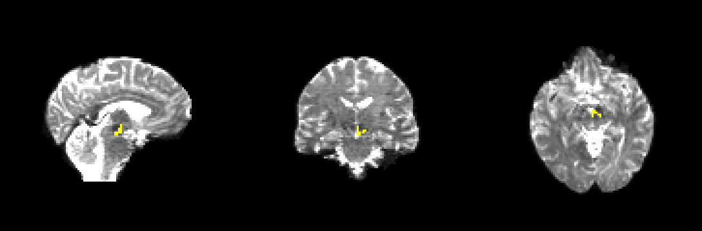

**Example — s1694 Left Hippocampus (whole-brain view):**
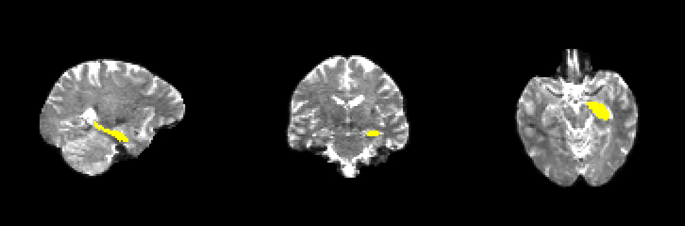

#### QC Method 2: Zoomed ROI View (Python/nibabel)

Tightly cropped around each ROI with 5x scaling so you can see individual voxels and surrounding anatomy. Generated using `roi_qc_zoomed.py` for all 57 subjects (342 images total). Best for verifying precise anatomical placement.

**Example — s1694 Left VTA (zoomed):**
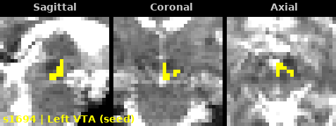

**Example — s1694 Left Hippocampus (zoomed):**
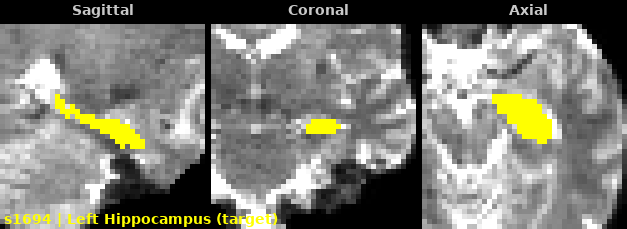

**Example — s1694 Left VTA-HPC Tract Atlas (zoomed):**
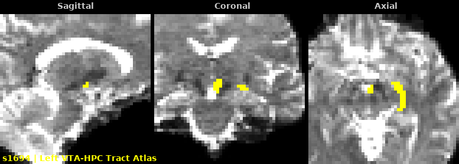

#### QC Method 3: FSLeyes Render (Publication Quality)

Full ortho views rendered locally via `fsleyes render` with color-coded overlays: VTA in yellow, hippocampus in red, tract atlas in green. Generated for all 57 subjects (114 images total). Includes orientation labels (P/A, L/R, S/I).

**Example — s1694 Left hemisphere (FSLeyes ortho):**
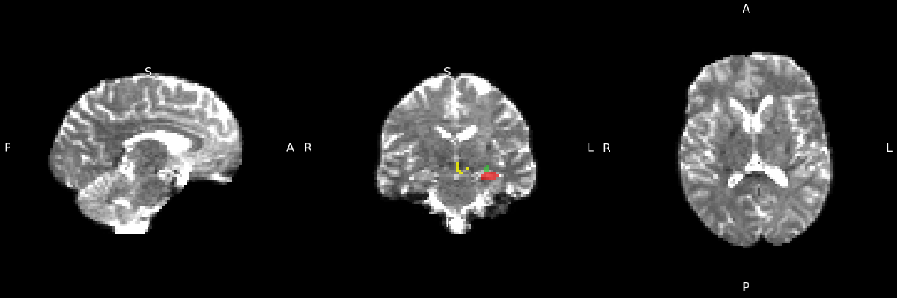

**Example — s1694 Right hemisphere (FSLeyes ortho):**
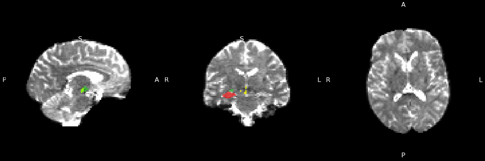

#### QC Image Locations

| QC Method | Images Per Subject | Total | Location |
|-----------|-------------------|-------|----------|
| Whole-brain (Python) | 6 | 342 | `CSD/<subj>/qc/roi_qc_*.png` |
| Zoomed (Python) | 6 | 342 | `CSD/<subj>/qc/roi_qc_*_zoomed.png` |
| FSLeyes render | 2 | 114 | `~/Desktop/SDN/DTI/data.check/roi_qc_fsleyes/<subj>/` |

#### QC Scripts

All QC scripts are stored at `/data/projects/STUDIES/IMPACT/DTI/scripts/`:

| Script | What it does |
|--------|-------------|
| `step20_21_full_audit.sh` | 9-part automated audit (run on cluster) |
| `roi_qc_python.py` | Whole-brain 3-panel overlays for all subjects (run on cluster) |
| `roi_qc_zoomed.py` | Zoomed ROI overlays for all subjects (run on cluster) |
| `fsleyes_qc_render.sh` | FSLeyes ortho renders (run locally with mounted server) |

#### QC Verdict

All 57 subjects pass all 9 automated audits and visual inspection. No subjects excluded. ROIs consistently land in the correct anatomical locations across all subjects. Ready for Step 22.

---

## Step 22 — Atlas-Based Exclusion Masks

Ranesh's original pipeline used 13 individual exclusion ROIs (ventral pallidum, accumbens L/R, striatum, thalamus, cortex/cerebellum, brainstem, amygdala, red nucleus, fornix, optic tract, optic nerve, opposite hemisphere) to constrain tractography. Each had to be warped, tidied (overlaps subtracted), and passed as separate `-exclude` flags to tckgen.

Instead, we use the **atlas shortcut** that Ranesh recommended: his GroupMean_thr50 tract atlas (built from ~170 HCP 7T subjects using those 13 exclusion ROIs) already encodes "where VTA→HPC streamlines should plausibly go." We dilate this atlas by 2 voxels, add the VTA seed and HPC target ROIs, binarize the result into an "inclusion zone," and invert everything outside it into a single exclusion mask.

From Ranesh's meeting notes: "By dilating the atlas by like two-ish voxels, you're generating like this box where your streamlines should plausibly go through... you exclude everything outside of this box... add the VTA and the hippocampus to this atlas mask, and then you invert everything else."

**Logic (per hemisphere):**
1. Dilate tract atlas by 2 voxels (`fslmaths -dilM -dilM`)
2. Add VTA + HPC to dilated atlas, binarize → inclusion zone
3. Invert inclusion zone → exclusion mask (everything outside is excluded)

**Input (per subject, from Step 21):**
- `CSD/<subj>/rois/left_tract_atlas_diff.nii.gz` — left GroupMean_thr50 atlas in diffusion space
- `CSD/<subj>/rois/right_tract_atlas_diff.nii.gz` — right GroupMean_thr50 atlas in diffusion space
- `CSD/<subj>/rois/left_VTA_diff.nii.gz` — left VTA seed ROI in diffusion space
- `CSD/<subj>/rois/right_VTA_diff.nii.gz` — right VTA seed ROI in diffusion space
- `CSD/<subj>/rois/left_HPC_diff.nii.gz` — left hippocampus target in diffusion space
- `CSD/<subj>/rois/right_HPC_diff.nii.gz` — right hippocampus target in diffusion space

**Expected Output (per subject):**
```
derivatives/CSD/s1000/rois/
│
├── l_atlas_dilated.nii.gz      # left tract atlas dilated by 2 voxels
├── r_atlas_dilated.nii.gz      # right tract atlas dilated by 2 voxels
├── l_inclusion_zone.nii.gz     # left allowed region (atlas + VTA + HPC, binarized)
├── r_inclusion_zone.nii.gz     # right allowed region
├── exclusion_mask_l.nii.gz     # LEFT exclusion mask (inverted inclusion zone)
├── exclusion_mask_r.nii.gz     # RIGHT exclusion mask (inverted inclusion zone)
```

This step is lightweight — fslmaths operations only. We allow up to 30 parallel jobs.

**Running Step 22 in tmux:**

1. SSH into the cluster and reattach (or create) the tmux session:
```bash
ssh -XY tur50045@cla19097.tu.temple.edu
tmux attach -t csd || tmux new -s csd
```

2. Create the script:
```bash
nano run_step22_exclusion_masks.sh
```

3. Paste the following into nano:
```bash
#!/bin/bash
# ============================================================
# Step 22: Build Atlas-Based Exclusion Masks
# ============================================================
# Uses Ranesh's GroupMean_thr50 tract atlas to create a single
# exclusion mask per hemisphere, replacing 13 individual exclusion ROIs.
#
# Logic (per Ranesh):
#   1. Dilate tract atlas by 2 voxels (fslmaths -dilM -dilM)
#   2. Add VTA seed + HPC target to dilated atlas
#   3. Binarize = inclusion zone (where streamlines are allowed)
#   4. Invert = exclusion mask (everything outside is excluded)
#
# Input:  CSD/<subj>/rois/ (atlas, VTA, HPC in diffusion space)
# Output: CSD/<subj>/rois/ (exclusion_mask_l/r.nii.gz)
# ============================================================

export FSLDIR=/usr/local/fsl
export PATH=$FSLDIR/bin:$PATH
source $FSLDIR/etc/fslconf/fsl.sh

csd_base="/data/projects/STUDIES/IMPACT/DTI/derivatives/CSD"
nifti_base="/data/projects/STUDIES/IMPACT/DTI/NIFTI"
log_file="/data/projects/STUDIES/IMPACT/DTI/scripts/step22.log"

echo "=== Step 22: Building exclusion masks ==="  > "$log_file"
echo "Started: $(date)" >> "$log_file"

process_subj() {
    subj=$1
    d="$csd_base/$subj/rois"

    # Check inputs exist
    missing=0
    for f in left_tract_atlas_diff.nii.gz right_tract_atlas_diff.nii.gz \
             left_VTA_diff.nii.gz right_VTA_diff.nii.gz \
             left_HPC_diff.nii.gz right_HPC_diff.nii.gz; do
        if [ ! -f "$d/$f" ]; then
            echo "!!! [$subj] Missing $f — SKIPPING" | tee -a "$log_file"
            missing=1
        fi
    done
    if [ "$missing" -eq 1 ]; then return 1; fi

    echo ">>> [$subj] Building exclusion masks" | tee -a "$log_file"

    # === LEFT HEMISPHERE ===
    # 1. Dilate tract atlas by 2 voxels
    fslmaths "$d/left_tract_atlas_diff.nii.gz" -dilM -dilM "$d/l_atlas_dilated.nii.gz"

    # 2. Add VTA + HPC to dilated atlas, binarize = inclusion zone
    fslmaths "$d/l_atlas_dilated.nii.gz" \
        -add "$d/left_VTA_diff.nii.gz" \
        -add "$d/left_HPC_diff.nii.gz" \
        -bin "$d/l_inclusion_zone.nii.gz"

    # 3. Invert = exclusion mask
    fslmaths "$d/l_inclusion_zone.nii.gz" -binv "$d/exclusion_mask_l.nii.gz"

    # === RIGHT HEMISPHERE ===
    fslmaths "$d/right_tract_atlas_diff.nii.gz" -dilM -dilM "$d/r_atlas_dilated.nii.gz"

    fslmaths "$d/r_atlas_dilated.nii.gz" \
        -add "$d/right_VTA_diff.nii.gz" \
        -add "$d/right_HPC_diff.nii.gz" \
        -bin "$d/r_inclusion_zone.nii.gz"

    fslmaths "$d/r_inclusion_zone.nii.gz" -binv "$d/exclusion_mask_r.nii.gz"

    echo ">>> [$subj] Done" | tee -a "$log_file"
}

export -f process_subj
export csd_base log_file FSLDIR PATH

# Run all subjects in parallel (lightweight fslmaths — 30 jobs fine)
for subj in $(ls -1 "$nifti_base"); do
    process_subj "$subj" &
    while [ "$(jobs -r | wc -l)" -ge 30 ]; do sleep 0.5; done
done
wait

echo "=== Step 22 Complete: $(date) ===" | tee -a "$log_file"
```

4. Save and exit nano:
Press Ctrl+O then Enter to save
Press Ctrl+X to close

5. Make the script runnable and execute inside tmux:
```bash
chmod +x run_step22_exclusion_masks.sh
./run_step22_exclusion_masks.sh 2>&1 | tee step22.log
```

6. Detach from tmux while it runs (if needed):
Press Ctrl+B, then D to detach. Reconnect later with:
```bash
tmux attach -t csd
```
* Note: All coding output from this script is recorded in step22.log.

**Step 22 Audit — verify exclusion masks for all subjects (7 checks):**

The audit verifies:
1. **File existence** — all 6 output files per subject
2. **Binary check** — exclusion masks contain only 0s and 1s
3. **Dimension match** — masks match DWI dimensions
4. **VTA not excluded** — VTA voxels have value 0 in the exclusion mask (i.e., they are NOT excluded)
5. **HPC not excluded** — HPC voxels have value 0 in the exclusion mask
6. **Exclusion coverage** — inclusion zone is <20% of total volume (most of the brain is excluded)
7. **Inclusion zone size** — reasonable voxel count (100-50000 range)

Results: **57/57 subjects pass all 7 checks. 0 failures, 0 warnings.**

Inclusion zone voxel counts range from ~1526 to ~1934 (mean ≈ 1720), consistent across subjects — this represents the narrow VTA→HPC white matter corridor.

### Step 22 Visual QC

QC images show the inclusion corridor (green), VTA (yellow), and HPC (red) overlaid on the mean b0 in three views (sagittal, coronal, axial), both whole-brain and zoomed.

**Example: s1000 — Left VTA→HPC exclusion mask:**

The green corridor traces a plausible anatomical path from VTA (midbrain) through medial forebrain bundle white matter to hippocampus (medial temporal lobe). VTA and HPC are fully contained within the inclusion zone.

| Script | Purpose |
|--------|---------|
| `run_step22_exclusion_masks.sh` | Build exclusion masks for all subjects |
| `step22_audit.sh` | 7-check automated audit |
| `step22_visual_qc.py` | Generate QC overlay images (run on cluster) |

#### QC Verdict

All 57 subjects pass all 7 automated audits and visual inspection. Exclusion masks show anatomically plausible VTA→HPC corridors. Inclusion zone sizes are consistent (1526-1934 voxels). Ready for Step 23 (test tractography).

**NOTE**: Ranesh recommended experimenting with 1 vs 2 voxel dilation. We start with 2 voxels. If Step 23 test tractography produces tracts that look too loose/dispersed, we can re-run with 1 voxel dilation.

---

## Step 23 — Test Tractography (Parameter Tuning)

Before running tractography on all 57 subjects, we test on 5 subjects with multiple FOD cutoff values to find optimal parameters for our 3T IMPACT data. Ranesh's pipeline was optimized for 7T HCP data — the key difference is that lower magnetic field strength produces noisier FOD estimates, so the FOD amplitude cutoff (which determines when tracking stops) may need to be higher at 3T to avoid following noise.

Ranesh's exact advice: "Start at 0.1, try 0.08, maybe 0.06. At 3T, 0.08 might work." He also noted that minlength/maxlength (35-65mm at 7T) may need adjustment at 3T.

**Ranesh's 7T parameters vs. our 3T test values:**

| Parameter | Ranesh (HCP 7T) | Our test (IMPACT 3T) | Rationale |
|-----------|-----------------|---------------------|-----------|
| FOD cutoff (`-cutoff`) | 0.06 | **0.1, 0.08, 0.06** | 3T may need higher cutoff — test all three |
| Streamline target (`-select`) | 2500 | **1000** | Reduced for faster testing (will increase in Step 24) |
| Seeding attempts (`-seeds`) | 25,000,000 | **5,000,000** | Reduced for faster testing (will increase in Step 24) |
| Min track length (`-minlength`) | 35 mm | **35 mm** | Start with Ranesh's value |
| Max track length (`-maxlength`) | 65 mm | **65 mm** | Start with Ranesh's value |
| Seed direction (`-seed_unidirectional`) | yes | **yes** | Match Ranesh |
| Stop flag (`-stop`) | yes | **yes** | Stop when select count reached |
| Threads (`-nthreads`) | 24 | **8** | Shared cluster |
| Exclusion strategy | 13 individual ROIs | **1 atlas-based mask** | Ranesh's recommended shortcut (Step 22) |

**Flags NOT used** (Ranesh didn't use these either): ACT, backtrack, crop_at_gmwmif, angle, step_size (MRtrix defaults).

**NOT using `-fslgrad`** because gradients are already embedded in dwi.mif from Step 15 (mrconvert with `-fslgrad`).

**Test subjects** (from Ranesh's suggestion): s169, s4222, s4418, s606, s1000

**Total runs:** 5 subjects × 3 cutoffs × 2 hemispheres = **30 tckgen runs**

**Input (per subject):**
- `/data/projects/STUDIES/IMPACT/DTI/derivatives/CSD/<subj>/wm_fod_norm.mif` (normalized WM FODs from Step 19)
- `/data/projects/STUDIES/IMPACT/DTI/derivatives/CSD/<subj>/rois/left_VTA_diff.nii.gz` (seed ROI)
- `/data/projects/STUDIES/IMPACT/DTI/derivatives/CSD/<subj>/rois/left_HPC_diff.nii.gz` (target/include ROI)
- `/data/projects/STUDIES/IMPACT/DTI/derivatives/CSD/<subj>/rois/exclusion_mask_l.nii.gz` (exclusion mask from Step 22)
- (same for right hemisphere with right_ prefix and _r suffix)

**Expected Output (per subject):**
```
derivatives/CSD/s1000/tckgen/
│
├── l_vta_l_hipp/
│   ├── l_vta_l_hipp_0.1.tck     # left tract at cutoff 0.1
│   ├── l_vta_l_hipp_0.08.tck    # left tract at cutoff 0.08
│   └── l_vta_l_hipp_0.06.tck    # left tract at cutoff 0.06
│
├── r_vta_r_hipp/
│   ├── r_vta_r_hipp_0.1.tck     # right tract at cutoff 0.1
│   ├── r_vta_r_hipp_0.08.tck    # right tract at cutoff 0.08
│   └── r_vta_r_hipp_0.06.tck    # right tract at cutoff 0.06
```

**Running Step 23 in tmux:**

1. SSH into the cluster and create a tmux session:
```bash
ssh -XY tur50045@cla19097.tu.temple.edu
tmux new -s tckgen_test
```

2. Create the script:
```bash
nano /data/projects/STUDIES/IMPACT/DTI/scripts/run_step23_test_tractography.sh
```

3. Paste the following into nano:
```bash
#!/bin/bash
# ============================================================
# Step 23: Test Tractography on 5 Subjects (Parameter Tuning)
# ============================================================
# Tests tckgen with 3 FOD cutoff values (0.1, 0.08, 0.06) on
# 5 subjects to find optimal parameters for 3T IMPACT data.
# Ranesh used cutoff=0.06 at 7T; predicted 0.08 for 3T.
#
# Input:  CSD/<subj>/wm_fod_norm.mif (normalized WM FODs)
#         CSD/<subj>/rois/left_VTA_diff.nii.gz (seed)
#         CSD/<subj>/rois/left_HPC_diff.nii.gz (target/include)
#         CSD/<subj>/rois/exclusion_mask_l.nii.gz (exclusion)
#         (same for right hemisphere)
#
# Output: CSD/<subj>/tckgen/l_vta_l_hipp/l_vta_l_hipp_<cutoff>.tck
#         CSD/<subj>/tckgen/r_vta_r_hipp/r_vta_r_hipp_<cutoff>.tck
#
# Parameters matching Ranesh's pipeline (adjusted for 3T):
#   -seed_unidirectional (same as Ranesh)
#   -select 1000 (Ranesh: 2500, reduced for test)
#   -seeds 5000000 (Ranesh: 25M, reduced for test)
#   -minlength 35 (Ranesh: 35mm at 7T)
#   -maxlength 65 (Ranesh: 65mm at 7T)
#   -stop (same as Ranesh)
#   -cutoff varies: 0.1, 0.08, 0.06 (Ranesh: fixed 0.06 at 7T)
#   -nthreads 8 (Ranesh: 24, reduced for shared cluster)
#
# NOT using -fslgrad (gradients already embedded in dwi.mif from Step 15)
# NOT using ACT, backtrack, angle, step_size (Ranesh didn't use these)
# ============================================================

export PATH=/data/tools/mrtrix3/bin:$PATH

csd_base="/data/projects/STUDIES/IMPACT/DTI/derivatives/CSD"
log_file="/data/projects/STUDIES/IMPACT/DTI/scripts/step23_test.log"

# 5 test subjects (from Ranesh's suggestion)
test_subjects="s169 s4222 s4418 s606 s1000"

echo "=== Step 23: Test Tractography ===" > "$log_file"
echo "Started: $(date)" >> "$log_file"
echo "Test subjects: $test_subjects" >> "$log_file"
echo "Cutoffs: 0.1, 0.08, 0.06" >> "$log_file"
echo "Parameters: -select 1000 -seeds 5000000 -minlength 35 -maxlength 65" >> "$log_file"
echo "" >> "$log_file"

for subj in $test_subjects; do
    echo "========================================" | tee -a "$log_file"
    echo ">>> [$subj] Starting test tractography" | tee -a "$log_file"
    echo "========================================" | tee -a "$log_file"

    # Verify inputs exist
    if [[ ! -f "$csd_base/$subj/wm_fod_norm.mif" ]]; then
        echo "!!! [$subj] MISSING wm_fod_norm.mif — skipping" | tee -a "$log_file"
        continue
    fi
    if [[ ! -f "$csd_base/$subj/rois/exclusion_mask_l.nii.gz" ]]; then
        echo "!!! [$subj] MISSING exclusion_mask_l.nii.gz — skipping" | tee -a "$log_file"
        continue
    fi

    for cutoff in 0.1 0.08 0.06; do
        # === LEFT HEMISPHERE ===
        echo ">>> [$subj] LEFT VTA→HPC at cutoff $cutoff — $(date)" | tee -a "$log_file"
        mkdir -p "$csd_base/$subj/tckgen/l_vta_l_hipp"

        tckgen "$csd_base/$subj/wm_fod_norm.mif" \
            "$csd_base/$subj/tckgen/l_vta_l_hipp/l_vta_l_hipp_${cutoff}.tck" \
            -seed_image "$csd_base/$subj/rois/left_VTA_diff.nii.gz" \
            -seed_unidirectional \
            -include "$csd_base/$subj/rois/left_HPC_diff.nii.gz" \
            -exclude "$csd_base/$subj/rois/exclusion_mask_l.nii.gz" \
            -select 1000 \
            -seeds 5000000 \
            -cutoff $cutoff \
            -minlength 35 \
            -maxlength 65 \
            -stop \
            -nthreads 8 \
            -force 2>&1 | tee -a "$log_file"

        # Log streamline count
        if [[ -f "$csd_base/$subj/tckgen/l_vta_l_hipp/l_vta_l_hipp_${cutoff}.tck" ]]; then
            count=$(tckinfo "$csd_base/$subj/tckgen/l_vta_l_hipp/l_vta_l_hipp_${cutoff}.tck" 2>/dev/null | grep "actual count" | awk '{print $NF}')
            echo "    → Left streamlines at cutoff $cutoff: $count" | tee -a "$log_file"
        else
            echo "    → Left tck file NOT created at cutoff $cutoff" | tee -a "$log_file"
        fi

        # === RIGHT HEMISPHERE ===
        echo ">>> [$subj] RIGHT VTA→HPC at cutoff $cutoff — $(date)" | tee -a "$log_file"
        mkdir -p "$csd_base/$subj/tckgen/r_vta_r_hipp"

        tckgen "$csd_base/$subj/wm_fod_norm.mif" \
            "$csd_base/$subj/tckgen/r_vta_r_hipp/r_vta_r_hipp_${cutoff}.tck" \
            -seed_image "$csd_base/$subj/rois/right_VTA_diff.nii.gz" \
            -seed_unidirectional \
            -include "$csd_base/$subj/rois/right_HPC_diff.nii.gz" \
            -exclude "$csd_base/$subj/rois/exclusion_mask_r.nii.gz" \
            -select 1000 \
            -seeds 5000000 \
            -cutoff $cutoff \
            -minlength 35 \
            -maxlength 65 \
            -stop \
            -nthreads 8 \
            -force 2>&1 | tee -a "$log_file"

        # Log streamline count
        if [[ -f "$csd_base/$subj/tckgen/r_vta_r_hipp/r_vta_r_hipp_${cutoff}.tck" ]]; then
            count=$(tckinfo "$csd_base/$subj/tckgen/r_vta_r_hipp/r_vta_r_hipp_${cutoff}.tck" 2>/dev/null | grep "actual count" | awk '{print $NF}')
            echo "    → Right streamlines at cutoff $cutoff: $count" | tee -a "$log_file"
        else
            echo "    → Right tck file NOT created at cutoff $cutoff" | tee -a "$log_file"
        fi
    done

    echo ">>> [$subj] All cutoffs complete — $(date)" | tee -a "$log_file"
    echo "" | tee -a "$log_file"
done

echo "========================================" | tee -a "$log_file"
echo "=== Step 23 Test Tractography Complete ===" | tee -a "$log_file"
echo "Finished: $(date)" | tee -a "$log_file"

# === SUMMARY TABLE ===
echo "" | tee -a "$log_file"
echo "=== SUMMARY TABLE ===" | tee -a "$log_file"
printf "%-8s %-15s %-8s %-12s\n" "Subject" "Hemisphere" "Cutoff" "Streamlines" | tee -a "$log_file"
printf "%-8s %-15s %-8s %-12s\n" "-------" "---------" "------" "-----------" | tee -a "$log_file"

for subj in $test_subjects; do
    for hemi_dir in l_vta_l_hipp r_vta_r_hipp; do
        if [[ "$hemi_dir" == "l_vta_l_hipp" ]]; then
            hemi_label="left"
        else
            hemi_label="right"
        fi
        for cutoff in 0.1 0.08 0.06; do
            tck="$csd_base/$subj/tckgen/$hemi_dir/${hemi_dir}_${cutoff}.tck"
            if [[ -f "$tck" ]]; then
                count=$(tckinfo "$tck" 2>/dev/null | grep "actual count" | awk '{print $NF}')
            else
                count="MISSING"
            fi
            printf "%-8s %-15s %-8s %-12s\n" "$subj" "$hemi_label" "$cutoff" "$count" | tee -a "$log_file"
        done
    done
done

echo "" | tee -a "$log_file"
echo "=== LENGTH STATISTICS ===" | tee -a "$log_file"
printf "%-8s %-15s %-8s %-12s %-12s %-12s\n" "Subject" "Hemisphere" "Cutoff" "Mean(mm)" "Median(mm)" "Std(mm)" | tee -a "$log_file"

for subj in $test_subjects; do
    for hemi_dir in l_vta_l_hipp r_vta_r_hipp; do
        if [[ "$hemi_dir" == "l_vta_l_hipp" ]]; then
            hemi_label="left"
        else
            hemi_label="right"
        fi
        for cutoff in 0.1 0.08 0.06; do
            tck="$csd_base/$subj/tckgen/$hemi_dir/${hemi_dir}_${cutoff}.tck"
            if [[ -f "$tck" ]]; then
                stats=$(tckstats "$tck" 2>/dev/null)
                mean_len=$(echo "$stats" | grep -i mean | head -1 | awk '{print $2}')
                median_len=$(echo "$stats" | grep -i median | head -1 | awk '{print $2}')
                std_len=$(echo "$stats" | grep -i std | head -1 | awk '{print $2}')
                printf "%-8s %-15s %-8s %-12s %-12s %-12s\n" "$subj" "$hemi_label" "$cutoff" "$mean_len" "$median_len" "$std_len" | tee -a "$log_file"
            fi
        done
    done
done
```

4. Save and exit nano:
Press Ctrl+O then Enter to save
Press Ctrl+X to close

5. Make the script runnable and execute inside tmux:
```bash
chmod +x run_step23_test_tractography.sh
./run_step23_test_tractography.sh 2>&1 | tee step23_test_full.log
```

6. Detach from tmux while it runs:
Press Ctrl+B, then D to detach. Reconnect later with:
```bash
tmux attach -t tckgen_test
```

**NOTE**: This step takes **2-5 hours** depending on cluster load. Each of the 30 tckgen runs takes ~5-10 minutes. The script logs streamline counts after each run and prints a summary table at the end.

**Step 23 Audit — verify test tractography outputs:**
```bash
#!/bin/bash
# Audit Step 23: Test tractography outputs

csd_base="/data/projects/STUDIES/IMPACT/DTI/derivatives/CSD"
export PATH=/data/tools/mrtrix3/bin:$PATH

printf "%-8s %-15s %-8s %-12s %-12s\n" "Subject" "Hemisphere" "Cutoff" "Streamlines" "MeanLen(mm)"
printf "%-8s %-15s %-8s %-12s %-12s\n" "-------" "---------" "------" "-----------" "-----------"

for subj in s169 s4222 s4418 s606 s1000; do
    for hemi_dir in l_vta_l_hipp r_vta_r_hipp; do
        hemi=$([[ "$hemi_dir" == "l_vta_l_hipp" ]] && echo "left" || echo "right")
        for cutoff in 0.1 0.08 0.06; do
            tck="$csd_base/$subj/tckgen/$hemi_dir/${hemi_dir}_${cutoff}.tck"
            if [[ -f "$tck" ]]; then
                count=$(tckinfo "$tck" 2>/dev/null | grep "actual count" | awk '{print $NF}')
                mean=$(tckstats "$tck" 2>/dev/null | grep -i mean | head -1 | awk '{print $2}')
                printf "%-8s %-15s %-8s %-12s %-12s\n" "$subj" "$hemi" "$cutoff" "$count" "$mean"
            else
                printf "%-8s %-15s %-8s %-12s %-12s\n" "$subj" "$hemi" "$cutoff" "MISSING" "N/A"
            fi
        done
    done
done
```

### Step 23 Results — Pilot Findings

We tested four FOD amplitude cutoffs (0.1, 0.08, 0.06, 0.01) on 5 subjects across both hemispheres to determine the optimal tracking threshold for our 3T data.

**Streamline counts (target: 1000, seed limit: 5,000,000):**

| Subject | Hemi | 0.1 | 0.08 | 0.06 | 0.01 |
|---------|------|-----|------|------|------|
| s169 | L | 118 | 556 | 1000 | 1000 |
| s169 | R | 30 | 434 | 1000 | 1000 |
| s4222 | L | 274 | 1000 | 1000 | 1000 |
| s4222 | R | 165 | 906 | 1000 | 1000 |
| s4418 | L | 1000 | 1000 | 1000 | 1000 |
| s4418 | R | 1000 | 1000 | 1000 | 1000 |
| s606 | L | 88 | 309 | 1000 | 1000 |
| s606 | R | 731 | 1000 | 1000 | 1000 |
| s1000 | L | — | — | 1000 | 1000 |
| s1000 | R | — | — | 1000 | 1000 |

**Key findings:**
- **0.1**: Too strict for 3T — most subjects failed to reach 1000 streamlines within the seed limit
- **0.08**: Inconsistent — some subjects hit target, others fell well short (e.g., s606 left = 309)
- **0.06**: Reliable — all 10/10 runs hit 1000 streamlines
- **0.01**: Equally reliable — all 10/10 runs hit 1000 streamlines, but ~5× more seed-efficient (avg ~415K seeds vs ~2.1M+ at 0.06)

**Visual and statistical comparison of 0.01 vs 0.06:**

We generated tract density images (TDIs) for both cutoffs and compared them:
- Tract paths are virtually identical — same VTA→HPC arc in both axial and coronal views
- 0.01 produces slightly thicker TDIs (broader spatial spread through the tract corridor)
- Spatial overlap (Dice coefficient) averaged 0.66 across all subjects/hemispheres
- Mean streamline lengths were nearly identical (~44mm at 0.01 vs ~47mm at 0.06)
- Standard deviation of lengths was marginally higher at 0.01 (~7mm vs ~6mm)

**Example comparison — s169, left VTA→HPC:**

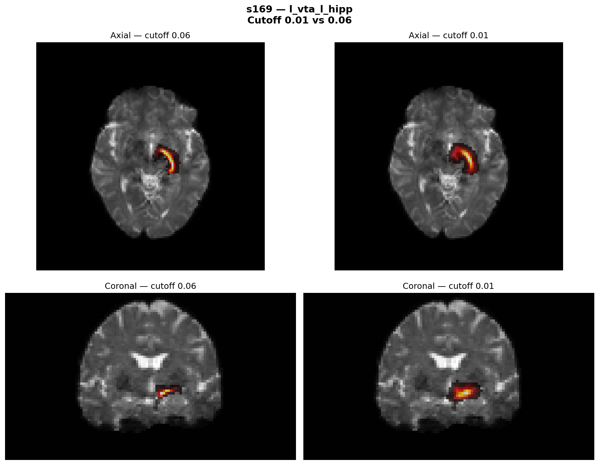

**Decision: Use cutoff 0.01 for full tractography (Step 24).**

Ranesh confirmed this choice — he reported that with the atlas-based exclusion mask, dropping the FOD cutoff as low as 0.01 produces robust and clean streamlines. The mask constrains tracking to the anatomically plausible corridor, preventing the spurious streamlines that would normally result from a permissive cutoff. He also noted that the tracts may not even require pyAFQ cleaning afterward, though we will still run the cleaning step (Step 25) as a safeguard.

---

## Step 24 — Full Tractography (All 57 Subjects)

With the optimal FOD cutoff determined in Step 23 (0.01), we now run tractography on all 57 subjects using Ranesh's full parameters. The only change from the pilot is scaling up the streamline target and seed limit to match Ranesh's production values.

**Parameters (finalized):**

| Parameter | Value | Source |
|-----------|-------|--------|
| FOD cutoff (`-cutoff`) | 0.01 | Pilot-tested (Step 23) + Ranesh confirmation |
| Streamline target (`-select`) | 2500 | Ranesh's production value |
| Seeding attempts (`-seeds`) | 25,000,000 | Ranesh's production value |
| Min track length (`-minlength`) | 35 mm | Ranesh's value |
| Max track length (`-maxlength`) | 65 mm | Ranesh's value |
| Seed direction (`-seed_unidirectional`) | yes | Ranesh's value |
| Stop flag (`-stop`) | yes | Ranesh's value |
| Threads (`-nthreads`) | 8 | Shared cluster |
| Exclusion strategy | 1 atlas-based mask per hemisphere | Step 22 |

**Input (per subject):**
- `/data/projects/STUDIES/IMPACT/DTI/derivatives/CSD/<subj>/wm_fod_norm.mif` (normalized WM FODs from Step 19)
- `/data/projects/STUDIES/IMPACT/DTI/derivatives/CSD/<subj>/rois/left_VTA_diff.nii.gz` (seed ROI)
- `/data/projects/STUDIES/IMPACT/DTI/derivatives/CSD/<subj>/rois/left_HPC_diff.nii.gz` (target/include ROI)
- `/data/projects/STUDIES/IMPACT/DTI/derivatives/CSD/<subj>/rois/exclusion_mask_l.nii.gz` (exclusion mask from Step 22)
- (same for right hemisphere with right_ prefix and _r suffix)

**Expected Output (per subject):**
```
derivatives/CSD/s1000/tckgen/
│
├── l_vta_l_hipp/
│   └── l_vta_l_hipp_0.01.tck     # left VTA→HPC tract (2500 streamlines)
│
├── r_vta_r_hipp/
│   └── r_vta_r_hipp_0.01.tck     # right VTA→HPC tract (2500 streamlines)
```

**Running Step 24 in tmux:**

1. SSH into the cluster and create a tmux session:
```bash
ssh -XY tur50045@cla19097.tu.temple.edu
tmux new -s step24
```

2. Create the script:
```bash
nano /data/projects/STUDIES/IMPACT/DTI/scripts/run_step24_full_tractography.sh
```

3. Paste the following into nano:
```bash
#!/bin/bash
# ============================================================
# Step 24: Full Tractography — All 57 Subjects (cutoff 0.01)
# ============================================================
# Runs tckgen on all subjects with parameters determined in Step 23:
#   - cutoff 0.01 (confirmed by Ranesh + pilot testing)
#   - select 2500 streamlines (Ranesh's target)
#   - seeds 25,000,000 (Ranesh's seed limit)
#   - minlength 35mm, maxlength 65mm (Ranesh's values)
#   - Atlas-based exclusion masks from Step 22
#
# Input:  CSD/<subj>/wm_fod_norm.mif
#         CSD/<subj>/rois/{left,right}_{VTA,HPC}_diff.nii.gz
#         CSD/<subj>/rois/exclusion_mask_{l,r}.nii.gz
#
# Output: CSD/<subj>/tckgen/{l,r}_vta_{l,r}_hipp/{l,r}_vta_{l,r}_hipp_0.01.tck
# ============================================================

export PATH=/data/tools/mrtrix3/bin:$PATH

csd_base="/data/projects/STUDIES/IMPACT/DTI/derivatives/CSD"
nifti_base="/data/projects/STUDIES/IMPACT/DTI/NIFTI"
log_file="/data/projects/STUDIES/IMPACT/DTI/scripts/step24_full.log"

echo "=== Step 24: Full Tractography ===" > "$log_file"
echo "Started: $(date)" >> "$log_file"
echo "Parameters: cutoff=0.01, select=2500, seeds=25000000, minlength=35, maxlength=65" >> "$log_file"
echo "" >> "$log_file"

subjects=$(ls -1 "$nifti_base")
total=$(echo "$subjects" | wc -w)
count=0

for subj in $subjects; do
    count=$((count + 1))
    echo "========================================" | tee -a "$log_file"
    echo ">>> [$count/$total] $subj — $(date)" | tee -a "$log_file"
    echo "========================================" | tee -a "$log_file"

    # Verify inputs
    if [[ ! -f "$csd_base/$subj/wm_fod_norm.mif" ]]; then
        echo "!!! [$subj] MISSING wm_fod_norm.mif — skipping" | tee -a "$log_file"
        continue
    fi

    for side in l r; do
        if [ "$side" = "l" ]; then
            seed=left_VTA_diff.nii.gz
            inc=left_HPC_diff.nii.gz
            exc=exclusion_mask_l.nii.gz
            dir=l_vta_l_hipp
            label="LEFT"
        else
            seed=right_VTA_diff.nii.gz
            inc=right_HPC_diff.nii.gz
            exc=exclusion_mask_r.nii.gz
            dir=r_vta_r_hipp
            label="RIGHT"
        fi

        echo ">>> [$subj] $label VTA→HPC — $(date)" | tee -a "$log_file"
        mkdir -p "$csd_base/$subj/tckgen/$dir"

        tckgen "$csd_base/$subj/wm_fod_norm.mif" \
            "$csd_base/$subj/tckgen/$dir/${dir}_0.01.tck" \
            -seed_image "$csd_base/$subj/rois/$seed" \
            -seed_unidirectional \
            -include "$csd_base/$subj/rois/$inc" \
            -exclude "$csd_base/$subj/rois/$exc" \
            -select 2500 \
            -seeds 25000000 \
            -cutoff 0.01 \
            -minlength 35 \
            -maxlength 65 \
            -stop \
            -nthreads 8 \
            -force 2>&1 | tee -a "$log_file"

        # Log streamline count
        if [[ -f "$csd_base/$subj/tckgen/$dir/${dir}_0.01.tck" ]]; then
            count_str=$(tckinfo "$csd_base/$subj/tckgen/$dir/${dir}_0.01.tck" 2>/dev/null | grep "count:" | head -1 | awk '{print $NF}')
            seeds_used=$(tckinfo "$csd_base/$subj/tckgen/$dir/${dir}_0.01.tck" 2>/dev/null | grep "total_count:" | awk '{print $NF}')
            echo "    → $subj $label: $count_str streamlines from $seeds_used seeds" | tee -a "$log_file"
        else
            echo "    → $subj $label: tck file NOT created" | tee -a "$log_file"
        fi
    done
done

echo "" | tee -a "$log_file"
echo "========================================" | tee -a "$log_file"
echo "=== Step 24 Complete ===" | tee -a "$log_file"
echo "Finished: $(date)" | tee -a "$log_file"

# === SUMMARY ===
echo "" >> "$log_file"
echo "=== SUMMARY ===" >> "$log_file"
printf "%-8s %-15s %-12s %-12s\n" "Subject" "Hemisphere" "Streamlines" "Seeds_used" >> "$log_file"

for subj in $(ls -1 "$nifti_base"); do
    for dir in l_vta_l_hipp r_vta_r_hipp; do
        f="$csd_base/$subj/tckgen/$dir/${dir}_0.01.tck"
        if [[ -f "$f" ]]; then
            cnt=$(tckinfo "$f" 2>/dev/null | grep "count:" | head -1 | awk '{print $NF}')
            seeds=$(tckinfo "$f" 2>/dev/null | grep "total_count:" | awk '{print $NF}')
            printf "%-8s %-15s %-12s %-12s\n" "$subj" "$dir" "$cnt" "$seeds" >> "$log_file"
        else
            printf "%-8s %-15s %-12s %-12s\n" "$subj" "$dir" "MISSING" "N/A" >> "$log_file"
        fi
    done
done
echo "STEP24_ALL_DONE" >> "$log_file"
```

4. Save and exit nano:
Press Ctrl+O then Enter to save
Press Ctrl+X to close

5. Make the script runnable and execute inside tmux:
```bash
chmod +x run_step24_full_tractography.sh
./run_step24_full_tractography.sh 2>&1 | tee step24_full_output.log
```

6. Detach from tmux while it runs:
Press Ctrl+B, then D to detach. Reconnect later with:
```bash
tmux attach -t step24
```

**NOTE**: This step takes approximately **4 hours** (57 subjects × 2 hemispheres × ~2 min each). The script logs streamline counts after each run and prints a full summary table at the end.

**Step 24 Audit — verify full tractography outputs:**
```bash
#!/bin/bash
# Audit Step 24: Full tractography outputs

csd_base="/data/projects/STUDIES/IMPACT/DTI/derivatives/CSD"
nifti_base="/data/projects/STUDIES/IMPACT/DTI/NIFTI"
export PATH=/data/tools/mrtrix3/bin:$PATH

pass=0
fail=0

printf "%-8s %-15s %-12s %-12s\n" "Subject" "Hemisphere" "Streamlines" "Seeds_used"
printf "%-8s %-15s %-12s %-12s\n" "-------" "---------" "-----------" "----------"

for subj in $(ls -1 "$nifti_base"); do
    for dir in l_vta_l_hipp r_vta_r_hipp; do
        f="$csd_base/$subj/tckgen/$dir/${dir}_0.01.tck"
        if [[ -f "$f" ]]; then
            cnt=$(tckinfo "$f" 2>/dev/null | grep "count:" | head -1 | awk '{print $NF}')
            seeds=$(tckinfo "$f" 2>/dev/null | grep "total_count:" | awk '{print $NF}')
            printf "%-8s %-15s %-12s %-12s\n" "$subj" "$dir" "$cnt" "$seeds"
            if [[ "$cnt" -ge 2500 ]]; then
                pass=$((pass + 1))
            else
                fail=$((fail + 1))
            fi
        else
            printf "%-8s %-15s %-12s %-12s\n" "$subj" "$dir" "MISSING" "N/A"
            fail=$((fail + 1))
        fi
    done
done

echo ""
echo "=== AUDIT RESULT ==="
echo "Pass (≥2500 streamlines): $pass / $((pass + fail))"
echo "Fail: $fail / $((pass + fail))"
```

### Step 24 Results

All 57 subjects completed successfully — **114/114 runs hit 2500 streamlines**, no subjects excluded.

- **Seed usage range:** 511K (s4650 left) to 2.03M (s35 right) — all well under the 25M seed cap
- **Average seeds used:** ~1.1M (~4.4% of the 25M limit)
- **Total tck files:** 114 (57 subjects × 2 hemispheres)

The cutoff 0.01 + atlas-based exclusion mask combination proved highly efficient at 3T, consistent with Ranesh's experience at 7T. No subject came close to exhausting the seed budget.

**Step 24 Audit Result:** 114/114 pass (all ≥ 2500 streamlines). 0 failures.

---