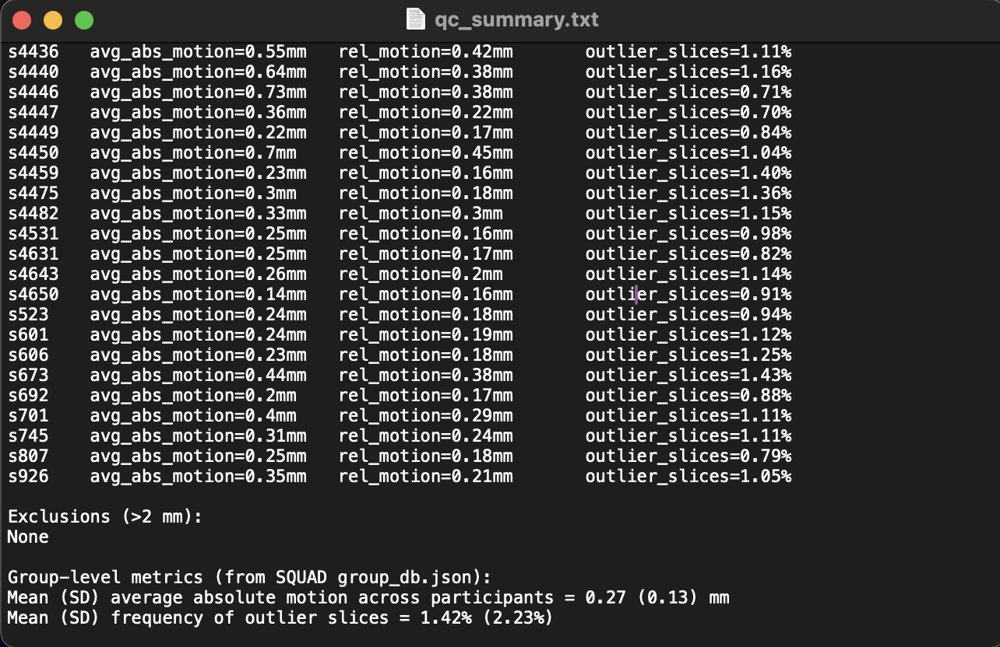

# 🧠 SDN Lab — Project IMPACT DTI Guide

### Before we begin: Accessing the Linux and Project IMPACT 

### 1. SSH Into the Linux
From your local terminal:
```bash
ssh tur50045@cla19097.tu.temple.edu
```

When logging into the Linux you’ll see standard Ubuntu + FreeSurfer/FSL initializations.

### 2. Navigate to Project Impact DICOMs
```bash
cd /data/projects/STUDIES/IMPACT/fMRI/dicoms
# this will take us into the raw dicoms

ls # checking the list of participants
s0105-pilot  s1000  s1228-pilot  s1253  s1323  s1350 ...
s4427  s4436  s4446  s4449  s4459  s4482 ...
```

### 3. Where Will the DTI Files Go?
I created this file:
```bash
tur50045@cla19097:/data/projects/STUDIES/IMPACT$ mkdir DTI
mkdri /DTI/config ##we will put configuration txt files neccesary for DTI preprocessing here
```
* Note: All the configutation files needed for this pipeline can be found in the /config folder of this repo: https://github.com/DiffusionTensorImaging-Repos/SDN-IMPACT-DTI/tree/bd9b3a1670651fc73af3fec46001cdf099ea086b/config

## What does the DTI pipeline ential?
- **Note** - see github repo for a a breif description of each of the steps below: https://github.com/DiffusionTensorImaging-Repos/LITe-DTI-Preprocessing-Scripts/blob/main/README.md

- Additionally all steps are described in detail before their implimentation below. 

A. Preprocessing
1. **DICOM to NIfTI Conversion**
2. **ANTs Skull Stripping**
3. **RB0 Concatenate**
4. **TOPUP**
5. **Mean B0 Image**
6. **Binary Brain Mask**
7. **MRDegibbes**
8. **Eddy Current Correction**
9. **DWI Extraction**
10. **DTI Fit**
11. **FLIRT and Convert**
12. **AFQ Prep - BIDS Conversion**
13. **ICV Calculation**

B. Add steps as they are completed...(PYAFQ,ProbTact, Analyses)


# DTI PREPROCESSING: 

## Step 1 — DICOM to NIfTI Conversion

Before we we begin conversion, lets quickly check which participants have the necessary DTI and anatomical DICOM Runs?

For a subject to be *DTI-clear*, it must include all four required scan types inside its DICOM folder:

- Note look through your DICOMS first To make sure your T1 and DTI runs follow this naming structure.
Example:

```bash
 ls /project/dicoms/subject*/
```

If they don't, update the naming throughout this step

1. Structural T1 (`anat_T1w_acq_mpgSag`)  
2. Diffusion run (`cmrr_mb3hydi_ipat2_64ch`)  
3. Fieldmap AP (`cmrr_fieldmapse_ap`)  
4. Fieldmap PA (`cmrr_fieldmapse_pa`)  


 **We will use the following bash Code to check which participants have these files:**

Paste the following into the SSH terminal: 
```bash
#!/bin/bash
# Tidy check for required DTI runs in each IMPACT subject folder

base_dir="/data/projects/STUDIES/IMPACT/fMRI/dicoms"

required_scans=(
    "anat_T1w_acq_mpgSag"
    "cmrr_mb3hydi_ipat2_64ch"
    "cmrr_fieldmapse_ap"
    "cmrr_fieldmapse_pa"
)

echo "=== DTI Scan Check: $base_dir ==="
printf "%-12s | %-25s | %-25s | %-20s | %-20s\n" \
"Subject" "T1 (anat_T1w)" "DTI (mb3hydi)" "Fieldmap AP" "Fieldmap PA"
printf -- "-------------+---------------------------+---------------------------+----------------------+----------------------\n"

for subj in "$base_dir"/*; do
    [ -d "$subj" ] || continue
    subj_id=$(basename "$subj")
    status=()
    for scan in "${required_scans[@]}"; do
        if find "$subj" -maxdepth 1 -type d -regex ".*/[0-9]+-$scan.*" | grep -q .; then
            status+=("✅")
        else
            status+=("❌")
        fi
    done
    printf "%-12s | %-25s | %-25s | %-20s | %-20s\n" \
    "$subj_id" "${status[0]}" "${status[1]}" "${status[2]}" "${status[3]}"
done
```

**What We get from the Output:**

 Most subjects are DTI-clear: they have T1, diffusion, and both fieldmaps present.
Incomplete subjects include:  
* s1253  
* s1476  
* s578  
* s820  
* s999-pilot

**Next, we will batch convert the DICOM to NIFTI conversion**

- We use **dcm2niix**, a widely adopted command-line tool that converts DICOM medical imaging files into the NIfTI format.  

- DICOMs are the raw scanner output, but NIfTI is the standard format used by neuroimaging software (FSL, AFNI, SPM, etc.).  
- `dcm2niix` automatically handles orientation, metadata, and generates `.json`, `.bval`, and `.bvec` files that are essential for preprocessing.  

As a reminder, we require the following four scan types for each subject:
1. **Structural T1** → `anat_T1w_acq_mpgSag`  
2. **DTI run** → `cmrr_mb3hydi_ipat2_64ch`  
3. **Fieldmap AP** → `cmrr_fieldmapse_ap`  
4. **Fieldmap PA** → `cmrr_fieldmapse_pa`  

- Only subjects with all 4 will be converted, and the output files will be place in the newly created DTI directory. 

This step will use the basic dc2niix function. 

**Note** — This step is lightweight and will be completed quickly, so we just paste it directly into the SSH terminal and run it for all participants at once. 

I quickly check available system RAM to decide how many participants we can process at once, by pasting this in the SSH terminal: 
```
free -h
```

Example output:
```
              total        used        free      shared  buff/cache   available
Mem:          125Gi       9.7Gi        54Gi        60Mi        61Gi       114Gi
Swap:         2.0Gi          0B       2.0Gi
```

dcm2niix is very lightweight, using only ~100–300 MB per subject. With 114 GB available, even 60 subjects in parallel is well within limits.
→ Safe to set max_jobs=60.

To run the code, 
**Paste the following directly into the SSH terminal**
```bash
#!/bin/bash
# ============================================================
# DICOM → NIfTI conversion for IMPACT (DTI pipeline)
# With subject-prefixed filenames + logging
# ============================================================

base_dir="/data/projects/STUDIES/IMPACT/fMRI/dicoms"
out_base="/data/projects/STUDIES/IMPACT/DTI/NIFTI"
dcm2niix_bin="/usr/bin/dcm2niix"   # confirmed path on cluster

# Required scan patterns (pattern:output_dir:label)
scan_types=(
    "anat_T1w_acq_mpgSag:struct:struct"
    "cmrr_mb3hydi_ipat2_64ch:dti:dwi"
    "cmrr_fieldmapse_ap:dti:fmapAP"
    "cmrr_fieldmapse_pa:dti:fmapPA"
)

# Log file (always overwrite dcm2niix.log)
logfile="dcm2niix.log"
: > "$logfile"

# Simple logger: prints to screen AND appends to logfile
log() { echo "$*" | tee -a "$logfile" ; }

log "=== Starting DICOM → NIfTI conversion ==="

for subj in "$base_dir"/*; do
    [ -d "$subj" ] || continue
    subj_id=$(basename "$subj")
    log "--- Checking subject: $subj_id ---"

    # Check completeness
    complete=true
    for scan in "${scan_types[@]}"; do
        pattern="${scan%%:*}"
        if ! find "$subj" -maxdepth 1 -type d -regex ".*/[0-9]+-$pattern.*" | grep -q .; then
            log "  ❌ Missing required scan: $pattern"
            complete=false
        fi
    done
    if [ "$complete" = false ]; then
        log "  ⚠️ Skipping $subj_id (not DTI-clear)"
        continue
    fi

    # Output directories
    subj_out="$out_base/$subj_id"
    mkdir -p "$subj_out/struct" "$subj_out/dti"

    # Convert each scan type
    for scan in "${scan_types[@]}"; do
        IFS=":" read -r pattern target label <<< "$scan"
        scan_dir=$(find "$subj" -maxdepth 1 -type d -regex ".*/[0-9]+-$pattern.*" | head -n 1)
        log "  ✅ Converting $pattern → $target/"

        {
            echo "----- [$subj_id $label] dcm2niix start"
            $dcm2niix_bin -o "$subj_out/$target" -f "${subj_id}_${label}" "$scan_dir"
            echo "----- [$subj_id $label] dcm2niix end"
            echo
        } >>"$logfile" 2>&1
    done
done

log "=== Conversion finished. Output saved to: $out_base ==="


```
Note: All coding output from this script is recorded in dcm2niix.log.

The output data will look like this: 
```bash
/data/projects/STUDIES/IMPACT/DTI/NIFTI/
│
├── s1000/
│   ├── struct/
│   │   ├── s1000_struct.nii
│   │   ├── s1000_struct.json
│   └── dti/
│       ├── s1000_dwi.nii
│       ├── s1000_dwi.bval
│       ├── s1000_dwi.bvec
│       ├── s1000_dwi.json
│       ├── s1000_fmapAP.nii
│       ├── s1000_fmapAP.json
│       ├── s1000_fmapPA.nii
│       ├── s1000_fmapPA.json
│
├── s1323/
│   ├── struct/
│   │   ├── s1323_struct.nii
│   └── dti/
│       ├── s1323_dwi.nii
│       ├── s1323_fmapAP.nii
│       ├── s1323_fmapPA.nii
│
└── ...
```
Next, we'll run a NIFTI AUDIT to check that conversion and file org was succesful.
- **Note**: in following pre-processing steps I will  present the audit code without this detailed explanation. In each step, it will do the same thing: checking for the presence of all the files showed in the output data of the code. 

- This script audits the **NIFTI output directory** (`/Volumes/DTI/DTI/Wave1/NIFTI`) to check which subjects have proper output from this step. 

For each subject, it confirms the presence of:  
- `struct/` folder with T1 outputs (`.nii`, `.json`)  
- `dti/cmrr_mb3hydi_ipat2_64ch/` with diffusion outputs (`.nii`, `.json`, `.bval`, `.bvec`)  
- `dti/cmrr_fieldmapse_ap/` with fieldmap AP outputs (`.nii`, `.json`)  
- `dti/cmrr_fieldmapse_pa/` with fieldmap PA outputs (`.nii`, `.json`)  

The script prints a table of subjects with a ✅/**NIFTI-clear** flag if all required files exist, or ❌ if anything is missing. It also provides a final summary count of complete vs. incomplete subjects.

**Paste the following directly into the SSH terminal:**

```bash
#!/bin/bash

# Base directory with subject-level NIFTI outputs
nifti_base="/data/projects/STUDIES/IMPACT/DTI/NIFTI"

# Counters
complete=0
incomplete=0

echo "=== NIFTI Output Check: $nifti_base ==="
printf "%-12s | %-8s\n" "Subject" "NIFTI-clear"
printf -- "-------------+----------\n"

for subj in "$nifti_base"/*; do
    [ -d "$subj" ] || continue
    subj_id=$(basename "$subj")

    # Required files for this layout
    struct_ok=$(ls "$subj"/struct/${subj_id}_struct.{nii,json} 2>/dev/null | wc -l)
    dwi_ok=$(ls "$subj"/dti/${subj_id}_dwi.{nii,json,bval,bvec} 2>/dev/null | wc -l)
    fmap_ap_ok=$(ls "$subj"/dti/${subj_id}_fmapAP.{nii,json} 2>/dev/null | wc -l)
    fmap_pa_ok=$(ls "$subj"/dti/${subj_id}_fmapPA.{nii,json} 2>/dev/null | wc -l)

    if [ $struct_ok -eq 2 ] && [ $dwi_ok -eq 4 ] && [ $fmap_ap_ok -eq 2 ] && [ $fmap_pa_ok -eq 2 ]; then
        echo "$subj_id    | ✅"
        ((complete++))
    else
        echo "$subj_id    | ❌"
        ((incomplete++))
    fi
done

echo
echo "Summary: $complete subjects complete, $incomplete subjects incomplete"
```

 OUTPUT: Summary: 57 subjects complete, 0 subjects incomplete (We're good to go)

---

## Step 2: ANTs Skull Stripping

We use **ANTs (Advanced Normalization Tools)**, an open-source software suite for image processing. ANTs is a highly reliable package for brain extraction.  
- ( ANTs’ template-based approach typically produces cleaner extractions than simpler tools (like FSL BET), especially for high-resolution T1 images.)

- **Why it’s needed for DTI:** later diffusion preprocessing (e.g., registration, distortion correction) requires the structural image to be **brain-only**. Extra tissue like skull and scalp can throw off alignment and bias field corrections, so stripping ensures cleaner, accurate DTI processing.


**Locating ANTs skull stripping**: 
- Rather than download the ANTs library, I conducted a search to check if it is already on the Linux:

Type the following into the terminal: 
```bash
find / -type f -name "antsBrainExtraction.sh" 2>/dev/null | head -n 20
```
I confirmed ANTs is available on the lab Linux system under: `data/tools/ANTs/bin`

- **Note**: If you need to download ANTs *yourself* in future implementations, the official repository is here:  https://github.com/ANTsX/ANTs

Next, we add the ANTs functions to path by pasting the following in the terminal: 
```bash
export ANTSPATH="/data/tools/ANTs/bin"
export PATH="$ANTSPATH:$PATH"
```

**Before skull stripping we will set up the template and mask for  skull stripping**:
 
- ANTs (Advanced Normalization Tools) needs a **template image** (a standardized brain) and a **mask** (which defines which parts of that template are “brain” vs. “not-brain”) to guide skull stripping. These act as a reference: your subject’s T1 is aligned to the template, and the mask tells ANTs where to cut off skull, scalp, and neck.

**Which template should I use?**  
- **NKI templates** (from the Enhanced NKI-Rockland sample) are commonly used for **adolescent and adult** data.  
- **OASIS** or **ICBM** templates are sometimes used for older adults.  
- **Custom or age-specific templates** might be needed for pediatric datasets or other special populations.  

**What to check as an RA:**  
- Confirm whether the lab already has suitable templates downloaded (saves time and ensures consistency across projects).  
- Look for a pair within the SAME TEMPLATE (eg., NKI):  
  - `T_template.nii.gz` → the actual template brain.  
  - `T_template_BrainCerebellumMask.nii.gz` → the brain + cerebellum mask.  
  - Type the following into the terminal to conduct this search to see if masks already exist on the Linux: 
```bash
 find / -type f -name "T_template.nii" 2>/dev/null | head -n 20
 find /-type f -name "T_template_BrainCerebellumMask.nii" 2>/dev/null | head -n 20
 ```

- If you don’t find both the template **and** its matching mask for the template type you’re using (e.g., NKI, OASIS, ICBM), download the correct pair from the official ANTs figshare repository:  
https://figshare.com/articles/dataset/ANTs_ANTsR_Brain_Templates/915436
Then save it and reference the brain and mask tamplates for your participants. 

**In our case:**  
- We already found the NKI templates (this template has worked very well on adult data) on the lab Linux under `/data/projects/STUDIES/LEARN/…/ANTs_Images/NKI`. 
- To keep things organized, we copy them into the IMPACT project folder:

Type the following into the terminal:
```bash
mkdir -p /data/projects/STUDIES/IMPACT/DTI/ANTsTemplate/NKI
cd /data/projects/STUDIES/IMPACT/DTI/ANTsTemplate/NKI

cp /data/projects/STUDIES/LEARN/fMRI/NM/ANTs_toolbox/NM_toolbox/ANTs_Images/NKI/T_template.nii.gz \
   /data/projects/STUDIES/IMPACT/DTI/ANTsTemplate/NKI/

cp /data/projects/STUDIES/LEARN/fMRI/NM/ANTs_toolbox/NM_toolbox/ANTs_Images/NKI/T_template_BrainCerebellumMask.nii.gz \
   /data/projects/STUDIES/IMPACT/DTI/ANTsTemplate/NKI/
```

**Now that the masks are set, we can execute the ANTs Skull Stripping.**

Brefore running this, I conduct a System RAM check to help decide how many paritcipants we can tell ANTs to skullstrip at once.

Type the following into the terminal: 

```bash
free -h
```

Example output:
```
              total        used        free      shared  buff/cache   available
Mem:          125Gi       9.7Gi        54Gi        60Mi        61Gi       114Gi
Swap:         2.0Gi          0B       2.0Gi
```

`antsBrainExtraction.sh` typically uses ~2–3 GB per subject.  
With 114 GB free, we could theoretically run ≈38 jobs in parallel (114 ÷ 3).  
To be safe but still efficient, we cap at 30 jobs (max_jobs=30).

**This script will use the antsBrainExtraction.sh functino from the ANTs library:** 

**Note** — This step may take a while (1-2 hours), so we run it as a background script in Nohup to avoid it terminating in the case ssh disruptions. Here is how to run The Bash Code in Nohup:

1.  **First, create the `run_ants.sh` script**

Open nano to create the script file:
```bash
nano run_ants.sh
```
 Paste the following into nano:
```bash
#!/bin/bash
# ============================================================
# Parallelized ANTs Skull Stripping for IMPACT (DTI)
# ============================================================

# Paths
ANTs_bin="/data/tools/ants/bin/antsBrainExtraction.sh"
TEMPLATE="/data/projects/STUDIES/IMPACT/DTI/ANTsTemplate/NKI/T_template.nii.gz"
TEMPLATE_MASK="/data/projects/STUDIES/IMPACT/DTI/ANTsTemplate/NKI/T_template_BrainCerebellumMask.nii.gz"
in_base="/data/projects/STUDIES/IMPACT/DTI/NIFTI"
out_base="/data/projects/STUDIES/IMPACT/DTI/derivatives/ANTs"

# Collect all subject IDs from NIFTI directory
subjects=($(ls -1 "$in_base"))

# Function to process one subject
process_subject () {
    subj_id="$1"
    echo "=== Processing $subj_id ==="

    nii_file="$in_base/$subj_id/struct/${subj_id}_struct.nii"
    out_dir="$out_base/$subj_id"
    mkdir -p "$out_dir"

    "$ANTs_bin" -d 3 -a "$nii_file" -e "$TEMPLATE" -m "$TEMPLATE_MASK" -o "$out_dir/"

    # Rename outputs with subject prefix
    mv "$out_dir/BrainExtractionBrain.nii.gz" "$out_dir/${subj_id}_BrainExtractionBrain.nii.gz"
    mv "$out_dir/BrainExtractionMask.nii.gz" "$out_dir/${subj_id}_BrainExtractionMask.nii.gz"
    mv "$out_dir/BrainExtractionPrior0GenericAffine.mat" "$out_dir/${subj_id}_BrainExtractionPrior0GenericAffine.mat"

    echo "=== Finished $subj_id ==="
}

# ==============================
# Run jobs in parallel (max 30)
# ==============================
max_jobs=30
job_count=0

for subj in "${subjects[@]}"; do
    process_subject "$subj" &   # run in background
    ((job_count++))

    if (( job_count >= max_jobs )); then
        wait -n                 # wait for one job to finish
        ((job_count--))
    fi
done

wait  # wait for all jobs to finish

echo -e "\n=== Skull stripping finished. Results saved to: $out_base ==="
```
**Save and exit nano:**
Press Ctrl+O then Enter to save
Press Ctrl+X to close

2. **Make the script runnable**
```bash
 chmod +x run_ants.sh 
 ```

3.  Run with nohup so it survives SSH disconnections during execution: 
```bash
 nohup ./run_ants.sh >ants.log 2>&1 & 
 ```

4. We can still watch the progress even though it is running outside of the ssh - by typing: 
```bash
tail -ants.log
```
- Even if you disconnect, the job keeps running. When you reconnect later, you can just run the same tail -f topup.log command to pick up the log again.

**Expected output structure**:
```bash
/data/projects/STUDIES/IMPACT/DTI/derivatives/ANTs/
│
├── s1000/
│   ├── s1000_BrainExtractionBrain.nii.gz
│   ├── s1000_BrainExtractionMask.nii.gz
│   ├── s1000_BrainExtractionPrior0GenericAffine.mat
│
├── s1323/
│   ├── s1323_BrainExtractionBrain.nii.gz
│   ├── s1323_BrainExtractionMask.nii.gz
│   ├── s1323_BrainExtractionPrior0GenericAffine.mat
│
└── ...
```

**Here is the script to conduct an audit to make sure this was properly run for all subjects:**
```bash
#!/bin/bash
# Robust audit for ANTs skull stripping outputs

in_base="/data/projects/STUDIES/IMPACT/DTI/NIFTI"
out_base="/data/projects/STUDIES/IMPACT/DTI/derivatives/ANTs"

printf "Subject\tBrain\tMask\tAffine\n"

for subj in $(ls -1 "$in_base"); do
    out_dir="$out_base/$subj"

    brain=$(find "$out_dir" -maxdepth 1 -type f -name "${subj}_BrainExtractionBrain.nii.gz" 2>/dev/null | head -n1)
    mask=$(find "$out_dir" -maxdepth 1 -type f -name "${subj}_BrainExtractionMask.nii.gz" 2>/dev/null | head -n1)
    affine=$(find "$out_dir" -maxdepth 1 -type f -name "${subj}_BrainExtractionPrior0GenericAffine.mat" 2>/dev/null | head -n1)

    [[ -n "$brain"  ]] && bstat="✅" || bstat="❌"
    [[ -n "$mask"   ]] && mstat="✅" || mstat="❌"
    [[ -n "$affine" ]] && astat="✅" || astat="❌"

    printf "%s\t%s\t%s\t%s\n" "$subj" "$bstat" "$mstat" "$astat"
done

echo -e "\n=== ANTs Skull Stripping Audit Finished ==="
```

**The next step in ANTs is to use the FSL - fsleyes- interface to check each participant to make sure that the skull strip was successful.**

- You may want to use another device other than the linux to operate fsleyes. Here is how to move the files from ANTs (or any other file) onto a local computer:
```bash
# === Copy ANTs-stripped brain + T1 from Linux to local ===
# Replace subject IDs in the brace list {s1287,s1323,s1324}

# first for brain extraction: 
rsync -av \
  "tur50045@cla19097:/data/projects/STUDIES/IMPACT/DTI/derivatives/ANTs/{s1228-pilot,s4418,s4419,s4423,s4427,s4429,s4436,s4440,s4446,s4447,s4449,s4450,s4459,s4475,s4482,s4531,s4631,s4643,s4650,s523,s601,s606,s673,s692,s701,s745,s807,s926}/*BrainExtractionBrain.nii.gz" \
  /Users/dannyzweben/Desktop/SDN/DTI/data.check/

#then the full T1
rsync -av \
  "tur50045@cla19097:/data/projects/STUDIES/IMPACT/DTI/derivatives/ANTs/{s1228-pilot,s4418,s4419,s4423,s4427,s4429,s4436,s4440,s4446,s4447,s4449,s4450,s4459,s4475,s4482,s4531,s4631,s4643,s4650,s523,s601,s606,s673,s692,s701,s745,s807,s926}/*BrainExtractionBrain.nii.gz" \
  /Users/dannyzweben/Desktop/SDN/DTI/data.check/
```

**Next, we will check the quality of  ANTs Skull Stripping with FSLeyes, and we will make sure to check every single participant.**

 **Open FSLeyes**
From terminal, launch:
```bash
fsleyes
```

When FSL opens, it will first pull up:


Next, we wil overlaying Structural and ANTS Images

For each participant:  
1. Load the participant’s NIFTI structural scan.  
2. Hit the **plus (+)** to add the ANTS-stripped version.  
3. Move the stripped brain above the struct.  
     

4. Change the stripped brain’s color so the extraction edges are visible:  


5. We want to make sure that for each participant, the stripped brain fully covers the T1 brain and doesn't capture non brain structures.  

6. Example of a Good Extraction -- For confidentiality this is generic example not from our data base.


7. Here it is good to begin keeping a csv to track your progress. 
I track each participant's progress after skullstripping. 


**Note:** If extraction cuts off brain or pulls in excesive spine/scalp/neck, exclude and note. This should be a rare issue (~all participants should be stripped propely if you used a good mask/template), if you run into several issues,switch template (NKI worked perfectly with IMPACT).

If you have found good mask and made sure it worked for ~all participants, we can move to the next step: 

---
## Step 6 — B0 Concatenation

- This is a step that is neccesary to prep our data before we run  **topup** for susceptibility distortion correction! This step will build a combined baseline (b0) image. 

This step extracts the first volume (the b0) from each subject’s AP and PA fieldmaps and merges them into a single 4D file. This merged file is the required input for topup.

This step will accomplish the following: 
1. Extract the first volume (b0) from the AP fieldmap (`*_fmapAP.nii`) → `<subj>_a2p_b0.nii.gz`  
2. Extract the first volume (b0) from the PA fieldmap (`*_fmapPA.nii`) → `<subj>_p2a_b0.nii.gz`  
3. Concatenate the AP and PA b0s into one file (`<subj>_merged_b0s.nii.gz`)  

This step will use the following input (per subject)
- `NIFTI/<subj>/dti/<subj>_fmapAP.nii`  
- `NIFTI/<subj>/dti/<subj>_fmapPA.nii`  

The code will use the fslroi + fslmerge FSL functions to grab the first b0 from each direction and merge them into the required *_merged_b0s.nii.gz

- This is a lightweight step and it will be pasted directly into the SSH terminal:

```bash
#!/bin/bash

# Step 6: B0 Concatenation (parallel + verbose)

nifti_base="/data/projects/STUDIES/IMPACT/DTI/NIFTI"
deriv_base="/data/projects/STUDIES/IMPACT/DTI/derivatives/b0_concat"

mkdir -p "$deriv_base"

# Function to process a single subject
process_subj() {
    subj=$1
    subj_dir="$nifti_base/$subj/dti"
    out_dir="$deriv_base/$subj"
    mkdir -p "$out_dir"

    echo ">>> [$subj] Starting B0 extraction and concatenation"

    # Check inputs exist
    if [ ! -f "$subj_dir/${subj}_fmapAP.nii" ] || [ ! -f "$subj_dir/${subj}_fmapPA.nii" ]; then
        echo "!!! [$subj] Missing AP or PA fieldmap. Skipping."
        return
    fi

    # Extract b0 from AP
    echo ">>> [$subj] Extracting AP b0"
    fslroi "$subj_dir/${subj}_fmapAP.nii" \
           "$out_dir/${subj}_a2p_b0.nii.gz" 0 1

    # Extract b0 from PA
    echo ">>> [$subj] Extracting PA b0"
    fslroi "$subj_dir/${subj}_fmapPA.nii" \
           "$out_dir/${subj}_p2a_b0.nii.gz" 0 1

    # Merge AP + PA
    echo ">>> [$subj] Merging AP+PA b0s"
    fslmerge -t "$out_dir/${subj}_merged_b0s.nii.gz" \
             "$out_dir/${subj}_a2p_b0.nii.gz" \
             "$out_dir/${subj}_p2a_b0.nii.gz"

    echo ">>> [$subj] Done!"
}

export -f process_subj
export nifti_base deriv_base

# === Run in parallel ===
# Safe to use 30 jobs: B0 extraction/merge is light compared to ANT for which 30 parellel was no problem
#30 subjects in parallel.

subjects=$(basename -a "$nifti_base"/*)

echo "Found $(echo $subjects | wc -w) subjects in $nifti_base"
echo "Running with up to 30 in parallel..."

if command -v parallel > /dev/null; then
    echo "$subjects" | tr ' ' '\n' | parallel -j 30 process_subj {}
else
    max_jobs=30
    for subj in $subjects; do
        process_subj "$subj" &
        while [ "$(jobs -r | wc -l)" -ge "$max_jobs" ]; do
            sleep 1
        done
    done
    wait
fi

echo "=== All B0 concatenation jobs finished ==="

```

* Note -  All coding output from this script is recorded in b0_concat.log

**Expected File Output (Per participant):**
```
/data/projects/STUDIES/IMPACT/DTI/derivatives/b0_concat/
│
├── s1000/
│ ├── s1000_a2p_b0.nii.gz
│ ├── s1000_p2a_b0.nii.gz
│ ├── s1000_merged_b0s.nii.gz
│
├── s1323/
│ ├── s1323_a2p_b0.nii.gz
│ ├── s1323_p2a_b0.nii.gz
│ ├── s1323_merged_b0s.nii.gz
│
└── ...
```

**B0 Audit to check that conversion and file org was succesful.**:
```bash
#!/bin/bash

nifti_base="/data/projects/STUDIES/IMPACT/DTI/NIFTI"
deriv_base="/data/projects/STUDIES/IMPACT/DTI/derivatives/b0_concat"

echo -e "Subject\tAP_b0\tPA_b0\tMerged"

for subj in $(ls "$nifti_base"); do
    out_dir="$deriv_base/$subj"
    ap="$out_dir/${subj}_a2p_b0.nii.gz"
    pa="$out_dir/${subj}_p2a_b0.nii.gz"
    merged="$out_dir/${subj}_merged_b0s.nii.gz"

    ap_status=$([ -f "$ap" ] && echo "✅" || echo "❌")
    pa_status=$([ -f "$pa" ] && echo "✅" || echo "❌")
    merged_status=$([ -f "$merged" ] && echo "✅" || echo "❌")

    echo -e "$subj\t$ap_status\t$pa_status\t$merged_status"
done

```
---
## Step 7 — TOPUP Susceptibility Distortion Correction

**TOPUP corrects for **susceptibility-induced geometric distortions** in diffusion-weighted MRI**

- By using the AP and PA b0s created in Step 6, TOPUP estimates the susceptibility field and produces corrected reference images. These corrected b0s are essential for accurate alignment and later diffusion preprocessing.


The following steps accomplished by our code..
1. Create an output directory for TOPUP results inside each subject’s `dti/` folder.  
2. Use the merged AP/PA b0 file  from the previous step(`<subj>_merged_b0s.nii.gz`) as input to TOPUP.  
3. Call in an acquisition parameters file (`acqp.txt`) that specifies phase encoding direction and readout time.  
4. TOPUP outputs corrected b0 images and a displacement field for later use.  


**! IMPORTANT: Configuration File needed:** 


This file tells TOPUP how the scans were collected. Each row is one scan (AP or PA) and describes:  
- **Direction of phase encoding** (whether distortion runs front-to-back or back-to-front).  
- **How long the readout took** (the time distortions can build up).  
- It can be found here: -`/data/projects/STUDIES/IMPACT/DTI/config/acqp.txt`  
- With both directions listed, TOPUP can figure out how the distortions flip and then fix them in the diffusion data.


For the TOPUP code, the following input, produced by the previous steps is needed: 

**Expected Input (per subject)**
- `NIFTI/<subj>/dti/<subj>_merged_b0s.nii.gz` (from Step 6)  
- Acquisition parameters file:  `/data/projects/STUDIES/IMPACT/DTI/config/acqp.txt`  

Topup will use the "topup" FSL function, and the topup call will use the following sturcture:
```
topup --imain="$b0_file" \
      --datain="$datain_file" \
      --config="$config_file" \
      --out="$output_prefix" \
      --iout="${output_prefix}_corrected_b0" \
      --fout="${output_prefix}_fieldmap" \
      --verbose
```

Before implimenting this code, I conducted a quick
**System RAM check**

```bash
free -h

              total        used        free      shared  buff/cache   available
Mem:          125Gi       9.7Gi        54Gi        60Mi        61Gi       114Gi
Swap:         2.0Gi          0B       2.0Gi

```
TOPUP is more demanding than earlier steps. Even though the system has plenty of RAM, I/O and CPU load can still cause failures when too many jobs run at once. To keep things stable, we cap parallel jobs at 18 (max_jobs=18).

**How to run The Bash Code in Nohup**

1. **Create the `run_topup.sh` script**
Open nano to create the script file:
```bash
nano run_topup.sh
```

2. **Paste the following into nano:**
```Bash
#!/bin/bash

# Step 7: TOPUP (susceptibility distortion correction)

nifti_base="/data/projects/STUDIES/IMPACT/DTI/NIFTI"
b0_base="/data/projects/STUDIES/IMPACT/DTI/derivatives/b0_concat"
deriv_base="/data/projects/STUDIES/IMPACT/DTI/derivatives/TOPUP"
datain_file="/data/projects/STUDIES/IMPACT/DTI/config/acqp.txt"
config_file="/usr/local/fsl/etc/flirtsch/b02b0_1.cnf"

process_subj() {
    subj=$1
    b0_file="$b0_base/$subj/${subj}_merged_b0s.nii.gz"
    output_dir="$deriv_base/$subj/topup_output"
    mkdir -p "$output_dir"

    output_prefix="$output_dir/${subj}_topup"

    # Skip if outputs already exist
    if [[ -f "${output_prefix}_corrected_b0.nii.gz" && -f "${output_prefix}_fieldmap.nii.gz" ]]; then
        echo "=== [$subj] Already has TOPUP outputs, skipping"
        return
    fi

    if [ ! -f "$b0_file" ]; then
        echo "!!! [$subj] Missing merged b0 input, skipping"
        return
    fi

    echo ">>> [$subj] Running TOPUP"
    topup --imain="$b0_file" --datain="$datain_file" \
          --config="$config_file" \
          --out="$output_prefix" \
          --iout="${output_prefix}_corrected_b0" \
          --fout="${output_prefix}_fieldmap" \
          --verbose
    echo ">>> [$subj] Done"
}

export -f process_subj
export nifti_base b0_base deriv_base datain_file config_file

subjects=$(basename -a "$nifti_base"/*)

echo "Found $(echo $subjects | wc -w) subjects in $nifti_base"

# Run in parallel: up to 18 jobs at once
if command -v parallel > /dev/null; then
    echo "$subjects" | tr ' ' '\n' | parallel -j 18 process_subj {}
else
    max_jobs=18
    for subj in $subjects; do
        process_subj "$subj" &
        while [ "$(jobs -r | wc -l)" -ge "$max_jobs" ]; do
            sleep 1
        done
    done
    wait
fi

echo "=== All TOPUP jobs finished ==="


```

3. **Save and exit nano:**
Press Ctrl+O then Enter to save
Press Ctrl+X to close

4. **Make the script runnable**
```bash
 chmod +x run_topup.sh 
 ```
5. **Run with nohup so it survives SSH disconnections**
```bash
 nohup ./run_topup.sh > topup.log 2>&1 & 
 ```

6. **Watch progress in real time**
We can still watch the progress even though it is running outside of the ssh!
```bash
tail -f topup.log
```
Even if you disconnect, the job keeps running. When you reconnect later, you can just run the same tail -f topup.log command to pick up the log again. **This log will also be SAVED and can be checked later if you encounter errors**

**Expected Output**:
```
derivatives/TOPUP/s100/topup_output/
│
├── s1000_topup.nii.gz
├── s1000_topup_corrected_b0.nii.gz
├── s1000_topup_fieldmap.nii.gz

derivatives/TOPUP/s1323/topup_output/
├── s1323_topup.nii.gz
├── s1323_topup_corrected_b0.nii.gz
├── s1323_topup_fieldmap.nii.gz
│
└── ...
```
Notes
* _topup.nii.gz → combined corrected image (TOPUP’s direct output, less commonly used than the corrected_b0)
* _corrected_b0.nii.gz → distortion-corrected baseline images
* _fieldmap.nii.gz → estimated field distortion map

**These outputs will be used in eddy motion corrections in following steps.**

**Here is a Topup Audit to check that conversion and file org was succesful**

```bash
#!/bin/bash
# Robust audit for TOPUP outputs (handles prefixed/unprefixed names)

nifti_base="/data/projects/STUDIES/IMPACT/DTI/NIFTI"

printf "Subject\tCorrected_b0\tFieldmap\tTopupCore\n"

for subj in $(ls -1 "$nifti_base"); do
    out_dir="$nifti_base/$subj/dti/topup_output"

    corrected=$(find "$out_dir" -maxdepth 1 -type f -name "*corrected*b0*.nii*" 2>/dev/null | head -n1)
    fieldmap=$(find "$out_dir" -maxdepth 1 -type f \( -name "*fieldmap*.nii*" -o -name "fout*.nii*" \) 2>/dev/null | head -n1)
    topupcore=$(find "$out_dir" -maxdepth 1 -type f \( -name "*fieldcoef*.nii*" -o -name "*movpar*.txt" -o -name "*log*.txt" \) 2>/dev/null | head -n1)

    [[ -n "$corrected" ]] && cstat="✅" || cstat="❌"
    [[ -n "$fieldmap" ]] && fstat="✅" || fstat="❌"
    [[ -n "$topupcore" ]] && tstat="✅" || tstat="❌"

    printf "%s\t%s\t%s\t%s\n" "$subj" "$cstat" "$fstat" "$tstat"
done

```
---

## Step 8 — Mean B0 Image (Collapse Across Time)


Each subject has multiple b0 volumes (AP and PA) across time. Averaging them creates a single, **mean b0 image** that is more robust, less noisy, and better aligned than using any one volume. This mean image will serve as the reference for later registration and eddy correction.

---
**The following steps will be accopmlished by our code**: 
-  For each subject, locate the merged b0 file produced in Step 7:  
-  Collapse the 4D b0 into a 3D mean volume.  
- ave output in the same `topup_output/` folder, suffixed with `_Tcollapsed.nii.gz`.  

Our code will utilitze the fslmaths fsl function, and the call will use this structure: 
```
fslmaths "$input_file" -Tmean "$output_file"
```

* This step is computationally light — averaging is fast and memory-safe.
We allow up to 60 parallel jobs at once because it’s just I/O + averaging. We'll just paste this right in the terminal. This step will be completed instantly!

**Here is the Bash Code for this step**

```bash
#!/bin/bash
# Step 8: Mean B0 Image (collapse across time, with logging)

deriv_base="/data/projects/STUDIES/IMPACT/DTI/derivatives/TOPUP"
logfile="mean_b0.log"

# Initialize/clear log
: > "$logfile"

# Logger function
log() { printf '%s %s\n' "$(date '+%F %T')" "$*" | tee -a "$logfile" ; }

# Source FSL environment once
source /usr/local/fsl/etc/fslconf/fsl.sh
export FSLOUTPUTTYPE=NIFTI_GZ

process_subj() {
    subj=$1
    input_file="${deriv_base}/${subj}/topup_output/${subj}_topup_corrected_b0.nii.gz"
    output_file="${deriv_base}/${subj}/topup_output/${subj}_topup_Tmean.nii.gz"

    if [[ -f "$input_file" ]]; then
        log ">>> [$subj] Averaging B0 across time"
        {
            echo "----- [$subj] fslmaths start"
            echo "cmd: fslmaths \"$input_file\" -Tmean \"$output_file\""
            fslmaths "$input_file" -Tmean "$output_file"
            echo "----- [$subj] fslmaths end"
            echo
        } >>"$logfile" 2>&1
        log ">>> [$subj] Done"
    else
        log "!!! [$subj] Missing input: $input_file"
    fi
}

# Max parallel jobs
max_jobs=60
job_count=0

for subj in $(ls -1 "$deriv_base"); do
    process_subj "$subj" &
    ((job_count++))

    if (( job_count >= max_jobs )); then
        wait -n
        ((job_count--))
    fi
done

wait
log "=== Mean B0 collapse finished for all subjects ==="
```
Note: All coding output from this script is recorded in mean_b0.log.


Expected file Output (per subject)
```bash
derivatives/TOPUP/<subj>/topup_output/
│
├── <subj>_topup.nii.gz              # input (4D b0 stack from TOPUP)
├── <subj>_topup_Tmean.nii.gz        # NEW mean B0 image
```

**Audit Step 8: Mean B0 Image (_Tmean.nii.gz). Checking that all the files were run propely.**

```bash
#!/bin/bash
# Audit Step 8: Mean B0 Image (_Tmean.nii.gz)
# Compare against NIFTI subject list

nifti_base="/data/projects/STUDIES/IMPACT/DTI/NIFTI"
deriv_base="/data/projects/STUDIES/IMPACT/DTI/derivatives/TOPUP"

printf "Subject\tMeanB0_Tcollapsed\n"

for subj in $(ls -1 "$nifti_base"); do
    mean_b0="${deriv_base}/${subj}/topup_output/${subj}_topup_Tmean.nii.gz"

    if [[ -f "$mean_b0" ]]; then
        stat="✅"
    else
        stat="❌"
    fi

    printf "%s\t%s\n" "$subj" "$stat"
done
```


## Step 9 — Brain Extraction on Mean B0


After creating the mean B0 image in Step 8, we need to generate a **brain mask**. This mask is critical for later MRtrix preprocessing steps (e.g., `dwidenoise`, `mrdegibbs`) because it ensures operations are limited to brain tissue, avoiding noise from skull and neck regions.  

This step will provide a **clean mask** for denoising and Gibbs ringing removal, prevent non-brain voxels from skewing noise estimation, and it ensures consistency across subjects during diffusion preprocessing.  

We use **FSL BET (Brain Extraction Tool)** on the mean B0 (`*_Tmean.nii.gz`) to create a skull-stripped volume and a binary brain mask.  

- **Input**: `<subj>_topup_Tmean.nii.gz` (mean b0)  
- **Output**:  
  - `<subj>_topup_Tmean_brain.nii.gz` → skull-stripped b0  
  - `<subj>_topup_Tmean_brain_mask.nii.gz` → binary mask  


This step is computationally light — averaging is fast and memory-safe.
We allow up to 60 parallel jobs at once (all participants simultaniously)

Thiss step is safe to run fully parallel without worrying about SSH disconnects. So we'll just paste this right in the terminal. This step will be completed instantly.


**The Bash Code**
```bash
# Step 8: Brain extraction on mean b0 (parallelized, Bash-only, safe logging)

deriv_base="/data/projects/STUDIES/IMPACT/DTI/derivatives/TOPUP"

# One shared log file (always overwrite bet.log)
logfile="bet.log"
: > "$logfile"   # create/clear

# Simple logger: prints to screen AND appends to logfile
log() { echo "$*" | tee -a "$logfile" ; }

# Source FSL environment once
source /usr/local/fsl/etc/fslconf/fsl.sh
export FSLOUTPUTTYPE=NIFTI_GZ

process_subj() {
    local subj="$1"
    local input="${deriv_base}/${subj}/topup_output/${subj}_topup_Tmean.nii.gz"
    local output="${deriv_base}/${subj}/topup_output/${subj}_topup_Tmean_brain.nii.gz"

    if [[ -f "$input" ]]; then
        log ">>> [$subj] Running BET on mean b0"
        {
            echo "----- [$subj] BET start"
            echo "cmd: bet \"$input\" \"$output\" -m -f 0.2 -g 0.1 -R -v"
            bet "$input" "$output" -m -f 0.2 -g 0.1 -R -v
            echo "----- [$subj] BET end"
            echo
        } >>"$logfile" 2>&1
        log ">>> [$subj] Brain mask created"
    else
        log "!!! [$subj] Missing input: $input"
    fi
}

subjects=$(ls -1 "$deriv_base")
max_jobs=60
job_count=0

for subj in $subjects; do
    process_subj "$subj" &
    ((job_count++))
    if (( job_count >= max_jobs )); then
        wait -n   # wait for one to finish, then continue launching
        ((job_count--))
    fi
done

wait  # ensure all background jobs are finished
log "=== Brain extraction finished for all subjects ==="
```

Note: All coding output from this script is recorded in bet.log.


**Expected Output (per subject)**
```
derivatives/TOPUP/<subj>/topup_output/
│
├── <subj>_topup_Tmean.nii.gz            # mean b0 (input)
├── <subj>_topup_Tmean_brain.nii.gz      # skull-stripped mean b0
├── <subj>_topup_Tmean_brain_mask.nii.gz # binary brain mask

```
**Here is the Audit to make sure all steps have been completed:**
```bash

#!/bin/bash
# Audit Step 8b: Brain extraction outputs (compare against NIFTI subject list)

nifti_base="/data/projects/STUDIES/IMPACT/DTI/NIFTI"
deriv_base="/data/projects/STUDIES/IMPACT/DTI/derivatives/TOPUP"

printf "Subject\tBrain\tMask\n"

for subj in $(ls -1 "$nifti_base"); do
    out_dir="$deriv_base/$subj/topup_output"
    brain="${out_dir}/${subj}_topup_Tmean_brain.nii.gz"
    mask="${out_dir}/${subj}_topup_Tmean_brain_mask.nii.gz"

    [[ -f "$brain" ]] && bstat="✅" || bstat="❌"
    [[ -f "$mask"  ]] && mstat="✅" || mstat="❌"

    printf "%s\t%s\t%s\n" "$subj" "$bstat" "$mstat"
done

echo -e "\n=== BET audit finished ==="
```
---


## Step 10 — Gibbs Ringing Removal + b=250 Cleanup

This step does two things:  reduces oscillation artifacts in diffusion MRI caused by Fourier sampling. Additionaly, we remove volumes with b=250 from the `.bvec` and `.bval` files. These volumes can cause instability in downstream tensor modeling.  
   The Olson Lab (and others at Temple) have regularly excluded these volumes, and doing so will not interfere with analyses. (Many labs don't even ***collect*** b=250 for DTI anymore, so this is a safe bet.)

**! Required Software**:

- Note that this step requires MRtrix3 (for following commands: dwidenoise, mrdegibbs, dwiextract).

Since MRtrix3 was not originally available on the LINUX, I cloned and built it manually:
```bash
cd /data/tools
git clone https://github.com/MRtrix3/mrtrix3.git
cd mrtrix3
./configure
/data/tools/mrtrix3$ ./build ##this won't add the GUI features, which depend on specific modules (QtSvg, QtOpenGL) not in the Linux, and we won't need them. 
```
Then we added it to the PATH (so commands are globally available):
```
export PATH=/data/tools/mrtrix3/bin:$PATH
```

**Our code will use the following Inputs**:
- Gradient tables (per subject):  
  - `NIFTI/<subj>/dti/cmrr_mb3hydi_ipat2_64ch/<subj>_cmrr_mb3hydi_ipat2_64ch.bval`  
  - `NIFTI/<subj>/dti/cmrr_mb3hydi_ipat2_64ch/<subj>_cmrr_mb3hydi_ipat2_64ch.bvec`  
- NIfTI data (per subject):  
  - `NIFTI/<subj>/dti/cmrr_mb3hydi_ipat2_64ch/<subj>_cmrr_mb3hydi_ipat2_64ch.nii.gz`

**Outputs (per subject)**:

- denoise/<subj>/dwidenoise/ → noise map + denoised volume
- denoise/<subj>/mrdegibbs/ → Gibbs-corrected volume
- denoise/<subj>/mrdegibbs_no_b250/ → final cleaned volume + modified .bval / .bvec


**And -  it will use the following functions from MrTRIX dwidenoise, mrdegibbs, dwiextract, which will be called using the following structure:**
```
dwidenoise dwi.nii.gz dwi_denoised.nii.gz -mask brain_mask.nii.gz -noise noise_map.nii.gz

 mrdegibbs dwi_denoised.nii.gz dwi_denoised_degibbs.nii.gz

dwiextract dwi_denoised_degibbs.nii.gz dwi_no_b250.nii.gz -fslgrad dwi.bvec dwi.bval -shells 0,1000,2000,3250,5000 -export_grad_fsl dwi_no_b250.bvec dwi_no_b250.bval
```


---

**Notes**: 

- Because it will take some time to finish across ~60 subjects, it’s best to run the script with nohup (in the background) so it survives SSH disconnects.
- We run one subject at a time. Mrdegibbs is multithreaded by default and will use all available CPU cores for a single subject. If you try to run many subjects in parallel, they compete for the same cores and slow each other down. Therefore, the most efficient approach is to run jobs sequentially (1 at a time) — each finishes quickly because it uses the whole available CPU.

---

**To run The Bash Code in Nohup**
1. **Create the `run_denoise.sh` script**
Open nano to create the script file:
```bash
nano run_denoise.sh
```
2. **Paste the following into nano:**
```bash
#!/bin/bash

# Step 9: Gibbs ringing removal + b=250 cleanup (sequential version)

denoise_dir="/data/projects/STUDIES/IMPACT/DTI/derivatives/denoise"
nifti_base="/data/projects/STUDIES/IMPACT/DTI/NIFTI"
topup_base="/data/projects/STUDIES/IMPACT/DTI/derivatives/TOPUP"

# Add MRtrix to PATH (adjust if installed elsewhere)

for subj in $(ls -1 "$nifti_base"); do
    echo ">>> [$subj] Starting denoise + mrdegibbs + b=250 cleanup"

    subj_dir="$nifti_base/$subj/dti"
    # Auto-detect .nii or .nii.gz for DWI
    dwi_file=$(ls "$subj_dir/${subj}_dwi.nii"* 2>/dev/null | head -n1)
    bval_file="$subj_dir/${subj}_dwi.bval"
    bvec_file="$subj_dir/${subj}_dwi.bvec"
    mask_file="$topup_base/$subj/topup_output/${subj}_topup_Tmean_brain_mask.nii.gz"

    # Skip subject if files are missing
    if [[ ! -f "$dwi_file" || ! -f "$bval_file" || ! -f "$bvec_file" || ! -f "$mask_file" ]]; then
        echo "!!! [$subj] Missing input files, skipping"
        continue
    fi

    out_subj="$denoise_dir/$subj"
    mkdir -p "$out_subj/dwidenoise" "$out_subj/mrdegibbs" "$out_subj/mrdegibbs_no_b250"

    # Step 1: Denoise
    dwidenoise \
        -mask "$mask_file" \
        -noise "$out_subj/dwidenoise/${subj}_noise_map.nii.gz" \
        "$dwi_file" \
        "$out_subj/dwidenoise/${subj}_denoised.nii.gz" -force

    # Step 2: Gibbs ringing removal
    mrdegibbs \
        "$out_subj/dwidenoise/${subj}_denoised.nii.gz" \
        "$out_subj/mrdegibbs/${subj}_denoised_degibbs.nii.gz" -force

    # Step 3: Remove b=250 shell from data (keep 0,1000,2000,3250,5000)
    dwiextract \
        "$out_subj/mrdegibbs/${subj}_denoised_degibbs.nii.gz" \
        -fslgrad "$bvec_file" "$bval_file" \
        -shells 0,1000,2000,3250,5000 \
        "$out_subj/mrdegibbs_no_b250/${subj}_dwi_no_b250.nii.gz" \
        -export_grad_fsl \
        "$out_subj/mrdegibbs_no_b250/${subj}_dwi_no_b250.bvec" \
        "$out_subj/mrdegibbs_no_b250/${subj}_dwi_no_b250.bval" \
        -force

    echo ">>> [$subj] Done"
done

echo "=== All subjects finished (sequential run) ==="


```
3. **Save and exit nano:**
Press Ctrl+O then Enter to save
Press Ctrl+X to close

4. **Make the script runnable**
```bash
 chmod +x run_denoise.sh 
 ```

5. **Run with nohup so it survives SSH disconnects**
```bash
 nohup ./run_denoise.sh >denoise.log 2>&1 & 
 ```
6. **Watch progress in real time**
We can still watch the progress even though it is running outside of the ssh!
```bash
tail -f denoise.log
```
Even if you disconnect, the job keeps running. When you reconnect later, you can just run the same tail -f topup.log command to pick up the log again.

**Outputs For each subject:**
```
derivatives/denoise/s1000/mrdegibbs_no_b250/
│
├── 1000_modified_bvec.bvec
├── 1000_mrdegibbs.nii.gzata
```

**Audit Script to ensure proper execution of this step:**
```bash
#!/bin/bash
# Audit Step 9: Denoise + mrdegibbs + b=250 cleanup

denoise_dir="/data/projects/STUDIES/IMPACT/DTI/derivatives/denoise"
nifti_base="/data/projects/STUDIES/IMPACT/DTI/NIFTI"

printf "Subject\tNoiseMap\tDenoisedDegibbs\tNoB250\tBvec\tBval\n"

for subj in $(ls -1 "$nifti_base"); do
    out_subj="$denoise_dir/$subj"

    noise_map="$out_subj/dwidenoise/${subj}_noise_map.nii.gz"
    degibbs="$out_subj/mrdegibbs/${subj}_denoised_degibbs.nii.gz"
    nob250="$out_subj/mrdegibbs_no_b250/${subj}_dwi_no_b250.nii.gz"
    nob250_bvec="$out_subj/mrdegibbs_no_b250/${subj}_dwi_no_b250.bvec"
    nob250_bval="$out_subj/mrdegibbs_no_b250/${subj}_dwi_no_b250.bval"

    [[ -f "$noise_map" ]] && noise_stat="✅" || noise_stat="❌"
    [[ -f "$degibbs" ]] && degibbs_stat="✅" || degibbs_stat="❌"
    [[ -f "$nob250" ]] && nob250_stat="✅" || nob250_stat="❌"
    [[ -f "$nob250_bvec" ]] && bvec_stat="✅" || bvec_stat="❌"
    [[ -f "$nob250_bval" ]] && bval_stat="✅" || bval_stat="❌"

    printf "%s\t%s\t%s\t%s\t%s\t%s\n" "$subj" "$noise_stat" "$degibbs_stat" "$nob250_stat" "$bvec_stat" "$bval_stat"
done
```
---
## Step 11 — Eddy Current & Motion Correction

FSL EDDY corrects for subject head motion during diffusion scans, Eddy current–induced geometric distortions, and uses TOPUP fieldmap outputs (Step 7) to further correct susceptibility distortions.

Without this step, head motion and distortions can bias tensor fitting and tractography.

**Inputs (per subject)**
1. From denoise step:
- <subj>_dwi_no_b250.nii.gz 
- <subj>_dwi_no_b250.bvec
- <subj>_dwi_no_b250.bval
2. From TOPUP step:
- <subj>_topup_Tmean_brain_mask.nii.gz
- <subj>_topup (field coefficients, fieldmap, corrected b0s)
3. From config:
- acqp.txt (phase encoding info) - same file we used in the TOPUP step
- index_no_b250.txt (volume index file)


Each 1 in index_no_b250.txt points to line 1 of acqp.txt, telling eddy to use that set of phase-encoding parameters for the corresponding volume. Because the b=250 volumes were dropped earlier, only the remaining shells are listed, all mapped to the same acquisition direction.

**Outputs (per subject)**
/data/projects/STUDIES/IMPACT/DTI/derivatives/eddyoutput/<subj>/
- data.nii.gz → corrected DWI
- bvals, bvecs → gradients, updated & rotated
- nodif_brain_mask.nii.gz → brain mask from Step 9
- cnr_maps.nii.gz → contrast-to-noise maps
-  eddy QC files (.eddy_rotated_bvecs, .eddy_outlier_report, etc.)

Our code will use the FSL ```eddy``` function, and it will use the following call
```bash
eddy --imain="$mrdegibbs_dir/${subj}_dwi_no_b250.nii.gz" \   # input 4D DWI
     --mask="$topup_dir/${subj}_topup_Tmean_brain_mask.nii.gz" \   # brain mask
     --acqp="$acq_params_file" \   # acq params (phase-encoding)
     --index="$index_file" \       # index file mapping vols → acq lines
     --bvecs="$mrdegibbs_dir/${subj}_dwi_no_b250.bvec" \   # input bvecs
     --bvals="$mrdegibbs_dir/${subj}_dwi_no_b250.bval" \   # input bvals
     --topup="$topup_dir/${subj}_topup" \   # TOPUP field estimate prefix
     --out="$out_dir/${subj}_eddy" \        # eddy output prefix
     --cnr_maps \   # write CNR maps
     --repol \      # replace outlier slices - very important!
     -v             # verbose output
```


Eddy is computationally intensive and can take a few hours, so we will again run with nohup. In practice it does not fully use all available RAM/cores, which means it is safe and  preferable to parallelize across multiple subjects.

**Before running EDDY, we will check our copmuting power**
```bash
free -h
              total        used        free      shared  buff/cache   available
Mem:          125Gi        10Gi        66Gi        60Mi        48Gi       113Gi
Swap:         2.0Gi       5.0Mi       2.0Gi

```
We cap eddy at 8 parallel jobs because each run typically uses ~6–10 GB of memory, and with ~113 GB free this keeps total usage well within safe limits. This balance avoids overloading the system while still speeding up processing by running multiple participants at once.

(We likely could have run more than 8 in parallel, but chose a conservative cap.)

**Running Eddy in Nohup**: 
1. **Creat script in Nano**
```bash
nano run_eddy.sh**
```
2. **Paste the following code into Nano**: 
```bash
#!/bin/bash

# Base directories
nifti_base="/data/projects/STUDIES/IMPACT/DTI/NIFTI"
denoise_dir="/data/projects/STUDIES/IMPACT/DTI/derivatives/denoise"
topup_base="/data/projects/STUDIES/IMPACT/DTI/derivatives/TOPUP"
eddy_base="/data/projects/STUDIES/IMPACT/DTI/derivatives/EDDY"

acq_params_file="/data/projects/STUDIES/IMPACT/DTI/config/acqp.txt"
index_file="/data/projects/STUDIES/IMPACT/DTI/config/index_no_b250.txt"

# Function to run EDDY for one subject
process_subj() {
    subj=$1
    echo ">>> [$subj] Running EDDY"

    mrdegibbs_dir="$denoise_dir/$subj/mrdegibbs_no_b250"
    topup_dir="$topup_base/$subj/topup_output"
    out_dir="$eddy_base/$subj"
    mkdir -p "$out_dir"

    eddy \
        --imain="$mrdegibbs_dir/${subj}_dwi_no_b250.nii.gz" \
        --mask="$topup_dir/${subj}_topup_Tmean_brain_mask.nii.gz" \
        --acqp="$acq_params_file" \
        --index="$index_file" \
        --bvecs="$mrdegibbs_dir/${subj}_dwi_no_b250.bvec" \
        --bvals="$mrdegibbs_dir/${subj}_dwi_no_b250.bval" \
        --topup="$topup_dir/${subj}_topup" \
        --out="$out_dir/${subj}_eddy" \
        --cnr_maps \
        --repol \
        -v

    echo ">>> [$subj] Done"
}

export -f process_subj
export denoise_dir topup_base eddy_base acq_params_file index_file

subjects=$(ls -1 "$nifti_base")

# Run up to 8 jobs in parallel
if command -v parallel > /dev/null; then
    echo "$subjects" | parallel -j 8 process_subj {}
else
    max_jobs=8
    job_count=0
    for subj in $subjects; do
        process_subj "$subj" &
        ((job_count++))
        if (( job_count >= max_jobs )); then
            wait -n
            ((job_count--))
        fi
    done
    wait
fi

echo "=== All EDDY jobs finished ==="

```

3. **Save and exit nano:**
Press Ctrl+O then Enter to save
Press Ctrl+X to close

4. **Make the script runnable**
```bash
 chmod +x run_eddy.sh
 ```
5. **Run with nohup so it survives SSH disconnects**
```bash
 nohup ./run_eddy.sh >eddy.log 2>&1 & 
 ```
6. **Watch progress in real time**
We can still watch the progress even though it is running outside of the ssh!
```bash
tail -f eddy.log
```
- Even if you disconnect, the job keeps running. When you reconnect later, you can just run the same tail -f eddy.log command to pick up the log again.

**Expected File Output (Per Subject):**
```
derivatives/EDDY/s1000/
│
├── s1000_eddy.nii.gz          # corrected diffusion data
├── s1000_eddy.eddy_parameters # motion + eddy current params
├── s1000_eddy.eddy_cnr_maps.nii.gz  # contrast-to-noise ratio maps (from --cnr_maps)
├── s1000_eddy.eddy_outlier_map  # outlier replacement info (from --repol)
├── s1000_eddy.eddy_outlier_n_stdev_map  # stdev map of outlier replacement
├── s1000_eddy.eddy_outlier_report  # text report of outlier volumes
├── s1000_eddy.eddy_post_eddy_shell_alignment_parameters  # shell alignment
├── s1000_eddy.eddy_post_eddy_shell_PE_translation_parameters
├── s1000_eddy.eddy_movement_rms  # motion summary (RMS displacement)
├── s1000_eddy.eddy_restricted_movement_rms
└── s1000_eddy.eddy_command_txt   # record of the full eddy command used
```
**Audit script to make sure eddy was run succesfuly**:
```bash
#!/bin/bash
# Audit Step: EDDY outputs

nifti_base="/data/projects/STUDIES/IMPACT/DTI/NIFTI"
eddy_base="/data/projects/STUDIES/IMPACT/DTI/derivatives/EDDY"

printf "Subject\tNII\tParams\tCNR\tOutlierMap\n"

for subj in $(ls -1 "$nifti_base"); do
    out_dir="$eddy_base/$subj"

    nii="$out_dir/${subj}_eddy.nii.gz"
    params="$out_dir/${subj}_eddy.eddy_parameters"
    cnr="$out_dir/${subj}_eddy.eddy_cnr_maps.nii.gz"
    outmap="$out_dir/${subj}_eddy.eddy_outlier_map"

    [[ -f "$nii" ]] && niistat="✅" || niistat="❌"
    [[ -f "$params" ]] && pstat="✅" || pstat="❌"
    [[ -f "$cnr" ]] && cnrstat="✅" || cnrstat="❌"
    [[ -f "$outmap" ]] && omapstat="✅" || omapstat="❌"

    printf "%s\t%s\t%s\t%s\t%s\n" "$subj" "$niistat" "$pstat" "$cnrstat" "$omapstat"
done

echo -e "\n=== EDDY audit finished ==="
```
**NOTE:** If EDDY fails to complete for one or more participants, see the guide linked here: Pipeline_Failure_Recovery.md. It provides code for auditing the issue and instructions for re-running earlier steps for that participant if necessary.


### Post EDDY Outlier Checks 

**For eddy, it is crucial to conduct quality assurance and outlier removal.**

- **Note**: An outlier is defined as a slice whose average intensity is at least four standard deviations lower than the expected intensity, where the expectation is given by the Gaussian Process prediction.

**We will handle outliers in 3 ways:**

1. The --repol flag, used in the EDDY code above, instructs EDDY to remove any slices deemed as movement outliers and replace them with predictions made by the Gaussian process 

2. We will use the EDDY-quad/squad quality control tool to calculate avg. absolute motion per participant - so we can exclude anybody with >2mm of absolute motion.
    - **Note**- for reporting purposes -  for this step we will also calculate Mean, SD of absolute motion, and of absolute outlier slices. 

3. Using FSLeyes, we will visually inspect all volumes for each participant, and any participant with more than five volumes with excessive intensity artifacts were excluded.

To run these scripts: 

1. The repol flag step is handled in the eddy script, so let's start with ...

2. Eddy QUAD/SQUAD: 

**The script will use the following FSL functions:**

- eddy_quad — runs QC on a single subject’s EDDY outputs.
- eddy_squad — aggregates QUAD outputs across all subjects to create group-level reports

**Required input (output from EDDY step):**
- Eddy output prefix:
/data/projects/STUDIES/IMPACT/DTI/derivatives/EDDY/<subj>/<subj>_eddy
- Brain mask:
/data/projects/STUDIES/IMPACT/DTI/derivatives/TOPUP/<subj>/topup_output/<subj>_topup_Tmean_brain_mask.nii.gz
- B-values (with b=250 removed):
/data/projects/STUDIES/IMPACT/DTI/derivatives/denoise/<subj>/mrdegibbs_no_b250/<subj>_dwi_no_b250.bval
- B-vectors (with b=250 removed):
/data/projects/STUDIES/IMPACT/DTI/derivatives/denoise/<subj>/mrdegibbs_no_b250/<subj>_dwi_no_b250.bvec
- Acquisition parameters file:
/data/projects/STUDIES/IMPACT/DTI/config/acqp.txt
- Index file (after dropping b=250 vols):
/data/projects/STUDIES/IMPACT/DTI/config/index_no_b250.txt

Additionally - SQUAD expects a text file listing QUAD subject dirs containing qc.json - this script creates the creation file. 
```
quad_list="$quad_base/quad_list.txt"
: > "$quad_list"
```

Quad and Squad jobs are low-intensity (mainly file I/O and small FSL utilities), so it’s safe to parallelize them. We cap at 60 concurrent runs which covered all participants in impact. If you have a larger sample consider checking availabe computing power first, but you should be good to go.
 
  This will compile the participant movement metrics with the total absolute motion and outlier %'s from SQUAD into a text file. The group-level SQUAD and summary steps run only after all per-subject jobs complete. 

* **Note**: If the outputs aren’t combining succesfuly into a single qc_summary.txt file, you can run QUAD and SQUAD manually and check each participant’s output. However, the combined QC file is much more convenient, so try to run it this way first and troubleshoot as needed 

Lastly - the script below is ***long*** because it combines quad, squad, and a script to combine them into one txt output. Feel free to only extract the quad and squad functions you need, or to run these 3 functions one at a time. 


```bash
#!/bin/bash
# ============================================================
# IMPACT DTI QC Pipeline (QUAD -> quad_list.txt -> SQUAD -> summary)
# Notes:
# - SQUAD expects a text file listing QUAD subject dirs containing qc.json - this script creates that file. 
# - Do NOT pre-create $squad_base (eddy_squad will create it)
# - "Outlier slice" = slice whose mean intensity is ≥ 4 SD below expected
# ============================================================

set -u -o pipefail
export OMP_NUM_THREADS=1
export MKL_NUM_THREADS=1 OPENBLAS_NUM_THREADS=1 NUMEXPR_NUM_THREADS=1

# --- Paths ---
nifti_base="/data/projects/STUDIES/IMPACT/DTI/NIFTI"
denoise_base="/data/projects/STUDIES/IMPACT/DTI/derivatives/denoise"
eddy_base="/data/projects/STUDIES/IMPACT/DTI/derivatives/EDDY"
topup_base="/data/projects/STUDIES/IMPACT/DTI/derivatives/TOPUP"
quad_base="/data/projects/STUDIES/IMPACT/DTI/derivatives/QUAD"
squad_base="/data/projects/STUDIES/IMPACT/DTI/derivatives/SQUAD"

acq_params="/data/projects/STUDIES/IMPACT/DTI/config/acqp.txt"
index_file="/data/projects/STUDIES/IMPACT/DTI/config/index_no_b250.txt"

out_txt="/data/projects/STUDIES/IMPACT/DTI/derivatives/qc_summary.txt"

quad_list="$quad_base/quad_list.txt"
: > "$quad_list"

# -------------------- Step 1: QUAD -------------------------
echo ">>> Step 1: running QUAD in parallel (max 60)..."

ls -1 "$nifti_base" | xargs -n 1 -P 60 -I{} bash -c '
  subj="{}"
  mask_file="'"$topup_base"'/$subj/topup_output/${subj}_topup_Tmean_brain_mask.nii.gz"
  bval_file="'"$denoise_base"'/$subj/mrdegibbs_no_b250/${subj}_dwi_no_b250.bval"
  bvec_file="'"$denoise_base"'/$subj/mrdegibbs_no_b250/${subj}_dwi_no_b250.bvec"
  eddy_prefix="'"$eddy_base"'/$subj/${subj}_eddy"
  out_dir="'"$quad_base"'/$subj"

  if [[ -f "$mask_file" && -f "$bval_file" && -f "$bvec_file" && -f "${eddy_prefix}.nii.gz" ]]; then
    echo ">>> QUAD: $subj"
    rm -rf "$out_dir"
    eddy_quad "$eddy_prefix" \
      -idx "'"$index_file"'" \
      -par "'"$acq_params"'" \
      -m "$mask_file" \
      -b "$bval_file" \
      -g "$bvec_file" \
      -o "$out_dir"
  else
    echo "!! Skipping $subj (missing inputs)"
  fi
'

# -------------------- Step 2: SQUAD ------------------------
echo ">>> Step 2: rebuilding quad_list (only QUADs with qc.json) and running SQUAD..."

find "$quad_base" -mindepth 1 -maxdepth 1 -type d \
  -exec test -f "{}/qc.json" \; -print | sort > "$quad_list"

nsubj=$(wc -l < "$quad_list" | tr -d " ")
echo "Found $nsubj subjects for SQUAD."
if [[ "$nsubj" -eq 0 ]]; then
  echo "!! quad_list.txt is empty; skipping SQUAD"
else
  # Optional: ensure a clean SQUAD run
  # rm -rf "$squad_base"

  echo "Running eddy_squad..."
  eddy_squad "$quad_list" -o "$squad_base" || echo "!! eddy_squad failed; continuing to summary with available data"
fi

# -------------------- Step 3: Summary ----------------------
echo ">>> Step 3: collating per-subject (QUAD) + group metrics (SQUAD)..."
{
  echo "QC Summary — IMPACT DTI"
  echo "Exclusion threshold: >2 mm average absolute motion"
  echo
  echo "Per-subject results:"
} > "$out_txt"

per_subj_tmp=$(mktemp)
excl_tmp=$(mktemp)

while IFS= read -r subj_dir; do
  subj=$(basename "$subj_dir")
  qc_file="$subj_dir/qc.json"
  [[ -f "$qc_file" ]] || continue

  abs_motion=$(python3 - <<PY "$qc_file"
import json,sys
d=json.load(open(sys.argv[1]))
print(d.get('qc_mot_abs') or d.get('avg_abs_motion') or "NA")
PY
)
  rel_motion=$(python3 - <<PY "$qc_file"
import json,sys
d=json.load(open(sys.argv[1]))
print(d.get('qc_mot_rel') or "NA")
PY
)
  out_prop=$(python3 - <<PY "$qc_file"
import json,sys
d=json.load(open(sys.argv[1]))
v=d.get('qc_outliers_tot') or d.get('outlier_prop')
print("" if v is None else v)
PY
)

  if [[ -n "$out_prop" ]]; then
    if (( $(echo "$out_prop <= 1" | bc -l) )); then
      out_pct=$(awk -v v="$out_prop" 'BEGIN{printf("%.2f",v*100)}')
    else
      out_pct=$(awk -v v="$out_prop" 'BEGIN{printf("%.2f",v)}')
    fi
  else
    out_pct="NA"
  fi

  printf "%s\tavg_abs_motion=%smm\trel_motion=%smm\toutlier_slices=%s%%\n" \
    "$subj" "$abs_motion" "$rel_motion" "$out_pct" >> "$per_subj_tmp"

  awk -v m="${abs_motion:-0}" -v s="$subj" 'BEGIN{ if (m+0>2.0) print s }' >> "$excl_tmp"
done < "$quad_list"

sort "$per_subj_tmp" >> "$out_txt"
echo >> "$out_txt"
echo "Exclusions (>2 mm):" >> "$out_txt"
if [[ -s "$excl_tmp" ]]; then
  sort "$excl_tmp" >> "$out_txt"
else
  echo "None" >> "$out_txt"
fi

# --- group stats from SQUAD group_db.json ---
group_db="$squad_base/group_db.json"
if [[ -f "$group_db" ]]; then
  echo >> "$out_txt"
  echo "Group-level metrics (from SQUAD group_db.json):" >> "$out_txt"

  python3 - "$group_db" >> "$out_txt" <<'PY'
import json, sys, numpy as np
path = sys.argv[1]
with open(path) as f:
    d = json.load(f)

motions = np.array(d.get("qc_motion", []), dtype=float)
outliers = np.array(d.get("qc_outliers", []), dtype=float)

if motions.size > 0:
    print(f"Mean (SD) average absolute motion across participants = {motions.mean():.2f} ({motions.std(ddof=1):.2f}) mm")
else:
    print("Mean (SD) average absolute motion across participants = NA (NA) mm")

if outliers.size > 0:
    print(f"Mean (SD) frequency of outlier slices = {outliers.mean():.2f}% ({outliers.std(ddof=1):.2f}%)")
else:
    print("Mean (SD) frequency of outlier slices = NA (NA)%")
PY
else
  echo >> "$out_txt"
  echo "!! No group_db.json found — group metrics unavailable" >> "$out_txt"
fi

rm -f "$per_subj_tmp" "$excl_tmp"

echo "=== Done. Summary written to: $out_txt ==="
tail -n 20 "$out_txt"


```

This will compile the participant movement metrics with the total absolute motion and outlier %'s from SQUAD into a text file. I moved this and the SQUAD output onto a local computer in order to check output: 

```bash
scp -Cp tur50045@cla19097.tu.temple.edu:/data/projects/STUDIES/IMPACT/DTI/derivatives/qc_summary.txt \
       tur50045@cla19097.tu.temple.edu:/data/projects/STUDIES/IMPACT/DTI/derivatives/SQUAD \
       /Users/dannyzweben/Desktop/SDN/DTI/eddyqc/
```            
Here is what our combine qc summary looks like:



**Interpretation:** We found that head motion was low across participants, with mean average absolute motion of 0.27 mm (SD = 0.13), and no subjects exceeded the 2 mm exclusion threshold. Mean frequency of outlier slices was 1.42% (SD = 2.23%). Quad output for some participants scans show inflated outlier percentages despite low movement—this can happen when a single bad volume marks many slices as outliers, which we will handle during manual FSLEYES visual check.

**Fsl squad** will also produce a pdf with this output: 


3. Lastly, we will visuall inspect the eddy output for each participant to exlcude those with >5 volumes with visible eddy motion artifacts. 

[insert visual motion correction  - using photos/fsl prep]

---
## Step 11: BedpostX

FSL BEDPOSTX (Bayesian Estimation of Diffusion Parameters Obtained using Sampling Techniques) fits a multi-fiber diffusion model at each voxel.

- Uses Markov Chain Monte Carlo (MCMC) sampling to estimate distributions of fiber orientations.
- Provides the probabilistic fiber model that is required for probabilistic tractography (probtrackx2).
- Without this step, tractography would assume only a single tensor per voxel, missing crossing/kissing fibers and producing biased streamlines.

**Inputs (per subject)**

From eddy step: 
- <subj>_eddy.nii.gz → eddy-corrected DWI
- <subj>_eddy.eddy_rotated_bvecs → rotated b-vectors
- <subj>_dwi_no_b250.bval (from denoise step, unchanged by eddy) → b-values

From topup: 
- nodif_brain_mask.nii.gz → brain mask (collapsed b0)

The code will create a folder, derivatives/bedpostx_input, and rename the eddy files to FSL expected files names

```
bedpostx_input/
 ├── data.nii.gz (eddy corrected dwi)
 ├── bvecs (eddy rotated)
 ├── bvals 
 └── nodif_brain_mask.nii.gz (collapsed brain mask)
 ```

- **Note:** Unlike TOPUP/EDDY, which is moderately parallel and safe to run many subjects at once, BEDPOSTX is far more CPU-intensive, using MCMC sampling voxel-by-voxel. We cap threads per job (e.g., 4) and then parallelize across subjects dynamically, so the node stays busy without oversubscribing cores.

Because this is going to run for a long time, we will run the script in nohup, so it survives SSH disruptions. 

1. Create the run_topup.sh script Open nano to create the script file:
```bash
nano run_bedpostx.sh
```
Paste the following into nano: 

```bash
#!/bin/bash
# ============================================================
# Step 11: BEDPOSTX (IMPACT DTI)
# ============================================================
# Prepares inputs and runs bedpostx for each subject
# Dynamically parallelizes across available cores
# Outputs go to: derivatives/BEDPOSTX/<subj>.bedpostX/
# ============================================================

set -u -o pipefail

# --- Paths ---
nifti_base="/data/projects/STUDIES/IMPACT/DTI/NIFTI"
eddy_base="/data/projects/STUDIES/IMPACT/DTI/derivatives/EDDY"
denoise_base="/data/projects/STUDIES/IMPACT/DTI/derivatives/denoise"
topup_base="/data/projects/STUDIES/IMPACT/DTI/derivatives/TOPUP"
bedpostx_base="/data/projects/STUDIES/IMPACT/DTI/derivatives/BEDPOSTX"

mkdir -p "$bedpostx_base"

# --- Dynamic resource detection ---
ncores=$(nproc)              # total CPU cores
threads_per_job=4            # cores used *inside* each bedpostx
max_jobs=$(( ncores / threads_per_job ))

echo "Detected $ncores cores → running up to $max_jobs jobs in parallel"
export OMP_NUM_THREADS=$threads_per_job
export MKL_NUM_THREADS=$threads_per_job
export OPENBLAS_NUM_THREADS=$threads_per_job
export NUMEXPR_NUM_THREADS=$threads_per_job

# --- Subject processing function ---
process_subj() {
    subj=$1
    echo ">>> [$subj] Preparing and running bedpostx"

    out_dir="$bedpostx_base/$subj"
    mkdir -p "$out_dir/bedpostx_input"

    # Copy and rename into FSL’s expected filenames
    cp "$eddy_base/$subj/${subj}_eddy.nii.gz"                  "$out_dir/bedpostx_input/data.nii.gz"
    cp "$eddy_base/$subj/${subj}_eddy.eddy_rotated_bvecs"      "$out_dir/bedpostx_input/bvecs"
    cp "$denoise_base/$subj/mrdegibbs_no_b250/${subj}_modified_bval.bval" \
       "$out_dir/bedpostx_input/bvals"
    cp "$topup_base/$subj/topup_output/${subj}_topup_Tmean_brain_mask.nii.gz" \
       "$out_dir/bedpostx_input/nodif_brain_mask.nii.gz"

    # Run bedpostx
    bedpostx "$out_dir/bedpostx_input"
}

export -f process_subj
export eddy_base denoise_base topup_base bedpostx_base

# --- Loop through subjects with job control ---
subjects=$(ls -1 "$nifti_base")

job_count=0
for subj in $subjects; do
    process_subj "$subj" &
    ((job_count++))
    if (( job_count >= max_jobs )); then
        wait -n
        ((job_count--))
    fi
done

wait
echo "=== All BEDPOSTX jobs finished ==="

```
3. Save and exit nano: Press Ctrl+O then Enter to save Press Ctrl+X to close

4. Make the script runnable
```bash
 chmod +x run_bedpostx.sh 
```
5. Run with nohup so it survives SSH disconnections
```bash
 nohup ./run_bedpostx.sh > bedpostx.log 2>&1 & 
```
6. Watch progress in real time We can still watch the progress even though it is running outside of the ssh!
```bash
tail -f bedpostx.log
```
Even if you disconnect, the job keeps running. When you reconnect later, you can just run the same tail -f topup.log command to pick up the log again. This log will also be SAVED and can be checked later if you encounter errors

**Audit script to make sure that bedpostx was run properly for each participant**
```bash
#!/bin/bash
# ============================================================
# Simple BEDPOSTX Audit (IMPACT DTI)
# ============================================================
# Checks only the main expected outputs:
# dyads1, mean_f1/th1/ph1, merged f/th/ph (fibers 1–3)
# ============================================================

nifti_base="/data/projects/STUDIES/IMPACT/DTI/NIFTI"
bedpostx_base="/data/projects/STUDIES/IMPACT/DTI/derivatives/BEDPOSTX"

printf "Subject\tdyads1\tmean_f1\tmean_th1\tmean_ph1\tf1\tth1\tph1\tf2\tth2\tph2\tf3\tth3\tph3\n"

for subj in $(ls -1 "$nifti_base"); do
    subj_dir="$bedpostx_base/$subj/bedpostx_input.bedpostX"

    dyads=$([ -f "$subj_dir/dyads1.nii.gz" ] && echo "✅" || echo "❌")
    meanf1=$([ -f "$subj_dir/mean_f1samples.nii.gz" ] && echo "✅" || echo "❌")
    meanth1=$([ -f "$subj_dir/mean_th1samples.nii.gz" ] && echo "✅" || echo "❌")
    meanph1=$([ -f "$subj_dir/mean_ph1samples.nii.gz" ] && echo "✅" || echo "❌")

    f1=$([ -f "$subj_dir/merged_f1samples.nii.gz" ] && echo "✅" || echo "❌")
    th1=$([ -f "$subj_dir/merged_th1samples.nii.gz" ] && echo "✅" || echo "❌")
    ph1=$([ -f "$subj_dir/merged_ph1samples.nii.gz" ] && echo "✅" || echo "❌")

    f2=$([ -f "$subj_dir/merged_f2samples.nii.gz" ] && echo "✅" || echo "❌")
    th2=$([ -f "$subj_dir/merged_th2samples.nii.gz" ] && echo "✅" || echo "❌")
    ph2=$([ -f "$subj_dir/merged_ph2samples.nii.gz" ] && echo "✅" || echo "❌")

    f3=$([ -f "$subj_dir/merged_f3samples.nii.gz" ] && echo "✅" || echo "❌")
    th3=$([ -f "$subj_dir/merged_th3samples.nii.gz" ] && echo "✅" || echo "❌")
    ph3=$([ -f "$subj_dir/merged_ph3samples.nii.gz" ] && echo "✅" || echo "❌")

    printf "%s\t%s\t%s\t%s\t%s\t%s\t%s\t%s\t%s\t%s\t%s\t%s\t%s\t%s\n" \
      "$subj" "$dyads" "$meanf1" "$meanth1" "$meanph1" \
      "$f1" "$th1" "$ph1" "$f2" "$th2" "$ph2" "$f3" "$th3" "$ph3"
done

echo -e "\n=== BEDPOSTX Audit Finished ==="
```

